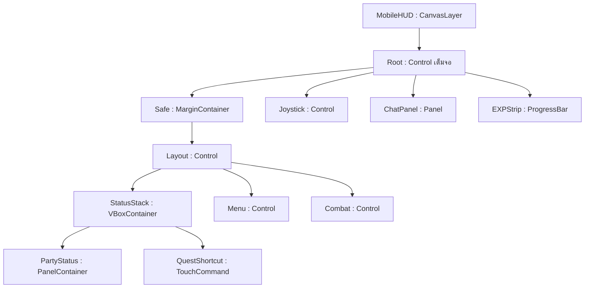
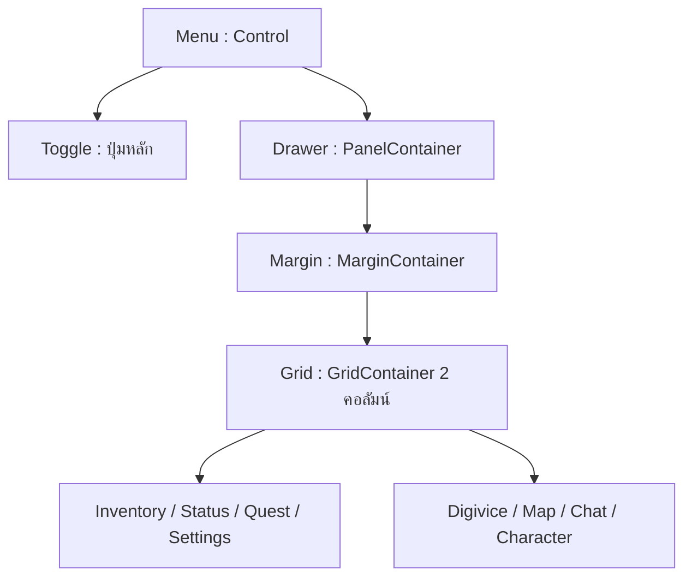
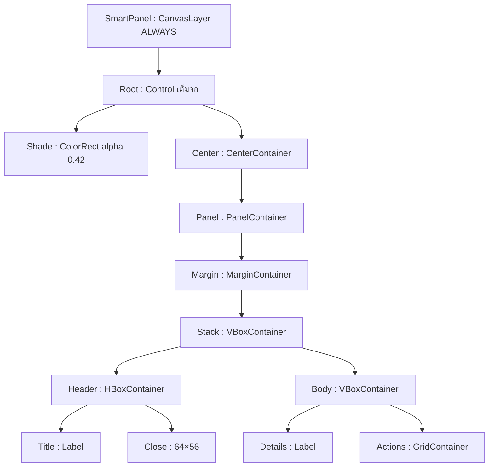

> อัปเดต v19: คู่มือระบบนี้อ้างอิงรุ่นก่อน สกิลปัจจุบันใช้ `mp_cost` และหัก MP คู่หู ส่วน DS เป็นของ Tamer สำหรับเปลี่ยนร่าง/รักษาร่าง อ่าน `README_SURVIVAL_STATUS_TH.md` สำหรับ API และสเตตัสปัจจุบัน

# Godot 4 — รีดีไซน์ Mobile HUD v18

โปรเจกต์นี้ต่อจาก v17 โดยเปลี่ยน HUD ทั้งสนาม ไม่เปลี่ยนข้อมูลตัวละครหรือฐานไอเทมเดิม โค้ดใช้งานจริงอยู่ใน `scripts/` และ Scene ที่พร้อม Import อยู่ใน `scenes/` อ่าน `README_FIRST_V18_TH.md` ก่อนรัน

## พฤติกรรมที่ผู้เล่นได้รับ

| ตำแหน่ง | การออกแบบ | เหตุผลด้าน UX |
|---|---|---|
| ซ้ายบน | รูป Tamer และคู่หูอยู่ใน PanelContainer เดียว | ลดจำนวนกรอบและหาค่าพลังได้ที่เดียว |
| HP/DS | HP ทั้งสองตัวสูง 24px ตัวเลข 17px; DS ร่วมหนึ่งหลอดสีน้ำเงิน | แยกเจ้าของ HP ได้ชัด ใช้ชื่อ/ตัวเลขร่วมกับสี |
| HP ต่ำ | สีแดงเมื่อ HP <=25% | เห็นความเสี่ยงโดยไม่ต้องอ่านทุกเฟรม |
| ใต้สถานะ | ปุ่มเควสต์หลักหนึ่งบรรทัด สูง 48px | แตะนำทางได้โดยไม่แสดงรายละเอียดยาวบนสนาม |
| ขวาบน | ปุ่มเมนูเดียว 64×64; Grid ย่อย 2 คอลัมน์ | ปิดแล้วคืนพื้นที่ให้ฉาก เปิดจึงเห็นคำสั่งทั้งหมด |
| ขวาล่าง | Attack 112×112; สกิล 74×74; Auto ใต้ Attack | รวมคำสั่งที่ใช้บ่อยอยู่ในบริเวณนิ้วโป้ง |
| ชุดถัดไป | เปลี่ยนหน้าแหล่งสกิล ไม่เปลี่ยนร่างตัวละคร | ลอง/ใช้ชุดสกิลได้ลื่นไหลโดยไม่ต้องเล่นคัตซีน |
| ซ้ายล่าง | Joystick 200×200; แชตข้างจอย ย่อเริ่มต้นสูง 52px | ไม่ทับนิ้วเดิน สามารถขยายเพื่อพิมพ์ได้ |
| ขอบล่าง | EXP Tamer เส้นเหลือง 4px | มองความคืบหน้าได้โดยไม่เพิ่มหลอดเต็มอีกกรอบ |
| Status/Inventory/Settings | ฉากหลังมืดโปร่ง alpha 0.42; ปุ่มใหญ่; Pause ระหว่างเปิด | อ่านและจิ้มได้แม่นยำ โลกไม่โจมตีระหว่างจัดการของ |

ขนาดในตารางคือ logical px ของฐาน 1280×720 ไม่ใช่จำนวน pixel จริงของโทรศัพท์ โปรเจกต์ใช้ `canvas_items` และ aspect `expand` เพื่อรักษาขนาดพื้นที่สัมผัสเมื่อจอกว้างขึ้น ตั้งค่า HUD เปลี่ยนกลุ่มต่อสู้เป็น 115% ได้

## ผัง Node ของสนาม



`Safe` เพิ่ม margin ซ้าย/บน/ขวา/ล่างจาก DisplayServer.get_display_safe_area() เมื่ออยู่บนมือถือ โดยแปลงหน่วย OS pixel เป็น viewport logical ก่อนใช้ Container จัดกรอบสถานะและแผงเมนู ส่วน Combat ใช้ Control เพื่อจัดตำแหน่งวงสกิล Container ไม่เหมาะกับการวางปุ่มเป็นครึ่งวงกลมโดยตรง

| Path ของ Node | ชนิด / หน้าที่ |
|---|---|
| Root/Safe/Layout/StatusStack/PartyStatus/Margin/Rows | VBoxContainer จัดรูปและหลอดโดยไม่ใช้พิกัดแยก |
| …/Rows/Portraits | HBoxContainer ของ TamerIcon, PartnerIcon และ Names |
| …/Rows/PartnerHP, TamerHP, DS | ProgressBar แต่ละหลอดมี Value: Label เต็มขอบ |
| Root/Safe/Layout/Menu/Toggle | EquipmentButton ขนาด 64×64 รองรับหลาย finger |
| …/Menu/Drawer | PanelContainer เคลื่อนด้วย Tween เป็นแผงเดียว |
| …/Drawer/Margin/Grid | GridContainer columns=2 ปุ่มย่อย 8 คำสั่ง |
| Root/Safe/Layout/Combat | Control 340×340 pivot=(340,340) ยึดมุมขวาล่าง |
| …/Combat/SkillPanel | FormSkillPanel สร้างปุ่มจาก MonsterSkill Resource |
| …/Combat/Attack, Recover | ตำแหน่งเดียวกัน แสดงสลับตามคู่หูยังมีชีวิตหรือไม่ |
| …/Combat/Evolve, Auto, Cycle, PageLabel | ปุ่มพัฒนา/ออโต้/เปลี่ยนหน้า และชื่อหน้าที่เลือก |
| Root/QuestTracker | ตัวแก้เป้าหมายเควสต์เดิม ซ่อนกรอบยาว; ปุ่ม shortcut เรียก request_navigation() |
| Root/TargetStatus | กรอบศัตรูแสดงเมื่อมีเป้าหมายที่ยังอยู่จริง |
| Root/EXPStrip | สร้างใน _build_extras() สูง 4px แสดง current_exp/max_exp ของ Tamer |

## ผังเมนูและหน้าต่างรายละเอียด





Status/Quest/Settings ใช้ Scene `hud_smart_panel.tscn` ร่วมกัน กระเป๋าใช้ `inventory_ui.tscn` เดิมที่ปรับขนาดตามจอและสี Shade ใหม่ ดิจิไวซ์ใช้ EquipmentScreen เดิมที่ปรับ Close/Tab ให้ใหญ่ขึ้น ทุกหน้าต่างดูแล pause ที่ตัวเองเริ่มและคืนเมื่อปิดหรือถูกลบ

เลือกแผ่นสีมืดโปร่งตามตัวเลือกที่อนุญาตในโจทย์ เพื่อไม่ต้องอ่าน screen texture เพิ่มในมือถือ `CanvasItemMaterial` ไม่มี Blur สำเร็จรูป; ถ้าต้องการ blur จริงในอนาคตต้องทำ ShaderMaterial + screen texture/BackBufferCopy และวัดประสิทธิภาพบนเครื่องจริง

## Skill Cycle ที่ไม่ข้ามระบบพัฒนาร่าง

1. สร้างหน้าจาก `partner.forms` ตามสายคู่หู หนึ่งหน้ามากสุด 4 สกิล ชุดที่มี 5 สกิลจะมีหน้า 2
2. ชื่อหน้าแสดงชื่อร่างและลำดับ เช่น Champion • 2/4 ร่างที่ยังติดเควสต์แสดง “ล็อกเควสต์” และกดใช้ไม่ได้
3. เมื่อเปลี่ยนร่างจริง สัญญาณ skills_changed รีเซ็ตหน้าไปชุดของร่างในสนาม
4. เมื่อ Cycle ไม่เรียก load_monster_data()/digivolve() จึงไม่เปลี่ยน Sprite, HP, ATK, Level หรือหัก DS ค่าพัฒนา
5. เมื่อใช้สกิลต่างร่าง ส่ง MonsterData + slot ไปยัง Tamer.command_form_skill() และ Partner.command_form_skill() ตรวจว่าเป็นร่างในสายและปลดล็อกแล้วอีกครั้ง
6. ดาเมจ = `attack_power ของร่างสนาม × multiplier ของสกิล × randf_range(0.95, 1.05)`; ใช้ท่าร่ายจาก SpriteFrames ร่างสนาม และ projectile/AoE ตาม Resource ของสกิล
7. DS/คูลดาวน์ใช้ค่าของสกิลที่กด คูลดาวน์อยู่ใน instance ของคู่หู keyed by skill.id จึงไม่หายเมื่อสลับหน้า
8. Auto-Battle ยังเลือกจาก `partner.active_skills` ของร่างสนาม การ Cycle มีผลกับปุ่ม Manual เท่านั้น ร่างที่เพิ่มใหม่ควรตั้ง skill.id ให้ไม่ซ้ำกัน

ร่าง Ultimate/Mega ปลดล็อกด้วย QuestManager.can_use_form() ตามระบบเดิม ยังไม่ได้เพิ่มเงื่อนไขเลเวลใหม่ในงาน UI นี้ การปล่อยให้ร่าง Rookie ใช้สกิล Champion หลังปลดล็อกเป็นกติกาตามที่ขอ สามารถปรับ DS/CD เพื่อบาลานซ์ได้ใน Resource

## การรับสัมผัสและอายุของ Node

- ใช้ TouchCommand/EquipmentButton ของเดิมเพื่อรองรับนิ้วเดินและนิ้วโจมตีพร้อมกัน ไม่เปลี่ยน UI สนามไปใช้ pointer เมาส์เดียว
- Menu ใช้ Tween ของ Node.create_tween() และ kill ตัวเก่าก่อน Tween ใหม่ กดสลับเร็วได้โดยไม่กระตุกกลับจาก callback เก่า
- revision ป้องกัน callback ของปุ่มสกิลที่ถอดแล้ว remove_child() ก่อน queue_free() ทำให้ปุ่มเดิมหยุดรับ Input ทันที
- เมนูที่ปิดซ่อน Drawer จริง; Minimap ที่ซ่อนตรวจ is_visible_in_tree() ก่อนรับสัมผัส; Drawer ใช้ _unhandled_input() ให้ปุ่มย่อยรับคำสั่งก่อน
- ขณะเมนูกาง ปิดรับคำสั่งต่อสู้ที่อาจอยู่ใต้ Drawer ขณะพิมพ์แชตปล่อย Joystick/ยกเลิก Auto Navigation
- ก่อน modal/cutscene ปล่อยทุก finger และ focus ของ LineEdit ป้องกันเดินค้างเมื่อ Resume
- target_changed รับ argument แบบ Variant ตรวจ is_instance_valid() ก่อน cast WildMonster เพื่อไม่เกิด error “previously freed” เหมือนปัญหาก่อนหน้า

## ไฟล์และวิธีนำไปต่อยอด

| ไฟล์ | หน้าที่ |
|---|---|
| scenes/mobile_hud.tscn + scripts/mobile_hud.gd | ผังหลัก เชื่อม Tamer/Partner, menu, overlay, input และ Safe Area |
| scenes/collapsible_hud_menu.tscn + scripts/collapsible_hud_menu.gd | เมนู Grid และ Tween |
| scripts/form_skill_panel.gd | หน้า Skill Cycle + cooldown/DS/quest lock |
| scenes/party_status_hud.tscn + scripts/party_status_hud.gd | สถานะรวมและ portrait cache |
| scenes/hud_smart_panel.tscn + scripts/hud_smart_panel.gd | Status/Quest/Settings modal |
| scripts/hud_preferences.gd | ConfigFile บันทึกขนาดปุ่ม/เมนู motion/แชต/มินิแมป |
| scripts/mobile_chat_panel.gd | Chat แบบ Container แป้นพิมพ์และย่อ/ขยาย |
| scripts/tamer.gd + scripts/partner_monster.gd | รับคำสั่งสกิลจาก Resource ร่างอื่นโดยคงร่างสนาม |
| tests/clean_hud_test.tscn | Regression ใหม่สำหรับ Touch, menu, modal, pages, DS/CD และหน้าจอ |

Scene โลกทุกโซนใช้ mobile_hud.tscn ร่วมกัน จึงได้รับ UI ใหม่อัตโนมัติ หากจะคัดลอกเข้าโปรเจกต์ของคุณเอง ให้คัดลอก Scene/Script ใหม่ตามตารางและอัปเดต Tamer/Partner ตามหัวข้อท้ายคู่มือ ไม่สร้าง Autoload ชื่อเดียวกันซ้ำ และไม่วาง class_name ทับชื่อ Singleton

ปรับ margin ใน MobileHUD._layout() ปรับขนาด/ตำแหน่งวงสกิลใน FormSkillPanel.SLOT_OFFSETS ปรับเวลาคลี่เมนูใน CollapsibleHudMenu.duration ปรับจำนวนคอลัมน์ที่ Drawer/Margin/Grid เลือกค่าขนาดใหญ่ขึ้นได้ในหน้า Settings โดยไม่ต้องแก้ Resource ตัวละคร

## ผลการทดสอบ

ทดสอบ Godot 4.4.1 stable บน Linux: 17 ชุด 640 ข้อ ผ่านทั้งหมด ตรวจการเดิน, การต่อสู้/ลูกไฟ/AoE, ตาย/ฟื้น, Quest/วาร์ป, เซฟ, Equipment, Inventory/Loot, Pre-game Flow, freed target และ HUD ใหม่ รายละเอียดอยู่ใน HUD_TEST_RESULTS_V18.json และ docs/test_logs/

HUD ใหม่ทดสอบ 1280×720, 1600×720, 1280×800 และ 1280×640 รวมการตั้งขนาดปุ่ม 115% ใช้สัมผัสผ่าน Input.parse_input_event() จริง ไม่ได้ตรวจเพียงการเรียกฟังก์ชันโดยตรง

ภาพใน docs/previews/ ถ่ายจาก Godot Compatibility renderer ที่รันฉากจริงบน Mesa: Gameplay, Menu, Status, Inventory และ Settings ยังไม่ได้ทดสอบ Export Android/iOS หรือวัด FPS/พื้นที่สัมผัสบนเครื่องโทรศัพท์จริงในรอบนี้ แชตและ Server ยังจำลองในเครื่องเหมือน v17

## GDScript ฉบับเต็มของระบบ HUD ใหม่

โค้ดต่อไปนี้ตรงกับไฟล์ใน ZIP หากใช้โปรเจกต์ที่ให้มาไม่ต้องคัดลอกซ้ำ Scene ได้ผูก Script ไว้แล้ว

### เมนูพับพร้อม Tween — `scripts/collapsible_hud_menu.gd`

```gdscript
class_name CollapsibleHudMenu
extends Control
## เมนูยุบเหลือปุ่มเดียว กางเป็น Grid 2 คอลัมน์ โดยไม่เปลี่ยน layout ของ Container ระหว่าง Tween
signal action_requested(action: StringName)
signal expanded_changed(expanded: bool)
@export_range(0.05, 0.5) var duration: float = 0.18
var expanded: bool = false
var animations_enabled: bool = true
var buttons: Dictionary = {}
var _tween: Tween
var _revision: int = 0
@onready var toggle_button: EquipmentButton = $Toggle
@onready var drawer: PanelContainer = $Drawer
@onready var grid: GridContainer = $Drawer/Margin/Grid

func _ready() -> void:
    # Touch targets 140×56; Container จัดช่อง ส่วน Drawer ว่างจาก Container จึง slide ได้
    mouse_filter = Control.MOUSE_FILTER_IGNORE
    drawer.add_theme_stylebox_override("panel", ClassicUIStyle.frame(Color("34779f"), Color("07182ef5")))
    toggle_button.pressed.connect(toggle)
    var actions: Array[StringName] = [&"inventory", &"status", &"quest", &"settings", &"equipment", &"map", &"chat", &"character"]
    var names: Array[String] = ["กระเป๋า", "สถานะ", "เควสต์", "ตั้งค่า", "ดิจิไวซ์", "แผนที่", "แชต", "ตัวละคร"]
    for index: int in range(actions.size()):
        var button := EquipmentButton.new()
        button.custom_minimum_size = Vector2(140, 56)
        button.caption = names[index]
        button.pressed.connect(_request_action.bind(actions[index]))
        grid.add_child(button)
        buttons[actions[index]] = button
    set_expanded(false, false)

func toggle() -> void:
    # กดเร็วกลาง Tween ได้: สั่งจากเป้าหมาย expanded ไม่รอ Tween เก่าจบ
    set_expanded(not expanded)

func set_expanded(value: bool, animated: bool = true) -> void:
    # หนึ่ง property มี Tween เดียว kill เก่าก่อนและใช้ revision กัน callback รุ่นเก่า
    _revision += 1
    var revision: int = _revision
    if _tween != null and _tween.is_valid():
        _tween.kill()
    expanded = value
    expanded_changed.emit(expanded)
    toggle_button.set_caption("ปิดเมนู" if expanded else "เมนู +")
    for button: EquipmentButton in buttons.values():
        button.release_input()
        button.locked = true
    if not animated or not animations_enabled:
        drawer.position = Vector2(-252, 76)
        drawer.modulate.a = 1.0 if value else 0.0
        drawer.visible = value
        _finish(revision)
        return
    if value and not drawer.visible:
        drawer.position = Vector2(-228, 58)
        drawer.modulate.a = 0.0
    drawer.show()
    _tween = create_tween().set_parallel(true).set_trans(Tween.TRANS_QUAD).set_ease(Tween.EASE_OUT)
    _tween.tween_property(drawer, "position", Vector2(-252, 76) if value else Vector2(-228, 58), duration)
    _tween.tween_property(drawer, "modulate:a", 1.0 if value else 0.0, duration)
    _tween.chain().tween_callback(_finish.bind(revision))

func _finish(revision: int) -> void:
    # ซ่อน Drawer จริงหลัง fade จบ เพื่อไม่รับ Touch ในช่องว่างขณะยุบ
    if revision != _revision:
        return
    drawer.visible = expanded
    for button: EquipmentButton in buttons.values():
        button.locked = not expanded or bool(button.get_meta("unavailable", false))

func _request_action(action: StringName) -> void:
    # ปิดแบบทันทีเมื่อจะเปิด modal ไม่ให้ Tween/นิ้วเดิมค้างอยู่ใต้ฉากหลังมืด
    if not expanded:
        return
    set_expanded(false, false)
    action_requested.emit(action)

func release_input() -> void:
    toggle_button.release_input()
    for button: EquipmentButton in buttons.values():
        button.release_input()

func _unhandled_input(event: InputEvent) -> void:
    # ดูด Touch เฉพาะ Drawer ที่เห็นจริง ปิดอยู่แล้วฉากด้านหลังยังแตะเลือกเป้าหมายได้
    if not drawer.visible or not (event is InputEventScreenTouch or event is InputEventScreenDrag):
        return
    var local: Vector2 = drawer.get_global_transform_with_canvas().affine_inverse() * event.position
    if Rect2(Vector2.ZERO, drawer.size).has_point(local):
        get_viewport().set_input_as_handled()

```

### Skill Page Switcher — `scripts/form_skill_panel.gd`

```gdscript
class_name FormSkillPanel
extends Control
## หน้า UI เป็นเพียงแหล่งสกิล ไม่ใช่ร่างจริงของคู่หู; Resource ไม่ถูกแก้ตอนสลับหน้า
signal skill_requested(slot: int)
signal form_skill_requested(source: MonsterData, slot: int)
signal page_changed(title: String, index: int, count: int)
@export var partner: PartnerMonster
@export var tamer: Tamer
var buttons: Array[TouchCommand] = []
var pages: Array[Dictionary] = []
var page_index: int = 0
var _revision: int = 0
const BUTTON_SIZE := Vector2(74, 74)
const SLOT_OFFSETS: Array[Vector2] = [Vector2(118,196), Vector2(94,112), Vector2(168,30), Vector2(254,66)]

func configure(owner_partner: PartnerMonster, owner_tamer: Tamer) -> void:
    # ถอด signal เจ้าของเก่าก่อน รองรับการเปลี่ยนคู่หู
    if is_instance_valid(partner) and partner.skills_changed.is_connected(rebuild):
        partner.skills_changed.disconnect(rebuild)
    partner = owner_partner
    tamer = owner_tamer
    partner.skills_changed.connect(rebuild)
    rebuild(partner.active_skills)

func rebuild(_skills: Array[MonsterSkill]) -> void:
    # เปลี่ยนร่างจริงแล้วกลับมาหน้าแรกของร่างนั้น; จำนวนเกิน 4 แบ่งเป็นหลายหน้า
    pages.clear()
    page_index = 0
    for source: MonsterData in partner.forms:
        if source == null:
            continue
        for offset: int in range(0, maxi(1, _form_skills(source).size()), 4):
            if source == partner.current_form and offset == 0:
                page_index = pages.size()
            pages.append({"form": source, "offset": offset})
    _draw_page()

func cycle_page() -> void:
    # ไม่โหลด MonsterData ไม่รีเซ็ต HP/DS/CD; ยกเลิกคำสั่งจากหน้าก่อนที่ยังเดินไปหาเป้า
    if pages.size() < 2:
        return
    partner.cancel_page_skill()
    page_index = (page_index + 1) % pages.size()
    _draw_page()

func _draw_page() -> void:
    _revision += 1
    for button: TouchCommand in buttons:
        button.release_input()
        remove_child(button)
        button.queue_free()
    buttons.clear()
    if pages.is_empty():
        return
    var source: MonsterData = pages[page_index].form
    var offset: int = pages[page_index].offset
    var skills: Array[MonsterSkill] = _form_skills(source)
    for local_slot: int in range(mini(4, skills.size() - offset)):
        var slot: int = offset + local_slot
        var skill: MonsterSkill = _form_skills(source)[slot]
        if skill == null:
            continue
        var button := TouchCommand.new()
        button.name = "Skill%d" % slot
        button.position = SLOT_OFFSETS[local_slot]
        button.size = BUTTON_SIZE
        button.icon = skill.icon
        button.caption = skill.display_name
        button.tint = skill.effect_color.darkened(0.55)
        button.set_meta("skill_slot", slot)
        button.set_meta("skill_id", skill.id)
        button.pressed.connect(_request_slot.bind(slot, skill.id, _revision))
        add_child(button)
        buttons.append(button)
    _refresh_buttons()
    page_changed.emit(_page_title(), page_index, pages.size())

func _page_title() -> String:
    var source: MonsterData = pages[page_index].form
    return "%s • %d/%d%s" % [source.monster_name, page_index + 1, pages.size(), " • ล็อกเควสต์" if not QuestManager.can_use_form(source) else ""]

func _process(_delta: float) -> void:
    _refresh_buttons()

func _refresh_buttons() -> void:
    if pages.is_empty():
        return
    var source: MonsterData = pages[page_index].form
    for button: TouchCommand in buttons:
        var slot: int = int(button.get_meta("skill_slot", -1))
        if not is_instance_valid(partner) or not is_instance_valid(tamer) or slot < 0 or slot >= _form_skills(source).size():
            button.locked = true
            continue
        var skill: MonsterSkill = _form_skills(source)[slot]
        if skill == null or skill.id != button.get_meta("skill_id"):
            button.locked = true
            continue
        var remaining: float = partner.cooldown_remaining(skill)
        button.locked = not partner.can_use_skill_from_form(source, slot) or partner.evolution_busy or not partner.is_alive() or remaining > 0.0 or tamer.ds < skill.ds_cost
        button.set_caption("ล็อก" if not QuestManager.can_use_form(source) else ("%.1fs" % remaining if remaining > 0.0 else skill.display_name))

func _request_slot(slot: int, expected_id: StringName, expected_revision: int) -> void:
    # ตรวจ revision/Resource/สิทธิ์ซ้ำตอนกด ป้องกัน callback จากปุ่มที่ queue_free ยังไม่จบเฟรม
    if expected_revision != _revision or pages.is_empty() or not is_instance_valid(partner):
        return
    var source: MonsterData = pages[page_index].form
    if not partner.can_use_skill_from_form(source, slot):
        return
    var skill: MonsterSkill = _form_skills(source)[slot]
    if skill.id != expected_id or partner.cooldown_remaining(skill) > 0 or tamer.ds < skill.ds_cost or not partner.is_alive() or partner.evolution_busy:
        return
    if source == partner.current_form:
        skill_requested.emit(slot)
    else:
        form_skill_requested.emit(source, slot)

func release_input() -> void:
    for button: TouchCommand in buttons:
        button.release_input()

func _form_skills(source: MonsterData) -> Array[MonsterSkill]:
    # ชุด runtime ของร่างปัจจุบันอาจถูกระบบ buff/อุปกรณ์ปรับโดยไม่แก้ Resource
    return partner.active_skills if source == partner.current_form else source.skills

```

### สถานะรวม — `scripts/party_status_hud.gd`

```gdscript
class_name PartyStatusHUD
extends PanelContainer
## กรอบเดียวแสดงคู่หูและ Tamer; HP ทั้งสองยังเห็น แต่ DS เป็นค่าร่วมหนึ่งหลอด ไม่มี EXP ในกรอบ
@onready var tamer_portrait: TextureRect = $Margin/Rows/Portraits/TamerIcon
@onready var partner_portrait: TextureRect = $Margin/Rows/Portraits/PartnerIcon
@onready var names: Label = $Margin/Rows/Portraits/Names
@onready var partner_hp: ProgressBar = $Margin/Rows/PartnerHP
@onready var tamer_hp: ProgressBar = $Margin/Rows/TamerHP
@onready var ds_bar: ProgressBar = $Margin/Rows/DS
var _tamer_texture: Texture2D
var _partner_texture: Texture2D

func update_values(tamer: Node, partner: Node) -> void:
    # Signal-driven อัปเดตเมื่อค่าจริงเปลี่ยน ตัดการสร้าง Atlas ซ้ำทุกเฟรม
    if partner.current_form == null:
        return
    names.text = "%s • Lv%d\n%s • Lv%d" % [tamer.display_name, tamer.progress.level, partner.current_form.monster_name if partner.is_alive() else "DIGITAMA", partner.progress.level]
    _update_hp(partner_hp, partner.hp, partner.max_hp, "คู่หู")
    _update_hp(tamer_hp, tamer.hp, tamer.max_hp, "Tamer")
    ds_bar.max_value = maxf(1.0, tamer.max_ds)
    ds_bar.value = tamer.ds
    (ds_bar.get_node("Value") as Label).text = "DS  %.0f / %.0f" % [tamer.ds, tamer.max_ds]
    var tamer_image: Texture2D = tamer.sprite.sprite_frames.get_frame_texture(&"idle_down", 0)
    var partner_image: Texture2D = partner.egg_sprite.texture if not partner.is_alive() else partner.current_form.sprite_frames.get_frame_texture(partner.current_form.idle_animation, 0)
    if tamer_image != _tamer_texture:
        _tamer_texture = tamer_image
        tamer_portrait.texture = _portrait(tamer_image)
    if partner_image != _partner_texture:
        _partner_texture = partner_image
        partner_portrait.texture = _portrait(partner_image)

func _update_hp(bar: ProgressBar, hp: int, maximum: int, title: String) -> void:
    # สีแดงเมื่อ <=25% เพิ่มคำว่า HP/ตัวเลขด้วย เพื่อไม่พึ่งการมองสีอย่างเดียว
    bar.max_value = maxi(1, maximum)
    bar.value = hp
    (bar.get_node("Value") as Label).text = "%s HP  %d / %d" % [title, hp, maximum]
    var color: Color = Color("d45463") if float(hp) / maxi(1, maximum) <= 0.25 else Color("238a68")
    var style: StyleBoxFlat = bar.get_theme_stylebox("fill") as StyleBoxFlat
    if style.bg_color != color:
        style = style.duplicate() as StyleBoxFlat
        style.bg_color = color
        bar.add_theme_stylebox_override("fill", style)

func _portrait(texture: Texture2D) -> Texture2D:
    # Atlas ใช้ภาพเดิม ไม่สร้างรูปภาพใหม่; ตัดส่วนบนให้อ่านหน้าตัวละครในกรอบสี่เหลี่ยม
    var visible: Texture2D = WalkTextureTools.visible_texture(texture)
    var result := AtlasTexture.new()
    result.atlas = visible
    result.region = Rect2(0, 0, visible.get_width(), visible.get_height() * 0.5)
    return result

```

### Smart Panel Overlay — `scripts/hud_smart_panel.gd`

```gdscript
class_name HudSmartPanel
extends CanvasLayer
## modal ร่วมของ Status/Quest/Settings: ฉากหลังมืดโปร่งไม่ต้องใช้ blur shader บนมือถือสเปกต่ำ
signal action_requested(action: StringName)
signal closed
var is_open: bool = false
var kind: StringName = &""
var _owns_pause: bool = false
var _previous_back_quit: bool = true
var hud: CanvasLayer
var buttons: Dictionary = {}
@onready var root: Control = $Root
@onready var panel: PanelContainer = $Root/Center/Panel
@onready var title: Label = $Root/Center/Panel/Margin/Stack/Header/Title
@onready var close_button: EquipmentButton = $Root/Center/Panel/Margin/Stack/Header/Close
@onready var body: VBoxContainer = $Root/Center/Panel/Margin/Stack/Body
@onready var details: Label = $Root/Center/Panel/Margin/Stack/Body/Details
@onready var actions: GridContainer = $Root/Center/Panel/Margin/Stack/Body/Actions

func _ready() -> void:
    process_mode = Node.PROCESS_MODE_ALWAYS
    layer = 86
    panel.add_theme_stylebox_override("panel", ClassicUIStyle.frame(Color("34779f"), Color("07182ef5")))
    root.hide()
    close_button.pressed.connect(close_screen)
    get_viewport().size_changed.connect(_layout)

func _layout() -> void:
    # Container จัดกลางจอ ความกว้าง adaptive สูงพอสำหรับตัวเลข/Touch 56px
    panel.custom_minimum_size = Vector2(minf(840, get_viewport().get_visible_rect().size.x - 64), 480)

func open_kind(value: StringName, title_text: String, content: String, options: Array[Dictionary] = []) -> bool:
    # ไม่แย่ง pause ของ Inventory/Equipment/Cutscene
    if is_open or get_tree().paused or hud.partner.evolution_busy:
        return false
    hud.release_for_equipment()
    _layout()
    kind = value
    title.text = title_text
    details.text = content
    _build_actions(options)
    is_open = true
    hud._sync_skill_input()
    _owns_pause = true
    _previous_back_quit = get_tree().quit_on_go_back
    get_tree().quit_on_go_back = false
    get_tree().paused = true
    root.show()
    return true

func _build_actions(options: Array[Dictionary]) -> void:
    # Native GridContainer จัดปุ่ม 2 คอลัมน์ touch ขนาด >=56px ไม่ย่อจนเล็กตามข้อความ
    for child: Node in actions.get_children():
        actions.remove_child(child)
        child.queue_free()
    buttons.clear()
    for option: Dictionary in options:
        var button := EquipmentButton.new()
        button.caption = str(option.label)
        button.custom_minimum_size = Vector2(300, 56)
        button.size_flags_horizontal = Control.SIZE_EXPAND_FILL
        button.pressed.connect(_request.bind(StringName(option.id)))
        actions.add_child(button)
        buttons[StringName(option.id)] = button

func _request(action: StringName) -> void:
    # Status/Settings อยู่ใน modal ต่อได้; Quest นำทางและออกตัวละครให้ HUD ปิดก่อนทำงาน
    action_requested.emit(action)

func close_screen() -> void:
    if not is_open:
        return
    panel.add_theme_stylebox_override("panel", ClassicUIStyle.frame(Color("34779f"), Color("07182ef5")))
    root.hide()
    close_button.release_input()
    for button: EquipmentButton in buttons.values():
        button.release_input()
    is_open = false
    _restore_pause()
    closed.emit()

func _restore_pause() -> void:
    if _owns_pause and is_inside_tree():
        get_tree().paused = false
        get_tree().quit_on_go_back = _previous_back_quit
    _owns_pause = false

func _exit_tree() -> void:
    _restore_pause()

func _notification(what: int) -> void:
    if what == NOTIFICATION_WM_GO_BACK_REQUEST and is_open:
        close_screen()

func _unhandled_input(event: InputEvent) -> void:
    # consume พื้นที่ว่างของ overlay ป้องกันเลือกศัตรูผ่านช่องระหว่างปุ่ม
    if not is_open:
        return
    if event is InputEventKey and event.pressed and event.keycode == KEY_ESCAPE:
        close_screen()
    get_viewport().set_input_as_handled()

```

### Preferences — `scripts/hud_preferences.gd`

```gdscript
class_name HudPreferences
extends RefCounted
## ค่าความสบายในการใช้งานเป็น preferences ของเครื่อง แยกจาก HP/Quest ของตัวละคร
var animations_enabled: bool = true
var combat_scale: float = 1.0
var minimap_visible: bool = false
var chat_collapsed: bool = true
var save_path: String = "user://hud_preferences_v18.cfg"

func load_data() -> void:
    var config := ConfigFile.new()
    if config.load(save_path) != OK:
        return
    animations_enabled = bool(config.get_value("hud", "animations", true))
    var factor: Variant = config.get_value("hud", "combat_scale", 1.0)
    combat_scale = clampf(float(factor), 1.0, 1.15) if (factor is float or factor is int) and is_finite(float(factor)) else 1.0
    minimap_visible = bool(config.get_value("hud", "minimap", false))
    chat_collapsed = bool(config.get_value("hud", "chat_collapsed", true))

func save_data() -> Error:
    # ไม่บันทึกตำแหน่งนิ้ว/Target หรือ Node จึงคืนค่าได้หลังเปลี่ยน Scene/บัญชี
    var config := ConfigFile.new()
    config.set_value("hud", "animations", animations_enabled)
    config.set_value("hud", "combat_scale", combat_scale)
    config.set_value("hud", "minimap", minimap_visible)
    config.set_value("hud", "chat_collapsed", chat_collapsed)
    return config.save(save_path)

```

### แชตแบบย่อ — `scripts/mobile_chat_panel.gd`

```gdscript
class_name MobileChatPanel
extends Panel
## แชตแบบพับได้ ปุ่ม touch แยก finger และ LineEdit เรียกคีย์บอร์ดมือถือ
signal editing_changed(editing: bool)
var log_view: RichTextLabel
var line_edit: LineEdit
var send_button: ClassicCommand
var fold_button: ClassicCommand
var tabs: Array[ClassicCommand] = []
var active_filter: StringName = &"all"
var collapsed: bool = false
var _touch_finger: int = -1
var _keyboard_offset: float = 0.0

var bottom_inset: float = 24
var _rows: VBoxContainer
signal folded_changed(collapsed: bool)

func _ready() -> void:
    mouse_filter = Control.MOUSE_FILTER_STOP
    add_theme_stylebox_override("panel", ClassicUIStyle.frame(ClassicUIStyle.BLUE, Color("07182ed9")))
    var margin := MarginContainer.new()
    margin.set_anchors_and_offsets_preset(Control.PRESET_FULL_RECT)
    for side: String in ["left","right","top","bottom"]:
        margin.add_theme_constant_override("margin_"+side, 4)
    add_child(margin)
    _rows = VBoxContainer.new()
    _rows.add_theme_constant_override("separation", 4)
    margin.add_child(_rows)
    var header := HBoxContainer.new()
    _rows.add_child(header)
    var title := Label.new()
    title.text = "พูดคุย • LOCAL"
    title.size_flags_horizontal = Control.SIZE_EXPAND_FILL
    title.add_theme_font_size_override("font_size", 15)
    header.add_child(title)
    fold_button = _button(header, "+", Vector2(64,44))
    fold_button.pressed.connect(toggle_collapsed)
    var tab_row := HBoxContainer.new()
    tab_row.name = "Tabs"
    _rows.add_child(tab_row)
    for index: int in range(3):
        var tab: ClassicCommand = _button(tab_row,["ทั้งหมด","ทั่วไป","ระบบ"][index],Vector2(80,44))
        tab.size_flags_horizontal = Control.SIZE_EXPAND_FILL
        tab.pressed.connect(_set_filter.bind([&"all",&"local",&"system"][index]))
        tabs.append(tab)
    log_view = RichTextLabel.new()
    log_view.custom_minimum_size = Vector2(0,100)
    log_view.size_flags_vertical = Control.SIZE_EXPAND_FILL
    log_view.add_theme_font_size_override("normal_font_size", 15)
    log_view.scroll_following = true
    _rows.add_child(log_view)
    var edit_row := HBoxContainer.new()
    edit_row.name = "Edit"
    _rows.add_child(edit_row)
    line_edit = LineEdit.new()
    line_edit.custom_minimum_size = Vector2(0,48)
    line_edit.size_flags_horizontal = Control.SIZE_EXPAND_FILL
    line_edit.max_length = 160
    line_edit.placeholder_text = "พิมพ์ข้อความ…"
    line_edit.virtual_keyboard_enabled = true
    line_edit.text_submitted.connect(_submit)
    line_edit.focus_entered.connect(func(): editing_changed.emit(true))
    line_edit.focus_exited.connect(func(): editing_changed.emit(false))
    edit_row.add_child(line_edit)
    send_button = _button(edit_row,"ส่ง",Vector2(64,48))
    send_button.pressed.connect(_send)
    GameChat.messages_changed.connect(_refresh)
    set_collapsed(true)
    _refresh()

func _button(parent: Node, text: String, extent: Vector2) -> ClassicCommand:
    var button := ClassicCommand.new()
    button.custom_minimum_size = extent
    button.caption = text
    button.tint = Color("10385a")
    parent.add_child(button)
    button._label.add_theme_font_size_override("font_size", 15)
    return button

func layout_panel() -> void:
    offset_bottom = -bottom_inset - _keyboard_offset
    offset_top = offset_bottom - (52.0 if collapsed else 260.0)

func set_collapsed(value: bool) -> void:
    # Header 52px ยังแตะง่าย; เนื้อหา/แท็บซ่อนทั้ง Container จึงไม่เหลือช่องว่าง
    collapsed = value
    if line_edit == null:
        return
    line_edit.release_focus()
    _rows.get_node("Tabs").visible = not collapsed
    _rows.get_node("Edit").visible = not collapsed
    log_view.visible = not collapsed
    fold_button.set_caption("+" if collapsed else "−")
    layout_panel()

func _send() -> void:
    _submit(line_edit.text)

func _submit(text: String) -> void:
    # แตะ Send หรือ Enter ใช้ฟังก์ชันเดียวกัน ปิดคีย์บอร์ดเมื่อส่งสำเร็จ
    if GameChat.submit_local(text):
        line_edit.clear()
        line_edit.release_focus()

func _set_filter(filter: StringName) -> void:
    active_filter = filter
    _refresh()

func _refresh() -> void:
    # add_text แสดง [b] หรือ [img] ของผู้เล่นเป็นข้อความ ไม่ใช่ markup
    if log_view == null:
        return
    log_view.clear()
    for entry: Dictionary in GameChat.messages:
        if active_filter != &"all" and entry.channel != active_filter:
            continue
        log_view.push_color(Color("e5c87b") if entry.channel == &"system" else Color("8bdfed"))
        log_view.add_text("[%s] %s\n" % [entry.sender, entry.body])
        log_view.pop()
    for index: int in range(tabs.size()):
        tabs[index].tint = Color("226596") if active_filter == [&"all", &"local", &"system"][index] else Color("10385a")
        tabs[index].queue_redraw()

func toggle_collapsed() -> void:
    set_collapsed(not collapsed)
    folded_changed.emit(collapsed)

func release_input() -> void:
    # เรียกก่อนคัตซีน ไม่ปล่อย keyboard focus ค้างบนหน้าจอ
    _touch_finger = -1
    line_edit.release_focus()
    for button: ClassicCommand in tabs + [send_button, fold_button]:
        button.release_input()

func _input(event: InputEvent) -> void:
    # กิน touch ในหน้าต่าง ป้องกันเลือกศัตรูทะลุแชต
    if not is_visible_in_tree():
        return
    if event is InputEventScreenTouch:
        var local: Vector2 = get_global_transform_with_canvas().affine_inverse() * event.position
        if event.pressed and not event.canceled and Rect2(Vector2.ZERO, size).has_point(local):
            _touch_finger = event.index
            if not collapsed and Rect2(Vector2.ZERO, line_edit.size).has_point(line_edit.get_global_transform_with_canvas().affine_inverse() * event.position):
                line_edit.grab_focus()
                line_edit.caret_column = line_edit.text.length()
            get_viewport().set_input_as_handled()
        elif event.pressed and line_edit.has_focus():
            line_edit.release_focus()
        elif event.index == _touch_finger:
            if not event.pressed or event.canceled:
                _touch_finger = -1
            get_viewport().set_input_as_handled()
    elif event is InputEventScreenDrag and event.index == _touch_finger:
        # ลากข้อความเพื่อเลื่อนดูย้อนหลัง โดยไม่สั่งตัวละครเดิน
        if not collapsed:
            log_view.get_v_scroll_bar().value -= event.relative.y
        get_viewport().set_input_as_handled()

func _process(_delta: float) -> void:
    # ยกช่องพิมพ์เหนือคีย์บอร์ด Android/iOS เมื่อระบบรายงานความสูง
    var height: int = DisplayServer.virtual_keyboard_get_height() if line_edit.has_focus() else 0
    _apply_keyboard_height(height)

func _apply_keyboard_height(pixel_height: int) -> void:
    # OS ส่งหน่วย pixel จริง แต่ Control ใช้หน่วย viewport หลัง stretch
    var screen_height: float = maxf(1.0, get_tree().root.size.y)
    var viewport_height: float = get_viewport().get_visible_rect().size.y
    var desired: float = clampf(pixel_height * viewport_height / screen_height, 0.0, maxf(0.0, viewport_height - 230.0))
    if is_equal_approx(desired, _keyboard_offset):
        return
    _keyboard_offset = desired
    layout_panel()

```

### HUD เชื่อมระบบทั้งหมด — `scripts/mobile_hud.gd`

```gdscript
class_name MobileHUD
extends CanvasLayer
## HUD รับคำสั่ง/แสดงค่าจริง ไม่เก็บสำเนาสเตตัสหรือเปลี่ยน MonsterData ตอนสลับหน้า
@export var tamer: Tamer
@export var partner: PartnerMonster
@onready var joystick: MobileJoystick = $Root/Joystick
@onready var combat: Control = $Root/Safe/Layout/Combat
@onready var attack_button: TouchCommand = $Root/Safe/Layout/Combat/Attack
@onready var evolve_button: TouchCommand = $Root/Safe/Layout/Combat/Evolve
@onready var auto_button: TouchCommand = $Root/Safe/Layout/Combat/Auto
@onready var recover_button: TouchCommand = $Root/Safe/Layout/Combat/Recover
@onready var cycle_button: TouchCommand = $Root/Safe/Layout/Combat/Cycle
@onready var skill_panel: FormSkillPanel = $Root/Safe/Layout/Combat/SkillPanel
@onready var page_label: Label = $Root/Safe/Layout/Combat/PageLabel
@onready var party_status: PartyStatusHUD = $Root/Safe/Layout/StatusStack/PartyStatus
@onready var quest_button: TouchCommand = $Root/Safe/Layout/StatusStack/QuestShortcut
@onready var menu: CollapsibleHudMenu = $Root/Safe/Layout/Menu
@onready var message: Label = $Root/Message
const CUTSCENE_SCENE: PackedScene = preload("res://scenes/digivolve_cutscene.tscn")
var active_cutscene: DigivolveCutscene
var preferences := HudPreferences.new()
var equipment_button: EquipmentButton
var inventory_button: EquipmentButton
var stats_button: TouchCommand
var stats_panel: Label
var equipment_screen: EquipmentScreen
var inventory_screen: InventoryUI
var smart_panel: HudSmartPanel
var exp_strip: ProgressBar
var chat_panel: MobileChatPanel
var minimap: MobileMinimap
var target_card: Panel
var _target_bar: ProgressBar
var _target_name: Label
var _tracker: QuestTracker
var _target_refresh_left: float = 0.0
var _message_left: float = 0.0
var chat_editing: bool = false

func _ready() -> void:
    preferences.load_data()
    tamer.joystick = joystick
    tamer.digivolve_requested.connect(_request_digivolve)
    partner.form_changed.connect(_on_form_changed)
    tamer.target_changed.connect(_refresh_target)
    for source_signal: Signal in [tamer.hp_changed, tamer.ds_changed, partner.hp_changed, partner.state_changed, tamer.progress.progress_changed, partner.progress.progress_changed]:
        source_signal.connect(_refresh_bars)
    tamer.progress.leveled_up.connect(_on_tamer_level)
    partner.progress.leveled_up.connect(_on_partner_level)
    tamer.auto_navigation_failed.connect(_show_message)
    partner.feedback.connect(_show_message)
    skill_panel.page_changed.connect(_on_page_changed)
    skill_panel.configure(partner, tamer)
    skill_panel.skill_requested.connect(tamer.command_skill)
    skill_panel.form_skill_requested.connect(tamer.command_form_skill)
    cycle_button.pressed.connect(skill_panel.cycle_page)
    attack_button.pressed.connect(tamer.command_attack)
    evolve_button.pressed.connect(tamer.command_digivolve)
    auto_button.pressed.connect(_toggle_auto)
    recover_button.pressed.connect(partner.recover)
    menu.action_requested.connect(_menu_action)
    menu.expanded_changed.connect(func(_expanded: bool): _sync_skill_input())
    menu.buttons[&"character"].set_meta("unavailable", not GameManager.gameplay_active)
    equipment_button = menu.buttons[&"equipment"]
    inventory_button = menu.buttons[&"inventory"]
    stats_button = menu.buttons[&"status"]
    equipment_screen = EquipmentScreen.new()
    add_child(equipment_screen)
    equipment_screen.configure(tamer, self)
    inventory_screen = preload("res://scenes/inventory_ui.tscn").instantiate() as InventoryUI
    add_child(inventory_screen)
    inventory_screen.configure(tamer, self)
    smart_panel = preload("res://scenes/hud_smart_panel.tscn").instantiate() as HudSmartPanel
    smart_panel.hud = self
    add_child(smart_panel)
    smart_panel.root.theme = $Root.theme
    smart_panel.action_requested.connect(_modal_action)
    smart_panel.closed.connect(_sync_skill_input)
    stats_panel = smart_panel.details
    InventoryManager.feedback.connect(_show_message)
    InventoryManager.item_picked_up.connect(_on_item_picked_up)
    _build_extras()
    QuestManager.quest_updated.connect(_refresh_quest)
    _refresh_quest(&"")
    get_viewport().size_changed.connect(_layout)
    _layout()
    _refresh_bars()

func _build_extras() -> void:
    # EXP เป็นเส้น 4px ของ Tamer; EXP คู่หูดูได้ใน Status ไม่เพิ่มหลอดเต็มบนสนาม
    exp_strip = ProgressBar.new()
    exp_strip.name = "EXPStrip"
    exp_strip.mouse_filter = Control.MOUSE_FILTER_IGNORE
    exp_strip.show_percentage = false
    exp_strip.add_theme_stylebox_override("background", ClassicUIStyle.frame(Color("132132"), Color("132132")))
    var fill := StyleBoxFlat.new()
    fill.bg_color = Color("ecc24c")
    exp_strip.add_theme_stylebox_override("fill", fill)
    $Root.add_child(exp_strip)
    chat_panel = MobileChatPanel.new()
    chat_panel.name = "ChatPanel"
    chat_panel.z_index = 50
    chat_panel.anchor_top = 1.0
    chat_panel.anchor_bottom = 1.0
    $Root.add_child(chat_panel)
    chat_panel.editing_changed.connect(_on_chat_editing)
    chat_panel.folded_changed.connect(_on_chat_folded)
    chat_panel.set_collapsed(preferences.chat_collapsed)
    minimap = MobileMinimap.new()
    minimap.name = "Minimap"
    minimap.anchor_left = 1.0
    minimap.anchor_right = 1.0
    minimap.offset_left = -248
    minimap.offset_right = -24
    minimap.offset_top = 96
    minimap.offset_bottom = 270
    $Root.add_child(minimap)
    var world: Node = tamer.get_parent().get_parent()
    minimap.configure(tamer, partner, world.get("background_texture"))
    if world.get("world_extent") is Vector2:
        minimap.world_extent = world.get("world_extent")
    if bool(world.get("open_world_enabled")):
        minimap.world_layout = (world.get_node("OpenWorldEnvironment") as OpenWorldEnvironment).layout
    _build_target_card()
    _tracker = preload("res://scenes/quest_tracker.tscn").instantiate() as QuestTracker
    _tracker.tamer = tamer
    _tracker.navigation_requested.connect(tamer.start_auto_navigation)
    _tracker.feedback.connect(_show_message)
    $Root.add_child(_tracker)
    _tracker.hide() # ใช้ตัวแก้เป้าหมายเดิม แต่แสดงเพียง shortcut บรรทัดเดียว
    quest_button.pressed.connect(_tracker.request_navigation)

func _layout() -> void:
    # Safe Area ของ OS เป็น pixel จริง แปลงเป็นหน่วย logical ก่อนเพิ่ม Margin
    var viewport_size: Vector2 = get_viewport().get_visible_rect().size
    var inset := Vector4(16,16,24,24)
    if OS.has_feature("mobile"):
        var safe: Rect2i = DisplayServer.get_display_safe_area()
        var screen: Vector2i = DisplayServer.screen_get_size()
        if screen.x > 0 and screen.y > 0 and safe.size.x > 0:
            var ratio: Vector2 = viewport_size / Vector2(screen)
            inset.x = maxf(inset.x, safe.position.x * ratio.x)
            inset.y = maxf(inset.y, safe.position.y * ratio.y)
            inset.z = maxf(inset.z, (screen.x - safe.end.x) * ratio.x)
            inset.w = maxf(inset.w, (screen.y - safe.end.y) * ratio.y)
    var margin: MarginContainer = $Root/Safe
    for index: int in range(4):
        margin.add_theme_constant_override(["margin_left","margin_top","margin_right","margin_bottom"][index], int(inset[index]))
    combat.scale = Vector2.ONE * preferences.combat_scale
    menu.animations_enabled = preferences.animations_enabled
    minimap.visible = preferences.minimap_visible
    joystick.offset_left = inset.x + 8
    joystick.offset_right = inset.x + 208
    joystick.offset_bottom = -inset.w
    joystick.offset_top = -inset.w - 200
    chat_panel.offset_left = inset.x + 232
    chat_panel.offset_right = chat_panel.offset_left + clampf(viewport_size.x - inset.z - 340 * preferences.combat_scale - chat_panel.offset_left - 24, 280, 452)
    chat_panel.bottom_inset = inset.w
    chat_panel.layout_panel()
    exp_strip.position = Vector2(inset.x, viewport_size.y - maxf(4, inset.w - 12))
    exp_strip.size = Vector2(viewport_size.x - inset.x - inset.z, 4)

func _process(delta: float) -> void:
    # ไม่คำนวณสเตตัสใหม่ทุกเฟรม อัปเดตเฉพาะ lock/cooldown/เป้าหมาย
    var blocked: bool = chat_editing or menu.expanded or (is_instance_valid(smart_panel) and smart_panel.is_open)
    attack_button.locked = blocked or not partner.is_alive() or partner.evolution_busy
    recover_button.locked = blocked or partner.evolution_busy
    auto_button.locked = attack_button.locked
    auto_button.set_caption("Auto ON" if partner.auto_battle else "Auto OFF")
    var next_index: int = partner.form_index + 1
    evolve_button.locked = blocked or partner.evolution_busy or not partner.is_alive() or next_index >= partner.forms.size()
    if not evolve_button.locked:
        evolve_button.locked = not QuestManager.can_use_form(partner.forms[next_index])
    cycle_button.locked = blocked or partner.evolution_busy or skill_panel.pages.size() < 2
    _target_refresh_left -= delta
    if _target_refresh_left <= 0:
        _target_refresh_left = 0.15
        _refresh_target(tamer.get_target())
    _message_left = maxf(0, _message_left - delta)
    message.visible = _message_left > 0

func _refresh_bars(_a: Variant = null, _b: Variant = null, _c: Variant = null) -> void:
    if not is_instance_valid(exp_strip):
        return
    party_status.update_values(tamer, partner)
    exp_strip.max_value = maxi(1, tamer.progress.max_exp)
    exp_strip.value = tamer.progress.current_exp
    recover_button.visible = not partner.is_alive()
    attack_button.visible = not recover_button.visible
    if is_instance_valid(smart_panel) and smart_panel.is_open and smart_panel.kind == &"status":
        stats_panel.text = _status_text()

func _status_text() -> String:
    return "TAMER Lv%d  EXP %d/%d\nHP %d/%d  ATK %d  SPD %.0f\n\nPARTNER Lv%d  EXP %d/%d\nHP %d/%d  ATK %d  SPD %.0f\n%s" % [tamer.progress.level,tamer.progress.current_exp,tamer.progress.max_exp,tamer.hp,tamer.max_hp,tamer.attack_power,tamer.move_speed,partner.progress.level,partner.progress.current_exp,partner.progress.max_exp,partner.hp,partner.max_hp,partner.attack_power,partner.move_speed,PartnerMonster.State.keys()[partner.state]]

func _refresh_quest(_id: StringName) -> void:
    var quest: StoryQuest = QuestManager.get_current_quest()
    quest_button.set_caption("เควสต์ครบแล้ว" if quest == null else "เควสต์ • " + quest.title)
    if not skill_panel.pages.is_empty():
        page_label.text = skill_panel._page_title()

func _on_page_changed(title: String, _index: int, _count: int) -> void:
    page_label.text = title

func _menu_action(action: StringName) -> void:
    # คำสั่ง modal ใช้ Pause ownership ของแต่ละหน้าต่าง ห้ามเปิดซ้อน
    match action:
        &"inventory": inventory_screen.open_screen()
        &"equipment": equipment_screen.open_screen()
        &"status": _toggle_stats()
        &"quest":
            var quest: StoryQuest = QuestManager.get_current_quest()
            var detail: String = "ผ่านเควสต์หลักครบแล้ว"
            if quest != null:
                detail = "%s\n%s\nความคืบหน้า %d / %d\nโซน: %s" % [quest.title,quest.description,QuestManager.get_progress(quest.id),quest.required_count,quest.zone_id]
            var options: Array[Dictionary] = []
            if quest != null:
                options.append({"id": &"navigate", "label": "นำทางไปเป้าหมาย"})
            smart_panel.open_kind(&"quest", "เควสต์หลัก", detail, options)
        &"settings": _open_settings()
        &"map":
            preferences.minimap_visible = not preferences.minimap_visible
            _save_preferences()
        &"chat": chat_panel.toggle_collapsed()
        &"character": _return_to_characters()

func _toggle_stats() -> void:
    if is_instance_valid(smart_panel) and smart_panel.is_open and smart_panel.kind == &"status":
        smart_panel.close_screen()
    else:
        smart_panel.open_kind(&"status", "สถานะ Tamer / คู่หู", _status_text())

func _settings_options() -> Array[Dictionary]:
    return [{"id": &"motion", "label": "เมนู: " + ("แอนิเมชัน" if preferences.animations_enabled else "ลดการเคลื่อนไหว")}, {"id": &"size", "label": "ปุ่มต่อสู้: %d%%" % roundi(preferences.combat_scale*100)}, {"id": &"map", "label": "แผนที่: " + ("แสดง" if preferences.minimap_visible else "ซ่อน")}, {"id": &"chat", "label": "แชต: " + ("ย่อ" if chat_panel.collapsed else "ขยาย")}, {"id": &"light", "label": "สลับแสงกลางวัน / เย็น"}]

func _open_settings() -> void:
    smart_panel.open_kind(&"settings", "ตั้งค่า HUD", "ปรับขนาดปุ่มและลดการเคลื่อนไหวได้ทันที\nบันทึกอัตโนมัติบนเครื่องนี้", _settings_options())

func _modal_action(action: StringName) -> void:
    if action == &"navigate":
        smart_panel.close_screen()
        _tracker.request_navigation()
        return
    match action:
        &"motion": preferences.animations_enabled = not preferences.animations_enabled
        &"size": preferences.combat_scale = 1.15 if preferences.combat_scale < 1.1 else 1.0
        &"map": preferences.minimap_visible = not preferences.minimap_visible
        &"chat": chat_panel.toggle_collapsed()
        &"light":
            var environment: Node = tamer.get_parent().get_parent().get_node_or_null("OpenWorldEnvironment")
            if environment != null:
                environment.lighting.toggle_time_of_day()
    _save_preferences()
    # เปลี่ยน caption เดิม ไม่สร้างปุ่มใหม่ระหว่างที่นิ้วยังค้าง
    for option: Dictionary in _settings_options():
        if smart_panel.buttons.has(option.id):
            smart_panel.buttons[option.id].set_caption(option.label)

func _save_preferences() -> void:
    var error: Error = preferences.save_data()
    if error != OK:
        _show_message("บันทึกการตั้งค่าไม่สำเร็จ: %s" % error_string(error))
    _layout()

func _on_chat_folded(collapsed: bool) -> void:
    preferences.chat_collapsed = collapsed
    _save_preferences()

func _on_chat_editing(editing: bool) -> void:
    chat_editing = editing
    joystick.release_input()
    joystick.visible = not editing
    skill_panel.release_input()
    if editing:
        tamer.cancel_auto_navigation()
    _sync_skill_input()

func _sync_skill_input() -> void:
    skill_panel.process_mode = Node.PROCESS_MODE_DISABLED if chat_editing or menu.expanded or (is_instance_valid(smart_panel) and smart_panel.is_open) else Node.PROCESS_MODE_INHERIT

func release_for_equipment() -> void:
    # คืนทุกนิ้วและคำสั่งเดิน ก่อน pause/cutscene เพื่อไม่เดินต่อเองเมื่อปิดหน้าต่าง
    chat_panel.release_input()
    joystick.release_input()
    skill_panel.release_input()
    menu.release_input()
    menu.set_expanded(false, false)
    tamer.cancel_auto_navigation()
    chat_editing = false
    for button: TouchCommand in [attack_button,evolve_button,auto_button,recover_button,cycle_button]:
        button.release_input()

func _request_digivolve(partner_node: PartnerMonster) -> void:
    if is_instance_valid(active_cutscene) or get_tree().paused:
        return
    release_for_equipment()
    var cutscene: DigivolveCutscene = CUTSCENE_SCENE.instantiate() as DigivolveCutscene
    get_tree().root.add_child(cutscene)
    cutscene.finished.connect(_on_cutscene_finished)
    if not cutscene.play_for(partner_node):
        cutscene.queue_free()
        return
    active_cutscene = cutscene

func _input(event: InputEvent) -> void:
    # บัง touch เฉพาะ card ที่แสดง ปล่อยพื้นที่สนามที่เหลือให้เลือกศัตรู
    if event is InputEventScreenTouch:
        for control: Control in [party_status,target_card]:
            if is_instance_valid(control) and control.is_visible_in_tree():
                var local: Vector2 = control.get_global_transform_with_canvas().affine_inverse() * event.position
                if Rect2(Vector2.ZERO,control.size).has_point(local):
                    get_viewport().set_input_as_handled()
                    return

func _toggle_auto() -> void:
    tamer.set_auto_battle(not partner.auto_battle)


func _show_message(value: String) -> void:
    GameChat.add_system(value)
    message.text = value
    _message_left = 3.0


func _on_cutscene_finished(_success: bool) -> void:
    # Signal หลังเวลาเกมถูกคืนแล้ว จึงรับคำสั่งครั้งใหม่ได้
    active_cutscene = null


func _build_target_card() -> void:
    # แสดงเฉพาะศัตรูที่เลือก HP อ่านสดได้แม้ศัตรูไม่มี hp_changed
    target_card = Panel.new()
    target_card.name = "TargetStatus"
    target_card.anchor_left = 0.5
    target_card.anchor_right = 0.5
    target_card.offset_left = -155
    target_card.offset_right = 155
    target_card.offset_top = 16
    target_card.offset_bottom = 75
    target_card.mouse_filter = Control.MOUSE_FILTER_IGNORE
    target_card.add_theme_stylebox_override("panel", ClassicUIStyle.frame(ClassicUIStyle.GOLD))
    $Root.add_child(target_card)
    _target_name = ClassicUIStyle.label("", Vector2(12, 4), Vector2(286, 22), 13)
    _target_name.horizontal_alignment = HORIZONTAL_ALIGNMENT_CENTER
    target_card.add_child(_target_name)
    _target_bar = ProgressBar.new()
    _target_bar.position = Vector2(12, 33)
    _target_bar.size = Vector2(286, 14)
    _target_bar.show_percentage = false
    _target_bar.add_theme_font_size_override("font_size", 1)
    _target_bar.mouse_filter = Control.MOUSE_FILTER_IGNORE
    _target_bar.add_theme_stylebox_override("background", ClassicUIStyle.frame(ClassicUIStyle.BLUE, Color("080e1c")))
    _target_bar.add_theme_stylebox_override("fill", ClassicUIStyle.frame(Color("ef6471"), Color("b72c42")))
    target_card.add_child(_target_bar)
    _target_bar.size = Vector2(286, 14)
    target_card.hide()


func _refresh_target(enemy: Variant) -> void:
    # Variant รับ reference ที่ถูก free แล้วได้ จึงตรวจได้ก่อนแปลงเป็น WildMonster
    # ถ้าบังคับชนิดในพารามิเตอร์ Godot จะ error ก่อนเข้าถึง guard ภายในฟังก์ชัน
    if not is_instance_valid(target_card):
        return
    if not is_instance_valid(enemy) or not (enemy is WildMonster):
        target_card.hide()
        return
    var live_enemy := enemy as WildMonster
    if live_enemy.is_queued_for_deletion() or not live_enemy.is_alive():
        target_card.hide()
        return
    target_card.show()
    _target_name.text = "%s  •  %d / %d" % [String(live_enemy.monster_id).capitalize(), live_enemy.hp, live_enemy.max_hp]
    _target_bar.max_value = live_enemy.max_hp
    _target_bar.value = live_enemy.hp


func _on_form_changed(_data: MonsterData) -> void:
    # Portrait และ roster เปลี่ยนตามร่างพร้อมกับปุ่มสกิล
    _refresh_bars()


func _on_tamer_level(new_level: int) -> void:
    GameChat.add_system("Tamer เลเวลเพิ่มเป็น %d" % new_level)


func _on_partner_level(new_level: int) -> void:
    GameChat.add_system("คู่หูเลเวลเพิ่มเป็น %d" % new_level)


func _on_item_picked_up(item: ItemData, quantity: int) -> void:
    # แจ้งใน HUD/แชตหลัง commit กระเป๋าแล้ว ไม่แจกซ้ำจากเอฟเฟกต์ Tween
    _show_message("เก็บ %s x%d" % [item.item_name, quantity])


func _return_to_characters() -> void:
    # ไม่ออกระหว่างจอง DS คัตซีน หรือหน้าต่างอุปกรณ์ถือ pause
    if partner.evolution_busy or get_tree().paused:
        return
    release_for_equipment()
    tamer.save_party_progress()
    GameManager.gameplay_active = false
    GameManager.go_to(GameManager.CHARACTER_SCENE)


```

## ส่วนที่เพิ่มใน Tamer และ Partner

เพิ่มใน Tamer (`scripts/tamer.gd`):

```gdscript
func command_form_skill(source: MonsterData, slot: int) -> void:
    # หยุดนำทางเควสต์ก่อนส่งคำสั่งต่อสู้
    cancel_auto_navigation()
    if is_instance_valid(partner):
        partner.command_form_skill(source, slot, get_target())
```

ส่วน Partner ใช้ `_pending_page_skill` และ `_pending_page_form` เก็บคำสั่งขณะวิ่งเข้าสู่ระยะ โดยใช้ CharacterBody2D/NavigationAgent2D เดิม:

```gdscript
func can_use_skill_from_form(source: MonsterData, slot: int) -> bool:
    # Skill Cycle ไม่ยกฐาน ATK/HP ของร่างอื่นมาใช้ และไม่ข้ามล็อกเควสต์
    if source == null or source not in forms or not QuestManager.can_use_form(source):
        return false
    var skills: Array[MonsterSkill] = active_skills if source == current_form else source.skills
    return slot >= 0 and slot < skills.size() and skills[slot] != null

func command_form_skill(source: MonsterData, slot: int, enemy: WildMonster) -> void:
    # รับ Resource ของร่างในสายคู่หูจริง ไม่รับสกิลปลอมจาก UI หรือ index ค้าง
    if not can_use_skill_from_form(source, slot) or not is_alive() or evolution_busy:
        return
    if source == current_form:
        command_skill(slot, enemy)
        return
    var skill: MonsterSkill = source.skills[slot]
    if cooldown_remaining(skill) > 0.0 or not is_instance_valid(tamer) or tamer.ds < skill.ds_cost:
        return
    if not is_instance_valid(enemy):
        enemy = find_nearest_enemy()
    command_attack(enemy)
    if is_instance_valid(target) and target == enemy:
        _pending_skill = -1
        _pending_page_skill = skill
        _pending_page_form = source

func cancel_page_skill() -> void:
    # เรียกเมื่อเลือกเป้าหมายใหม่/กลับ Idle/เปลี่ยนร่าง ไม่ทิ้งคำสั่งเดินไปร่ายเก่าไว้
    _pending_page_skill = null
    _pending_page_form = null
    _pending_skill = -1

```

ใน `_battle_tick()` ตรวจล็อก/DS ของสกิลที่รอไว้ก่อนหา cast_range เมื่อถึงระยะและมี Line of Sight เรียก `_try_skill_resource(_pending_page_skill)` แล้วล้างคำสั่ง ใช้กลไกท่าร่าย/projectile เดิมร่วมกันกับ `_try_skill(slot)` และเรียก `cancel_page_skill()` ใน `_cancel_combat_action()` ทุกครั้งเพื่อไม่ทิ้งคำสั่งค้างหลังเปลี่ยนเป้าหมาย/ร่าง/สลบ

ตัวอย่างกลไกร่ายร่วมจาก Partner ตัวจริง:

```gdscript
func _try_skill_resource(skill: MonsterSkill) -> bool:
    # กลไกเดียวกับสกิลร่างปัจจุบัน: ท่าร่าย/Projectile/AoE ใช้ Resource ที่ร้องขอ
    # attack_power และ Sprite ยังคงเป็นร่างในสนาม คูลดาวน์เก็บตาม skill.id เดิม
    if combat_action.busy or not is_instance_valid(tamer) or not is_alive() or evolution_busy:
        return false
    if skill == null or cooldown_remaining(skill) > 0.0 or not is_instance_valid(target) or not target.is_alive():
        return false
    if global_position.distance_to(target.global_position) > skill.cast_range:
        return false
    var direction: Vector2 = global_position.direction_to(target.global_position)
    var fallback: StringName = current_form.cast_animation if skill.animation_prefix == &"cast" else current_form.attack_animation
    if not _has_line_of_sight() or not combat_action.can_begin(skill.animation_prefix, direction, fallback):
        return false
    if not tamer.consume_ds(skill.ds_cost):
        return false
    # หัก DS/CD ครั้งเดียวตอนเริ่มร่าย เก็บ ATK ตอนนี้แม้ Level Up ระหว่างท่า
    skill_cooldowns[skill.id] = skill.cooldown
    _action_target = target
    _action_skill = skill
    _action_damage = skill.roll_damage(attack_power, _damage_rng)
    velocity = Vector2.ZERO
    _attack_animation_locked = true
    if not combat_action.begin(skill.animation_prefix, direction, fallback, skill.release_frame):
        tamer.restore_ds(skill.ds_cost)
        skill_cooldowns.erase(skill.id)
        _clear_action_context()
        return false
    if skill.animation_prefix == &"cast" and combat_action.busy:
        _charge_effect = _create_action_effect(self, _mouth_offset(), direction,
            CombatActionEffect.Kind.CHARGE, skill.effect_color, skill.effect_size,
            _time_to_frame(sprite.animation, skill.release_frame))
    return true

```

