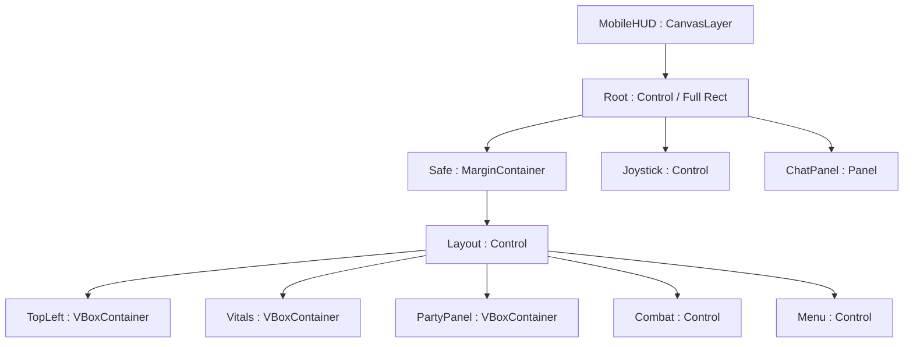
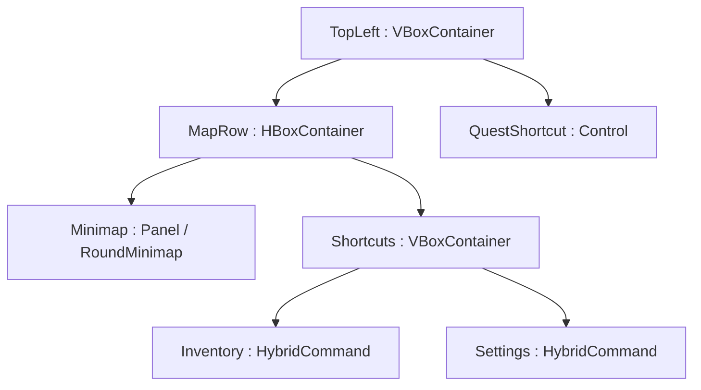

# HUD มือถือแบบ Genshin × ROO — v23

เวอร์ชันนี้ปรับจากโปรเจกต์ v22 จริง ใช้ Godot 4.4.1 / GDScript และภาพตัวละครเดิม
เปิด `project.godot` รอ import ให้จบ แล้วกด F5 บัญชีทดสอบ `demo / demo`

## ตำแหน่ง UI ที่ใช้

คำขอต้นทางระบุตำแหน่งมินิแมพและปาร์ตี้สลับกันบางส่วน เวอร์ชันนี้กำหนดมินิแมพ/เควสต์ที่ซ้ายบน และปาร์ตี้ที่ขวา
วางแถบ HP / DS / MP กลางล่าง และชุดปุ่มต่อสู้ขวาล่าง เพื่อให้บริเวณกลางฉากเปิดโล่ง

| พื้นที่ | เนื้อหา | หลักคิด UX |
| --- | --- | --- |
| ซ้ายบน | มินิแมพวงกลม, กระเป๋า, ตั้งค่า, ข้อความเควสต์ | ตัวอักษรมีเงา ไม่มีกรอบเควสต์ทึบ; แตะเควสต์เพื่อนำทางได้ |
| ซ้ายล่าง | Joystick, แชตพับได้เหนือ Joystick | ไม่ทับพื้นที่นิ้วเดิน; ขยายแชตแล้วซ่อน shortcut เควสต์ชั่วคราว |
| กลางล่าง | อิ่ม/แรงวงกลม, HP Tamer, HP คู่หู, DS และ MP | HP สูง 7 หน่วย, พลังงานสูง 4 หน่วย; ตัวเลขอยู่นอกหลอดจึงอ่านได้แม้หลอดบาง |
| ขวา | ทีมคู่หู 3 ช่องแนวตั้ง | แสดงรูป/HP ของแต่ละตัวจริง กรอบสีทองแสดงตัวที่ลงสนาม |
| ขวาล่าง | โจมตี 112×112, สกิล 4 ตำแหน่ง 72×72, Auto / Evolve / ชุดสกิล | สี่ตำแหน่งคงที่ช่วยจำตำแหน่งนิ้ว ช่องที่ไม่มีสกิลปิดใช้งาน |
| ขวาบน | เมนูเพิ่มเติมที่ยุบได้ | Status, ดิจิไวซ์, Quest Log และเปลี่ยนตัวละครยังเข้าถึงได้ |
| ขอบล่าง | เส้น EXP สีเหลือง | ไม่เพิ่มกรอบสถานะบนสนาม |

## โครงสร้าง Node หลัก





Node ย่อยของ `Vitals` และ `PartyPanel` สร้างครั้งเดียวใน `_ready()` ของสคริปต์แต่ละตัว:

| Node path ภายใต้ Root/Safe/Layout | ประเภท / สคริปต์ |
| --- | --- |
| Vitals/Needs/Hunger และ Stamina | `NeedsOrb` : Control |
| Vitals/TamerHeader และ PartnerHeader | HBoxContainer; ชื่อ/เลเวลฝั่งซ้าย ตัวเลข HP ฝั่งขวา |
| Vitals/TamerHP และ PartnerHP | `HybridVitalsBar` : ProgressBar |
| Vitals/Energy/DS และ MP | VBoxContainer; Label และ HybridVitalsBar |
| PartyPanel/Member0, Member1, Member2 | `HybridCommand` : Control; แต่ละปุ่มมี HP : HybridVitalsBar |
| Combat/SkillPanel/Skill0 ถึง Skill3 | `HybridCommand`; FormSkillPanel สร้างใหม่เมื่อเปลี่ยนหน้า/ร่าง |
| Combat/Attack และ Recover | สลับแสดงเฉพาะปุ่มที่เหมาะกับสถานะชีวิตคู่หู |
| Combat/Auto, Evolve, Cycle | ปุ่มกะทัดรัดใกล้นิ้วโจมตี |
| Combat/PageLabel | ชื่อชุดสกิล, ลำดับหน้า และข้อความล็อกเควสต์ |
| Menu/Drawer/Margin/Grid | PanelContainer → MarginContainer → GridContainer ของเมนูเพิ่มเติม |

`Root/EXPStrip`, `Root/TargetStatus` และแชตสร้างโดย `MobileHUD._build_extras()`
ข้อมูลทีมเก็บใน `Actors/Tamer/PartnerRoster` ซึ่งเป็น Node ข้อมูล ไม่มี Sprite หรือ Collider ของตัวสำรอง

## ไฟล์หลักที่แก้/เพิ่ม

| ไฟล์ | หน้าที่ |
| --- | --- |
| scenes/mobile_hud.tscn | Scene HUD หลักพร้อม anchors และ Container |
| scripts/mobile_hud.gd | ต่อ Signal, จัด layout และเชื่อมระบบเกมเดิม |
| scripts/hud/hud_safe_area.gd | แปลง safe area พิกเซลจอจริงเป็นหน่วย HUD |
| scripts/hud/skill_arc_layout.gd | คำนวณตำแหน่งสี่ช่องด้วย polar coordinates |
| scripts/form_skill_panel.gd | เปลี่ยนหน้า/รูปสกิล, ล็อกปุ่ม, อ่าน MP และ CD |
| scripts/hud/hybrid_command.gd | ปุ่มวงกลม, แผ่นดำคูลดาวน์ และเลข countdown |
| scripts/hud/hybrid_vitals.gd | หลอดกลางล่างและไอคอนอิ่ม/แรง |
| scripts/hud/hybrid_vitals_bar.gd | Tween หลอดแบบยกเลิก Tween เก่าก่อนเริ่มใหม่ |
| scripts/hud/hybrid_party_panel.gd | วาดสามสล็อตทีมและส่งคำสั่งสลับ |
| scripts/hud/partner_roster.gd | สถานะแยกของสมาชิก, สลับ actor และ serialize ทีม |
| scripts/hud/round_minimap.gd | ถนน/แม่น้ำ/marker จากข้อมูลแผนที่จริง ตัดขอบเป็นวงกลม |

ทุกไฟล์ข้างต้นมีคอมเมนต์ภาษาไทยในฟังก์ชัน ใช้ชื่อ `MobileJoystick` เดิม เพื่อหลีกเลี่ยงชื่อชนกับคลาสอื่น

## จัดปุ่มบนโค้งครึ่งวงกลม

สูตรจุดศูนย์กลางคือ `attack_center + Vector2(cos(angle), sin(angle)) * radius`
แกน Y ของ Godot ชี้ลง เลือกช่วง `-210° → -30°` จึงโอบด้านซ้ายและด้านบนของนิ้วโจมตีและเว้นพื้นที่ปุ่ม Auto ด้านล่าง
ช่วงกว้าง 180° จริง ปรับตำแหน่งเริ่ม/จบรอบปุ่มได้ใน Inspector ของ SkillPanel

```gdscript
# ตัวอย่างจาก skill_arc_layout.gd; อ่านไฟล์จริงสำหรับฟังก์ชันที่ใช้ซ้ำได้
var center := Vector2(222, 206)
var radius: float = 126.0
var button_size := Vector2(72, 72)

for index: int in range(4):
    # กระจายสี่จุดอย่างสม่ำเสมอ รวมปลายทั้งสองของครึ่งวงกลม
    var t: float = float(index) / 3.0
    var angle: float = deg_to_rad(lerpf(-210.0, -30.0, t))
    var point: Vector2 = center + Vector2(cos(angle), sin(angle)) * radius
    # Control ใช้มุมซ้ายบน ไม่ใช่จุดศูนย์กลาง
    buttons[index].position = point - button_size * 0.5
```

ปุ่มสกิลต้องอยู่ใน `Control` ธรรมดา ไม่อยู่ใน HBox/Grid เพราะ Container จะจัดตำแหน่งใหม่ทับค่า polar
ส่วนที่ต้องยืดหยุ่น เช่น ข้อความ, พลังงาน และสล็อตทีม ใช้ VBox/HBox/MarginContainer ตามปกติ

`FormSkillPanel` รักษาการสลับหน้าสกิลข้ามร่างที่มีอยู่ในโปรเจกต์เดิมไว้:
การเปลี่ยนหน้าไม่เปลี่ยน `current_form`, ATK, HP หรือ DS; คำสั่งสกิลตรวจ MP / CD / เควสต์ซ้ำก่อนส่งไป Partner
Auto-Battle ยังใช้ชุดสกิลของร่างที่ลงสนามจริง ไม่มีการปลดล็อก Ultimate ด้วยการเปิดดูหน้า

## คูลดาวน์บนปุ่ม

```gdscript
# ดึงสถานะจาก PartnerMonster ไม่ลด cooldown ใน HUD
var remaining: float = partner.cooldown_remaining(skill)
button.locked = remaining > 0.0 or partner.digimon_mp < skill.mp_cost
(button as HybridCommand).set_cooldown(remaining, skill.cooldown)
```

แผ่นดำวาดด้วย polygon รูปพัดตาม `remaining / duration` ตัวเลขใช้ `ceili(remaining)`
อ่าน CD 20 ครั้งต่อวินาที และตรวจค่าจริงอีกครั้งใน `_request_slot()` เมื่อแตะ
ตอนจบคัตซีนใช้ `evolution_changed` ปลดล็อกทันที ไม่ต้องรอรอบอัปเดตถัดไป
การเปลี่ยนหน้าถอดปุ่มเก่าจาก tree และใช้ revision ป้องกัน callback รุ่นเก่าสั่งสกิลผิดร่าง

## หลอด HP/DS/MP ลดอย่างนุ่มนวล

```gdscript
# ส่วนสำคัญของ HybridVitalsBar.set_vitals()
# Label ใช้ค่าจริงจาก Tamer/Partner ส่วน value เป็นภาพแสดงผลเท่านั้น
_kill_tween() # kill ก่อนเพื่อไม่ให้ Tween ครั้งเก่าแย่งเขียน value
_tween = create_tween().set_pause_mode(Tween.TWEEN_PAUSE_PROCESS)
_tween.tween_property(self, "value", goal, 0.28) \
    .set_trans(Tween.TRANS_CUBIC).set_ease(Tween.EASE_OUT)
```

ฟังก์ชันจริงตรวจ finite, clamp ค่าตาม max, ไม่สร้าง Tween ซ้ำเมื่อค่าเดิม และ snap เมื่อเปิด Reduce Motion
ถ้า max HP เปลี่ยนจากเลเวล/ร่าง จะรักษาอัตราส่วนภาพเดิมก่อน Tween ไปหาค่าจริง
เมื่อสลับสมาชิก ใช้ `update_values(tamer, partner, true)` เพื่อแสดง HP ของตัวใหม่ทันที
การตาย/ใช้สกิลอ่าน HP/MP จาก actor เสมอ ไม่อ่านค่าภาพหลอดที่กำลังเคลื่อนอยู่

## Responsive และรอยบาก

ตั้ง Project Settings: viewport 1280×720, stretch `canvas_items`, aspect `expand`, orientation Landscape
`HudSafeArea.for_viewport()` อ่าน `DisplayServer.get_display_safe_area()` เฉพาะมือถือ
เกมนี้ใช้หน้าต่างเต็มจอ จึงคูณขอบ safe area ด้วย `logical_size / physical_size` ก่อนเพิ่ม padding นิ้ว
หากเปลี่ยนเป็น embedded viewport หรือหน้าต่างไม่เต็มจอ ต้องแปลงพิกัด screen/window ของ viewport นั้นเพิ่มเติม

เมื่อ viewport เปลี่ยนขนาด `MobileHUD._layout()` อัปเดต theme margin ทั้งสี่ด้านของ `Root/Safe`
Combat ยึดขวาล่างและใช้ pivot ที่ขวาล่าง จึงขยายเป็น 115% เข้าด้านในพื้นที่ปลอดภัย
หลอดกลางคำนวณความกว้างจากพื้นที่ที่เหลือหลังเว้น Joystick และ Combat ส่วนจอเตี้ยย่อสล็อตทีมเป็น 76×76
แชตไม่ทับ Joystick และยกเหนือคีย์บอร์ดเท่าที่จำเป็น ไม่บวก keyboard height ซ้ำกับระยะห่าง Joystick

## สลับคู่หูจริงและรับเพื่อนใหม่

เกมเริ่มด้วย starter ที่เลือกหนึ่งตัวและอีกสองช่องว่าง ใช้ไข่ Digitama ในกระเป๋าเพื่อสุ่มสายที่ยังไม่มี
เมื่อทีมเต็มหรือไม่มีสายใหม่ จะไม่กินไข่ เกมต้นแบบนี้รองรับหนึ่งตัวต่อสายและรวมสูงสุด 3 ตัว
ไอคอนทีมทั้งสามในภาพตัวอย่างสร้างเฉพาะ `tools/hybrid_preview.gd` เพื่อแสดงการจัดวางครบทีม

```gdscript
# ให้คู่หูจากรางวัลเควสต์/ระบบฟักที่คุณต่อยอดเอง
if tamer.party_roster.add_partner(&"gabumon"):
    tamer.save_party_progress()

# MobileHUD ต่อ Signal หน้าจอเข้ากับ backend
party_panel.switch_requested.connect(_switch_party)
party_roster.switched.connect(_on_party_switched)

func _switch_party(index: int) -> void:
    if partner.evolution_busy or get_tree().paused:
        return
    release_for_equipment() # ปล่อยนิ้วและคำสั่งเดินที่ค้างอยู่
    party_roster.select_member(index)

func _on_party_switched(_index: int) -> void:
    # ค่าคนละตัวไม่ควรค่อย ๆ ไหลจากหลอดตัวเก่า
    party_status.update_values(tamer, partner, true)
```

`PartnerRoster.select_member()` ตรวจ index/pause/cutscene ซ้ำใน backend และยกเลิกเป้าหมาย/ท่าร่ายของตัวเก่า
เก็บ `id`, `form_id`, HP/max HP, MP, level/EXP, egg, cooldowns และ basic cooldown ของแต่ละสมาชิก
ใช้ CharacterBody2D คู่หู Node เดิม เปลี่ยน forms/SpriteFrames/สเตตัส จึงรักษา reference ของ Tamer, Loot, Safe Zone และศัตรูไว้ได้
สมาชิกสำรองไม่ฟื้น HP ฟรี ไม่รับ EXP จากสนาม และ cooldown ยังลดตามเวลาเกมที่ไม่ pause
สลับกลับตัวที่แพ้จะยังเป็นไข่ HP0 ต้อง Recover; ถ้า Tamer อ่อนแอ ร่างสูงจะกลับ Rookie โดยรักษา %HP

## การเซฟและโหลด

เพิ่ม `partner_roster` ใน `Tamer.capture_party_state()` ใช้ Dictionary ข้อมูลธรรมดา ไม่ serialize Node/Resource
`story_world.gd` คืน HP/เลเวล/Survival เดิมก่อน initialize ทีม แล้วจึง bind Inventory เพื่อไม่ให้ changed เซฟข้อมูลที่ยังไม่ครบ
เซฟ v22/v15 ที่ไม่มี partner_roster จะย้ายคู่หูตัวเดิมพร้อม HP/MP/ร่าง/เลเวลเข้าช่องแรก
ใน v23 ข้อมูลสมาชิก active ภายใน roster เป็นข้อมูลหลัก; top-level hp/form_id/partner_progress เป็น mirror สำหรับความเข้ากันได้
หากแก้ fixture เซฟด้วยมือ ต้องแก้สมาชิก active ใน roster ด้วย ไม่แก้เฉพาะ mirror

## ทดสอบและภาพหน้าจอ

เปิด `tests/hybrid_hud_test.tscn` แล้ว F6 เพื่อตรวจ safe area / 115% / CD / HP Tween / touch party / ไข่ / เซฟข้ามฉาก
เปิด `tools/hybrid_preview.tscn` แล้ว F6 เพื่อจับภาพจริงแบบ 16:9, จอกว้างจำลอง notch และแท็บเล็ต
ภาพจริงอยู่ใน `docs/previews/hybrid_v23/` และผลตรวจชุดทดสอบอยู่ใน `HYBRID_TEST_RESULTS_V23.json`
ผลรันในคอมพิวเตอร์ไม่ใช่ผลทดสอบมือถือจริง ควรตรวจ notch/ความร้อน/FPS บนอุปกรณ์เป้าหมายอีกครั้ง

## Android

APK ทดสอบชื่อ `DigitalAdventure_v23_HybridHUD_test.apk` ใช้ package `org.digitaladventure.mobiletest`
versionCode 23 และกุญแจทดสอบเดียวกับ v22 จึงติดตั้งอัปเดตทับได้หาก APK เดิมใช้กุญแจนั้น
preset `Android Test` ใช้ Compatibility, ARM32/ARM64, Export With Debug และไม่ใช้ Gradle
ข้อมูลเกมและทีมเป็น offline prototype ตามระบบเดิม

## เอกสารอ้างอิง Godot

- [DisplayServer.get_display_safe_area](https://docs.godotengine.org/en/4.4/classes/class_displayserver.html#class-displayserver-method-get-display-safe-area)
- [Control anchors และ layout](https://docs.godotengine.org/en/4.4/classes/class_control.html)
- [Tween ของ Godot 4](https://docs.godotengine.org/en/4.4/classes/class_tween.html)
