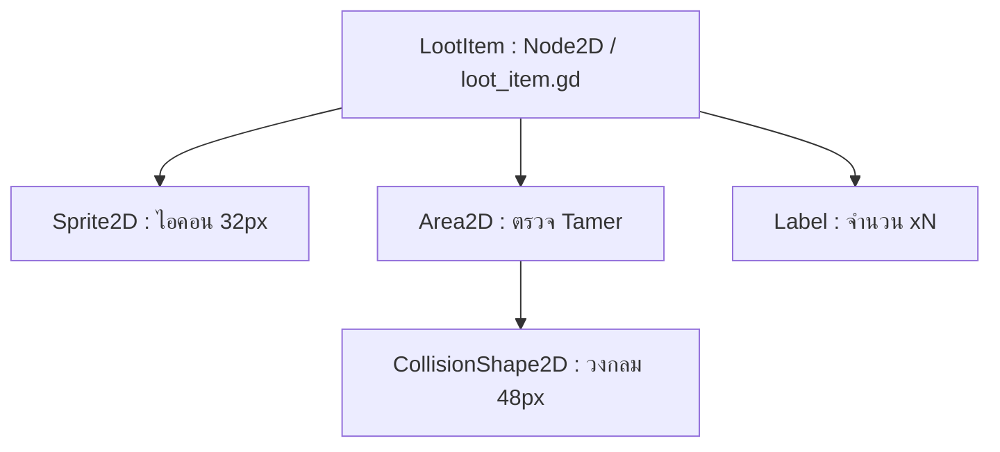
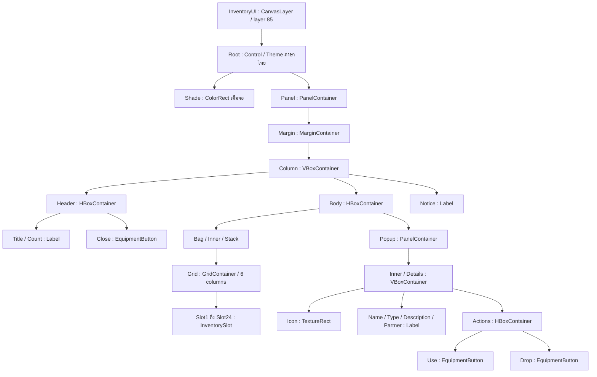
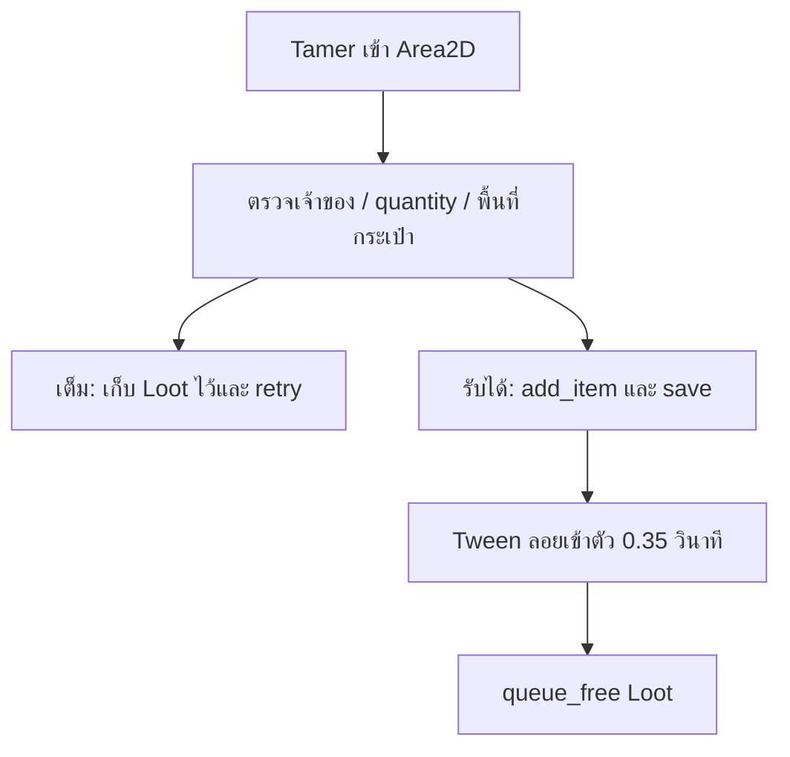

# Godot v17 — กระเป๋าไอเทมและระบบดรอป

โปรเจกต์นี้ต่อยอดจาก v16 ที่แก้ ZIP แล้ว ใช้ Godot Standard 4.4.1 / Compatibility / Landscape 1280×720 / canvas_items มี Native Control UI และ GDScript คอมเมนต์ภาษาไทย

## เริ่มใช้งาน

1. แตก ZIP ลงโฟลเดอร์ใหม่ `mobile_inventory_v17` แล้ว Import `project.godot`
2. กด F5: Loading → Login จำลอง → เลือก/สร้าง Tamer → เลือก Starter → Gameplay
3. ทดลอง Username `demo` / Password `demo` เลือก Server เดิมเพื่อใช้ตัวละครเดิม
4. โจมตีมอนสเตอร์ป่า เมื่อ HP=0 จะสุ่มดรอปตาม Resource `data/items/default_loot.tres`
5. เดินเข้าใกล้ไอคอนบนพื้น Tamer เก็บในรัศมี 48px มี Tween ดูดเข้าตัว
6. แตะ **กระเป๋า** ใต้ปุ่มอุปกรณ์ด้านบนขวา เลือกสล็อต → ดูรายละเอียด → ใช้หรือทิ้ง 1 ชิ้น
7. ทดสอบครบโดยเปิด `tools/inventory_preview.tscn` แล้วกด F6: Scene สาธิตใช้เซฟ `user://inventory_preview_v17.json` แยกจากเซฟจริง ตั้งดรอป 100% เฉพาะฉากสาธิต มีเนื้อ x10 ชิป x3 ไข่ x1 และใช้เนื้อให้ดู ก่อนหยุดอยู่หน้าไข่เพื่อให้ลองเอง

## Node Tree: ไอเทมบนพื้น



Scene: `res://scenes/loot_item.tscn`
Root ตั้ง `z_index=1` ไอคอนอยู่เหนือเท้าเล็กน้อย ไม่มี collision กับทางเดิน
Area2D ตั้ง `collision_layer=0`, `collision_mask=2` เพื่อตรวจ Tamer ที่อยู่ Physics Layer 2; เปิด `monitoring` และปิด `monitorable`
เชื่อม `body_entered` ใน `_ready()` ของ Script อัตโนมัติ ไม่ต้องเชื่อมซ้ำใน Editor
Loot เป็นลูก `Actors` แยกจาก WildMonster จึงยังอยู่หลังมอนสเตอร์ถูกลบ

## Node Tree: หน้ากระเป๋า Mobile



Scene: `res://scenes/inventory_ui.tscn`
`InventoryUI` เป็นลูกของ `MobileHUD : CanvasLayer` สร้างโดย `_build_inventory_ui()` แยกจากหน้าอุปกรณ์เดิม
สล็อตเป็น Control ที่วาดกรอบ/ไอคอน และใช้ `TouchCommand` รองรับ finger index จริง ไม่ต้องเปิด emulate_mouse_from_touch ในสนาม
GridContainer จัดช่องให้เป็น 6×4 รูปไอคอน 50px ชื่อด้านล่าง จำนวนมุมขวา เมื่อแตะช่อง Popup ด้านขวาจะแสดงข้อมูล
เลือกไอเทมด้วย ID แล้วหา index ใหม่เมื่อกด Use/Drop ป้องกัน index เก่าชี้ผิดชนิดหลัง stack แรกถูกลบ
เปิดกระเป๋าแล้ว SceneTree pause; UI ใช้ PROCESS_MODE_ALWAYS และคืน pause เมื่อปิด/ออก Scene จึงใช้ไอเทมและ Touch ขณะเกมหยุดได้
เมื่อ Popup เปลี่ยนขนาด Container จะจัด layout ใหม่ในเฟรมถัดไป

## โครงสร้างข้อมูล

| ไฟล์ | หน้าที่ |
|---|---|
| `scripts/item_data.gd` | Template Resource ของไอเทม |
| `scripts/item_catalog.gd` | ฐานข้อมูล Array[ItemData] ค้นจาก item_id |
| `scripts/loot_drop_entry.gd` | Item, Chance, Min/Max Quantity หนึ่งแถว |
| `scripts/loot_table.gd` | Resource ตารางดรอปและฟังก์ชัน roll |
| `scripts/InventoryManager.gd` | Autoload เก็บ stack/use/drop/save |
| `scripts/loot_item.gd` | Area2D รับ Tamer / Tween / retry / queue_free |
| `scripts/inventory_ui.gd` | Grid และ Popup Use/Drop |
| `scripts/inventory_slot.gd` | วาดช่องไอคอน/จำนวน |
| `scripts/wild_monster.gd` | เรียก `_spawn_loot()` จาก HP==0 ก่อน died/queue_free |
| `scripts/partner_monster.gd` | `restore_hp(amount)` คืนจำนวน HP ที่ฟื้นจริง |
| `scripts/story_world.gd` | คืน inventory ของตัวละครหลังคืน HP/ร่าง |
| `scripts/tamer.gd` | บันทึก inventory ใน party snapshot เดียวกับ HP/EXP/อุปกรณ์ |

`GameManager`, `QuestManager` และ `InventoryManager` เป็น Autoload ตาม `project.godot` ที่ตั้งให้แล้ว
หากย้ายเข้าโปรเจกต์อื่น: Project → Project Settings → Globals/Autoload → Path `res://scripts/InventoryManager.gd` → Name `InventoryManager` → Enable
ห้ามเพิ่ม `class_name InventoryManager` ใน Script เดียวกัน เพราะชนชื่อ Autoload

ItemData เป็นข้อมูลร่วมแบบอ่านอย่างเดียว จำนวนจริงเก็บใน Manager เป็น Array[Dictionary]: `{"item":ItemData, "quantity":int}`
หนึ่ง item_id ใช้หนึ่งช่อง ซ้อนสูงสุด 999 ชิ้น กระเป๋า 24 ชนิด `add_item` รับครบจำนวนหรือไม่รับเลย เมื่อเต็มของยังอยู่บนพื้นเพื่อเก็บภายหลัง
ตัวแปร `max_slots` / `max_stack` อยู่ใน Autoload Script; UI รุ่นนี้มี 24 ช่อง จึงตั้ง max_slots ได้ 1–24

| item_id | ประเภท | effect_value | การใช้งาน |
|---|---|---:|---|
| `meat` | CONSUMABLE | 80 | ฟื้น HP คู่หูปัจจุบันเท่าที่ขาด สูงสุด 80 |
| `data_chip` | QUEST_ITEM | 0 | เก็บเป็นของเควสต์; ชิปสวมใส่เดิมใช้หน้าอุปกรณ์ |
| `digitama` | EGG | 101 | เก็บรหัสชนิดสำหรับต่อยอดสแกน/ฟักไข่ |

รุ่นนี้ทำ **การดรอป/ถือครองไข่และชิป**; การฟักไข่และเงื่อนไขเควสต์รับชิปยังเป็นจุดต่อยอด จึงปิดปุ่ม Use ของสองประเภทนี้
เนื้อไม่ใช้ชุบคู่หูที่ HP=0/เป็นไข่ ใช้ Recover เดิมก่อน ไม่กินของเมื่อ HP เต็มหรือกำลังเปลี่ยนร่าง

## สร้างไอเทมและตารางดรอปใน Inspector

1. FileSystem → คลิกขวา `data/items` → New Resource → ItemData → ตั้งค่าตัวแปรแล้ว Save `.tres`
2. กำหนด item_id ไม่ซ้ำ และไฟล์ไอคอนใน item_texture; เพิ่ม Resource ที่สร้างเข้า `data/items/catalog.tres` → Items
3. สร้าง Resource LootTable → Entries → เพิ่ม LootDropEntry → ลาก ItemData ลง Item
4. Chance เป็นเลข **0–1**: 0.75 = 75%; 1 = แน่นอน; 0 = ไม่ดรอป
5. Min/Max Quantity เป็นจำนวนรวมของไอคอนหนึ่งกอง เช่น 1–2
6. เลือก WildMonster Scene → ช่อง Drop Table → ลาก LootTable ที่ต้องการลงไป
7. ปิด Loot Enabled สำหรับ NPC/ศัตรูทดสอบที่ไม่ควรดรอป

ตารางตัวอย่าง: เนื้อ 75% จำนวน 1–2, ชิป 35% จำนวน 1, ไข่ 8% จำนวน 1
แต่ละแถวสุ่มอิสระ ไม่ใช่การเลือกเพียงหนึ่งชนิด ศัตรูหนึ่งตัวอาจดรอปหลายชนิดหรือไม่ดรอปเลย
การย้าย Scene/ลบ Spawner ไม่ดรอป เพราะตรวจเฉพาะ HP==0 ไม่ผูกกับ tree_exited

## การเก็บของและเอฟเฟกต์



ตั้ง `_claimed` ก่อนเรียก add_item ป้องกัน body_entered/retry ซ้ำ ถ้ากระเป๋ารับไม่ได้คืน flag และลองใหม่ทุก 0.5 วินาที จึงไม่ต้องเดินออกเข้า Area อีกครั้ง
Commit ลงกระเป๋าก่อนเล่น Tween เพื่อให้ไอเทมยังอยู่หากเปลี่ยน Scene ระหว่างเอฟเฟกต์ Tween ใช้ WeakRef อ่านตำแหน่ง Tamer ทุกเฟรม
Loot ที่ทิ้งจาก UI มี pickup_delay 1 วินาทีและวางข้าง Tamer 55px เพื่อไม่ดูดกลับทันที
Loot ทั่วไปมี lifetime 120 วินาที; ตั้ง 0 หากต้องการคงไว้ตลอด Scene การวาร์ป/ออกเกมล้างของบนพื้น แต่จำนวนที่เก็บแล้วอยู่ในเซฟ

## ฟื้น HP ผ่านสัญญาณและบันทึกข้อมูล

`bind_player()` เชื่อม `InventoryManager.heal_requested` กับคู่หูปัจจุบัน `restore_hp()`
`use_item()` ตรวจชนิด/HP/state → ส่ง heal_requested → วัด HP ที่ฟื้นจริง → ลดจำนวนหนึ่ง → changed → save → item_used/feedback
Manager กันการเรียกซ้อนระหว่างธุรกรรม เมื่อเปลี่ยนผู้เล่นจะถอด signal ของเจ้าของเก่า แล้วผูกคู่หูใหม่
`restore_hp()` แจ้ง hp_changed เพื่ออัปเดต HUD แต่ไม่ save ก่อนจำนวนในกระเป๋าถูกลด; เซฟรวมทั้ง HP และ quantity หลัง commit

```gdscript
# World: เรียกหลังคืน HP / ร่าง / อุปกรณ์แล้ว
InventoryManager.bind_player(tamer, saved_inventory)

# รางวัลเควสต์หรือโค้ดทดสอบ
var meat: ItemData = load("res://data/items/meat.tres")
InventoryManager.add_item(meat, 10)

# UI จำ ID ไม่ใช้ index ที่อาจเปลี่ยนหลังลบ stack
InventoryManager.use_item(InventoryManager.index_of("meat"))
InventoryManager.drop_item(InventoryManager.index_of("meat"), 1)
```

ข้อมูล JSON อยู่ใน `party.inventory = {"version":1,"stacks":[{"id":"meat","quantity":10}]}`
เซฟใหม่ใช้ `user://profiles/<hash บัญชี+Server>/slot_N_story.json` ตาม GameManager v16; การวาร์ปคง inventory ใน party_snapshot
อ่าน saved_inventory ก่อน `party_snapshot.clear()` เพราะ Dictionary อาจอ้างตัวเดียวกัน
เซฟ v15/v16 ที่ไม่มี inventory ได้กระเป๋าว่าง อุปกรณ์/HP/EXP เดิมยังถูกคืนตามระบบเดิม
ไฟล์ JSON ไม่มี Node, Resource หรือ Texture และ restore กรอง ID ที่ไม่รู้จัก/จำนวนผิด/เศษส่วน/NaN พร้อมรวม ID ซ้ำ

## ทดสอบและขอบเขต

รัน `res://tests/inventory_loot_test.tscn` แบบ headless หรือเปิด F6: ทดสอบ 53 ข้อเช็กจาก World จริง ทั้งการชน Area2D, RNG, HP, Touch/UI, ขนาดกรอบ, JSON/disk, เปลี่ยน Scene และ pause ownership
รวมระบบเดิมทั้งหมด 16 ชุด / 606 ข้อเช็ก ผ่านบน Godot 4.4.1 Linux; logs และผลอยู่ `docs/test_logs/` กับ `INVENTORY_TEST_RESULTS.json`
ตัวเลข Animation/Tween ในชุด Damage Popup ตรวจด้วย --fixed-fps 60 เพื่อให้ช่วง Pop ที่สั้นวัดตาม simulated time คงที่
รอบนี้ไม่มีภาพจาก renderer Native เพราะ DisplayServer ของสภาพแวดล้อมทดสอบเปิดไม่ได้; ขนาดและตำแหน่ง Control ตรวจจาก Node จริงใน headless และมี Scene สาธิตให้เปิดบน Windows
ยังไม่ได้ทดสอบ APK/โทรศัพท์จริง Login/Server และ Inventory เป็น local offline prototype ตามโปรเจกต์เดิม

เอกสาร API อ้างอิง: [Resource](https://docs.godotengine.org/en/stable/classes/class_resource.html), [Area2D](https://docs.godotengine.org/en/stable/classes/class_area2d.html), [Tween](https://docs.godotengine.org/en/stable/classes/class_tween.html), [GridContainer](https://docs.godotengine.org/en/stable/classes/class_gridcontainer.html)

## โค้ด GDScript ฉบับเต็ม

ส่วนต่อไปนี้เป็น Script จริงจากโปรเจกต์ ใช้ path ตามหัวข้อ ไม่ต้องสร้างไฟล์ชื่อซ้ำถ้าใช้ ZIP ที่ให้มา

### scripts/item_data.gd

```gdscript
class_name ItemData
extends Resource
## ข้อมูลต้นแบบเท่านั้น: จำนวนที่ถืออยู่ต้องเก็บใน InventoryManager ไม่แก้ Resource ร่วมกัน
enum ItemType { CONSUMABLE, QUEST_ITEM, EGG }
@export var item_id: String = ""
@export var item_name: String = ""
@export var item_type: ItemType = ItemType.CONSUMABLE
@export var item_texture: Texture2D
@export_multiline var description: String = ""
@export var effect_value: int = 0

func type_label() -> String:
    # ชื่อที่ UI ใช้ แยกจากเลข Enum ที่เก็บใน Resource
    return ["ฟื้นฟูคู่หู", "ไอเทมเควสต์", "ไข่ดิจิมอน"][clampi(item_type, 0, 2)]
```

### scripts/item_catalog.gd

```gdscript
class_name ItemCatalog
extends Resource
## รวมฐานข้อมูลไว้จุดเดียว โหลดจาก ID เมื่อคืนเซฟ ไม่บันทึก Texture ลง JSON
@export var items: Array[ItemData] = []

func find_item(id: String) -> ItemData:
    # คืน null เมื่อ ID ไม่อยู่ในฐานข้อมูล เพื่อปฏิเสธไอเทม/เซฟที่ไม่รู้จัก
    for item: ItemData in items:
        if item != null and item.item_id == id:
            return item
    return null
```

### scripts/loot_drop_entry.gd

```gdscript
class_name LootDropEntry
extends Resource
## หนึ่งแถวของตารางดรอป โอกาสเป็น 0–1 ไม่ใช่เปอร์เซ็นต์ 0–100
@export var item: ItemData
@export_range(0.0, 1.0, 0.01) var chance: float = 0.5
@export_range(1, 999) var min_quantity: int = 1
@export_range(1, 999) var max_quantity: int = 1
```

### scripts/loot_table.gd

```gdscript
class_name LootTable
extends Resource
## สุ่มอิสระแต่ละแถว: ศัตรูหนึ่งตัวอาจดรอปหลายชนิดหรือไม่ดรอปเลย
@export var entries: Array[LootDropEntry] = []

func roll(rng: RandomNumberGenerator) -> Array[Dictionary]:
    # รับ RNG ภายนอกเพื่อกำหนด seed ทดสอบได้ และไม่แก้ไขค่าใน Resource
    var result: Array[Dictionary] = []
    for entry: LootDropEntry in entries:
        if entry == null or entry.item == null or entry.item.item_id.is_empty():
            continue
        var probability: float = clampf(entry.chance, 0.0, 1.0)
        if probability <= 0.0 or rng.randf() >= probability:
            continue
        var minimum: int = clampi(entry.min_quantity, 1, 999)
        var maximum: int = clampi(entry.max_quantity, minimum, 999)
        result.append({"item":entry.item, "quantity":rng.randi_range(minimum, maximum)})
    return result
```

### scripts/InventoryManager.gd

```gdscript
extends Node
## Autoload ชื่อ InventoryManager ไม่ประกาศ class_name ซ้ำกับ Singleton
## เก็บสถานะกระเป๋าของตัวละครที่กำลังเล่น Resource เป็นข้อมูลอ่านอย่างเดียว
signal changed
signal feedback(message: String)
signal item_used(item: ItemData, restored_hp: int)
signal heal_requested(amount: int)
signal item_picked_up(item: ItemData, quantity: int)
const CATALOG_PATH: String = "res://data/items/catalog.tres"
const LOOT_SCENE_PATH: String = "res://scenes/loot_item.tscn"
@export_range(1, 24) var max_slots: int = 24
@export_range(1, 999) var max_stack: int = 999
var catalog: ItemCatalog
var _items: Array[Dictionary] = []
var _player: WeakRef
var _busy: bool = false

func _ready() -> void:
    # โหลดฐานข้อมูลครั้งเดียว ข้อมูลสามชนิดมีขนาดเล็กและไม่มี Scene โลกเป็น dependency
    catalog = load(CATALOG_PATH) as ItemCatalog

func bind_player(player: Node, saved_data: Dictionary = {}) -> void:
    # เรียกหลัง World คืนเซฟ ห้ามใช้กระเป๋าของตัวละครก่อนหน้าเป็นค่าเริ่มต้น
    var previous: Node = player_node()
    if is_instance_valid(previous) and changed.is_connected(previous.save_party_progress):
        changed.disconnect(previous.save_party_progress)
    if is_instance_valid(previous) and is_instance_valid(previous.partner) and heal_requested.is_connected(previous.partner.restore_hp):
        heal_requested.disconnect(previous.partner.restore_hp)
    _player = weakref(player)
    restore_data(saved_data)
    changed.connect(player.save_party_progress)
    heal_requested.connect(player.partner.restore_hp)
    changed.emit()

func player_node() -> Node:
    # WeakRef ไม่ยื้อ Node ของ Scene เก่า และไม่เรียกสมาชิกบน Object ที่ถูก free แล้ว
    return _player.get_ref() if _player != null else null

func items() -> Array[Dictionary]:
    # UI ได้สำเนารายการ เพื่อไม่แก้ quantity ของจริงโดยข้ามฟังก์ชันตรวจเงื่อนไข
    return _items.duplicate(true)

func item_at(index: int) -> ItemData:
    # ปฏิเสธ index เก่า/นอกขอบ เพราะลบ stack แล้วลำดับ Array เปลี่ยนได้
    return _items[index].item if index >= 0 and index < _items.size() else null

func index_of(id: String) -> int:
    # UI จำ ID แล้วค้น index ใหม่ทุกครั้ง ไม่ผูกปุ่ม Use กับเลข index ค้างไว้
    for index: int in range(_items.size()):
        if _items[index].item.item_id == id:
            return index
    return -1

func count(id: String) -> int:
    # รวมจำนวนจาก stack ของ ID เดียว รุ่นนี้หนึ่ง ID ใช้หนึ่งช่องและเพดาน max_stack
    var index: int = index_of(id)
    return int(_items[index].quantity) if index >= 0 else 0

func _fail(message: String) -> bool:
    feedback.emit(message)
    return false

func add_item(item: ItemData, quantity: int = 1) -> bool:
    # รับครบจำนวนหรือไม่รับเลย เพื่อให้ Loot บนพื้นไม่หายเมื่อ stack/กระเป๋าเต็ม
    if _busy or item == null or quantity <= 0 or catalog == null:
        return false
    var canonical: ItemData = catalog.find_item(item.item_id)
    if canonical == null:
        return _fail("ไอเทมนี้ไม่อยู่ในฐานข้อมูล")
    var index: int = index_of(canonical.item_id)
    if quantity > max_stack - count(canonical.item_id):
        return _fail("จำนวนไอเทมเกินเพดานซ้อน เก็บเพิ่มไม่ได้")
    if index < 0 and _items.size() >= max_slots:
        return _fail("กระเป๋าเต็ม ไอเทมยังอยู่บนพื้น")
    if index < 0:
        _items.append({"item":canonical, "quantity":quantity})
    else:
        _items[index].quantity += quantity
    changed.emit()
    return true

func use_item(item_index: int) -> bool:
    # ตรวจทุกเงื่อนไขก่อนลดจำนวน ไม่กินเนื้อเมื่อ HP เต็ม/คู่หูสลบ/กำลังเปลี่ยนร่าง
    var item: ItemData = item_at(item_index)
    var player: Node = player_node()
    if _busy or item == null or not is_instance_valid(player):
        return false
    if item.item_type != ItemData.ItemType.CONSUMABLE:
        return _fail("ไข่เก็บไว้สำหรับระบบฟัก ส่วนชิปข้อมูลใช้เป็นไอเทมเควสต์")
    var partner: Node = player.partner
    if not is_instance_valid(partner) or not partner.is_alive():
        return _fail("คู่หูสลบ ใช้ Recover ก่อนใช้เนื้อ")
    if partner.evolution_busy:
        return _fail("รอคัตซีนเปลี่ยนร่างจบก่อน")
    if item.effect_value <= 0 or partner.hp >= partner.max_hp:
        return _fail("HP เต็มแล้ว ไอเทมยังอยู่ในกระเป๋า")
    _busy = true
    var previous_hp: int = partner.hp
    heal_requested.emit(item.effect_value) # คู่หูที่ bind อยู่รับคำสั่งฟื้น HP
    var healed: int = maxi(0, int(partner.hp) - previous_hp)
    if healed <= 0:
        _busy = false
        return false
    _remove(item_index, 1)
    _busy = false
    changed.emit() # save รวม HP และกระเป๋าหลัง commit พร้อมกัน
    item_used.emit(item, healed)
    feedback.emit("ใช้ %s — คู่หู HP +%d" % [item.item_name, healed])
    return true

func _remove(index: int, quantity: int) -> void:
    # ฟังก์ชันภายใน เรียกหลัง validation แล้ว จำนวนเป็นศูนย์จึงลบ stack
    _items[index].quantity -= quantity
    if _items[index].quantity <= 0:
        _items.remove_at(index)

func drop_item(item_index: int, quantity: int = 1) -> bool:
    # ทิ้งเป็น Loot จริง มีช่วงหน่วงก่อนดูดกลับ ไม่ลบของทิ้งถ้าไม่มี World รองรับ
    var item: ItemData = item_at(item_index)
    var player: Node2D = player_node() as Node2D
    if _busy or item == null or quantity <= 0 or quantity > int(_items[item_index].quantity) or not is_instance_valid(player):
        return false
    if player.partner.evolution_busy:
        return _fail("รอคัตซีนเปลี่ยนร่างจบก่อน")
    var parent: Node2D = player.get_parent() as Node2D
    if parent == null:
        return false
    var loot: Node2D = create_loot(item, quantity, parent, player.global_position + Vector2(55, 12), 1.0)
    if loot == null:
        return false
    _remove(item_index, quantity)
    changed.emit()
    feedback.emit("วาง %s x%d บนพื้น" % [item.item_name, quantity])
    return true

func create_loot(item: ItemData, quantity: int, parent: Node2D, at: Vector2, pickup_delay: float = 0.15) -> Node2D:
    # ใช้ร่วมกันทั้ง Drop จาก UI และมอนสเตอร์ ตั้งข้อมูล/พิกัดก่อน add_child
    if item == null or quantity <= 0 or not is_instance_valid(parent) or catalog.find_item(item.item_id) == null:
        return null
    var scene: PackedScene = load(LOOT_SCENE_PATH) as PackedScene
    if scene == null:
        return null
    var loot: Node2D = scene.instantiate() as Node2D
    loot.set("item", item)
    loot.set("quantity", quantity)
    loot.set("pickup_delay", maxf(0.0, pickup_delay))
    loot.position = parent.to_local(at)
    parent.add_child(loot)
    return loot

func get_save_data() -> Dictionary:
    # JSON มีแต่ ID/quantity ไม่เก็บ Resource, Node หรือ Texture ลงไฟล์
    var stacks: Array[Dictionary] = []
    for entry: Dictionary in _items:
        stacks.append({"id":entry.item.item_id, "quantity":int(entry.quantity)})
    return {"version":1, "stacks":stacks}

func restore_data(data: Dictionary) -> void:
    # เซฟเก่าที่ไม่มี inventory ได้กระเป๋าว่าง; เซฟว่างไม่แจกของซ้ำเมื่อเข้า Scene ใหม่
    _items.clear()
    var stacks: Variant = data.get("stacks", [])
    if not stacks is Array or catalog == null:
        return
    for entry: Variant in stacks:
        if not entry is Dictionary:
            continue
        var item: ItemData = catalog.find_item(str(entry.get("id", "")))
        var number: Variant = entry.get("quantity", 0)
        if item == null or not (number is int or number is float):
            continue
        if not is_finite(float(number)) or float(number) <= 0 or floorf(float(number)) != float(number):
            continue
        var quantity: int = int(minf(float(number), float(max_stack)))
        var index: int = index_of(item.item_id)
        if index >= 0:
            _items[index].quantity = mini(max_stack, int(_items[index].quantity) + quantity)
        elif _items.size() < max_slots:
            _items.append({"item":item, "quantity":quantity})
```

### scripts/loot_item.gd

```gdscript
class_name LootItem
extends Node2D
## Loot เป็นลูก Actors/World แยกจากศัตรู จึงยังอยู่หลังศัตรู queue_free
@export var item: ItemData
@export_range(1, 999) var quantity: int = 1
@export var pickup_delay: float = 0.15
@export var lifetime: float = 120.0
@onready var area: Area2D = $Area2D
@onready var sprite: Sprite2D = $Sprite2D
@onready var quantity_label: Label = $Quantity
var _claimed: bool = false
var _age: float = 0.0
var _retry_left: float = 0.0
var _start: Vector2
var _collector: WeakRef
var _notice_left: float = 0.0

func _ready() -> void:
    # Sprite แสดงไอคอนจาก Resource ขนาดประมาณ 32px ไม่ใช่ภาพเต็ม Character
    add_to_group("ground_loot")
    if item == null or item.item_texture == null or quantity <= 0:
        queue_free()
        return
    sprite.texture = item.item_texture
    sprite.scale = Vector2.ONE * (32.0 / maxf(1.0, maxf(sprite.texture.get_width(), sprite.texture.get_height())))
    quantity_label.text = "x%d" % quantity
    area.body_entered.connect(_on_body_entered)

func _physics_process(delta: float) -> void:
    # Retry เมื่อกระเป๋าเต็มแล้วผู้เล่นเคลียร์ช่องโดยยังยืนอยู่ใน Area ไม่ต้องเดินออกเข้าใหม่
    _age += delta
    _notice_left = maxf(0.0, _notice_left - delta)
    if _claimed:
        return
    if lifetime > 0.0 and _age >= lifetime:
        queue_free()
        return
    if _age < pickup_delay:
        return
    _retry_left -= delta
    if _retry_left <= 0.0:
        _retry_left = 0.5
        for body: Node2D in area.get_overlapping_bodies():
            _on_body_entered(body)
            if _claimed:
                break

func _on_body_entered(body: Node2D) -> void:
    # รับเฉพาะ Tamer ปัจจุบัน คู่หู/ศัตรูไม่เก็บของ; flag กัน callback ซ้ำแจกไอเทมหลายครั้ง
    if _claimed or _age < pickup_delay or not body is Tamer or body != InventoryManager.player_node():
        return
    if _notice_left > 0.0:
        return
    _claimed = true
    if not InventoryManager.add_item(item, quantity):
        _claimed = false
        _notice_left = 2.0
        return
    # Commit ของเข้ากระเป๋าก่อน Tween ป้องกัน Scene เปลี่ยน/ผู้เก็บหายระหว่างเอฟเฟกต์แล้วของสูญหาย
    InventoryManager.item_picked_up.emit(item, quantity)
    _collector = weakref(body)
    _start = global_position
    area.set_deferred("monitoring", false)
    var tween: Tween = create_tween().set_parallel(true)
    tween.tween_method(_float_to_collector, 0.0, 1.0, 0.35).set_trans(Tween.TRANS_QUAD).set_ease(Tween.EASE_IN)
    tween.tween_property(self, "modulate:a", 0.0, 0.35)
    tween.chain().tween_callback(queue_free)

func _float_to_collector(weight: float) -> void:
    # อ่านตำแหน่ง Tamer ทุกเฟรม จึงดูดตามตัวที่กำลังเดินโดยไม่ dereference Object ถูก free
    var collector: Node2D = _collector.get_ref() as Node2D
    if is_instance_valid(collector):
        global_position = _start.lerp(collector.global_position + Vector2(0, -35), weight)
        global_position.y -= sin(weight * PI) * 24.0
```

### scripts/inventory_ui.gd

```gdscript
class_name InventoryUI
extends CanvasLayer
## หน้าจอ Mobile ใช้ GridContainer จัดช่อง และ TouchCommand แยกนิ้วแบบเดียวกับเกม
## Pause เฉพาะช่วงเปิด จึงหยุดการต่อสู้ขณะเลือกของ แต่ UI ทำงาน PROCESS_MODE_ALWAYS
var player: Node
var hud: CanvasLayer
var is_open: bool = false
var selected_id: String = ""
var _owns_pause: bool = false
var _previous_back_quit: bool = true
var _refresh_pending: bool = false
var slots: Array[EquipmentButton] = []
@onready var root: Control = $Root
@onready var grid: GridContainer = $Root/Panel/Margin/Column/Body/Bag/Inner/Stack/Grid
@onready var count_label: Label = $Root/Panel/Margin/Column/Header/Count
@onready var close_button: EquipmentButton = $Root/Panel/Margin/Column/Header/Close
@onready var popup: PanelContainer = $Root/Panel/Margin/Column/Body/Popup
@onready var icon: TextureRect = $Root/Panel/Margin/Column/Body/Popup/Inner/Details/Icon
@onready var name_label: Label = $Root/Panel/Margin/Column/Body/Popup/Inner/Details/Name
@onready var type_label: Label = $Root/Panel/Margin/Column/Body/Popup/Inner/Details/Type
@onready var description_label: Label = $Root/Panel/Margin/Column/Body/Popup/Inner/Details/Description
@onready var partner_label: Label = $Root/Panel/Margin/Column/Body/Popup/Inner/Details/Partner
@onready var use_button: EquipmentButton = $Root/Panel/Margin/Column/Body/Popup/Inner/Details/Actions/Use
@onready var drop_button: EquipmentButton = $Root/Panel/Margin/Column/Body/Popup/Inner/Details/Actions/Drop
@onready var notice: Label = $Root/Panel/Margin/Column/Notice

func _ready() -> void:
    # สร้างช่องครั้งเดียว ไม่ queue_free ปุ่มที่ยังประมวลผล Touch อยู่ระหว่าง Use
    process_mode = Node.PROCESS_MODE_ALWAYS
    layer = 85
    root.hide()
    popup.hide()
    for index: int in range(24):
        var button := InventorySlot.new()
        button.name = "Slot%d" % (index + 1)
        button.custom_minimum_size = Vector2(92, 94)
        button.size_flags_horizontal = Control.SIZE_EXPAND_FILL
        button.pressed.connect(_choose_slot.bind(index))
        grid.add_child(button)
        slots.append(button)
    close_button.pressed.connect(close_screen)
    use_button.pressed.connect(_use_selected)
    drop_button.pressed.connect(_drop_selected)
    InventoryManager.changed.connect(_request_refresh)
    InventoryManager.feedback.connect(_show_notice)
    get_viewport().size_changed.connect(_layout)

func configure(tamer: Node, mobile_hud: CanvasLayer) -> void:
    # ผูกหลัง instantiate เพื่อให้ UI ใช้ HP ปัจจุบัน รวมสัญญาณฟื้น/แพ้/เปลี่ยนร่าง
    player = tamer
    hud = mobile_hud
    player.partner.hp_changed.connect(_request_refresh)
    player.partner.form_changed.connect(_request_refresh)
    _layout()

func _layout() -> void:
    # ปรับกรอบตาม Viewport logical size; เกมกำหนด Landscape 1280x720 + canvas_items
    var panel: Control = $Root/Panel
    var extent: Vector2 = get_viewport().get_visible_rect().size
    panel.position = Vector2((extent.x - 1184.0) * 0.5, (extent.y - 640.0) * 0.5)
    panel.size = Vector2(1184, 640)

func open_screen() -> bool:
    # ไม่แย่ง pause จากอุปกรณ์/คัตซีน และคืนทุก finger ก่อนหยุดเวลา
    if is_open or not is_instance_valid(player) or get_tree().paused or player.partner.evolution_busy:
        return false
    hud.release_for_equipment()
    player.cancel_auto_navigation()
    player.velocity = Vector2.ZERO
    player.partner.velocity = Vector2.ZERO
    _previous_back_quit = get_tree().quit_on_go_back
    get_tree().quit_on_go_back = false
    is_open = true
    _owns_pause = true
    get_tree().paused = true
    root.show()
    notice.text = "แตะไอเทมเพื่อดูรายละเอียด • ใช้/ทิ้งครั้งละ 1 ชิ้น"
    refresh()
    return true

func close_screen() -> void:
    # ปล่อย Touch ทั้งหมดก่อน Resume ป้องกันนิ้วเดิมสั่งโจมตีทะลุหน้าต่าง
    if not is_open:
        return
    root.hide()
    for button: EquipmentButton in slots + [close_button, use_button, drop_button]:
        button.release_input()
    is_open = false
    _restore_pause()
    if is_instance_valid(player):
        player.save_party_progress()

func _restore_pause() -> void:
    # ถือ ownership เฉพาะ pause ที่หน้าต่างนี้เปิดเอง
    if _owns_pause and is_inside_tree():
        get_tree().paused = false
        get_tree().quit_on_go_back = _previous_back_quit
    _owns_pause = false

func _exit_tree() -> void:
    # เปลี่ยน Scene หรือถูกลบขณะเปิดก็ไม่ทิ้งเกมไว้ในสถานะ pause
    _restore_pause()

func _notification(what: int) -> void:
    if what == NOTIFICATION_WM_GO_BACK_REQUEST and is_open:
        close_screen()

func _unhandled_input(event: InputEvent) -> void:
    # TouchCommand รับก่อน; พื้นที่ว่างถูก consume เพื่อไม่เลือกศัตรูด้านหลัง
    if not is_open:
        return
    if event is InputEventKey and event.pressed and event.keycode == KEY_ESCAPE:
        close_screen()
    get_viewport().set_input_as_handled()

func _request_refresh(_a: Variant = null, _b: Variant = null) -> void:
    # coalesce หลาย signal เป็นการวาดหนึ่งครั้งหลัง transaction เสร็จ
    if _refresh_pending:
        return
    _refresh_pending = true
    _refresh_deferred.call_deferred()

func _refresh_deferred() -> void:
    _refresh_pending = false
    if is_open:
        refresh()

func refresh() -> void:
    # อ่านข้อมูลล่าสุด แสดงไอคอน/จำนวน และ border ของ ID ที่เลือกไว้
    var entries: Array[Dictionary] = InventoryManager.items()
    count_label.text = "%d / %d ช่อง" % [entries.size(), InventoryManager.max_slots]
    for index: int in range(slots.size()):
        var button: EquipmentButton = slots[index]
        var item: ItemData = entries[index].item if index < entries.size() else null
        button.icon = item.item_texture if item != null else null
        button.quantity = int(entries[index].quantity) if item != null else -1
        button.locked = item == null or index >= InventoryManager.max_slots
        button.selected = item != null and item.item_id == selected_id
        button.set_caption(item.item_name if item != null else "—")
        # label ของช่องถูกสร้างก่อนได้ icon จึงตั้ง alignment ของข้อความใต้ไอคอน
        button._label.vertical_alignment = VERTICAL_ALIGNMENT_BOTTOM
        button._label.add_theme_font_size_override("font_size", 12)
        button._label.clip_text = true
        button.queue_redraw()
    _refresh_popup()

func _choose_slot(index: int) -> void:
    # เก็บ ID เพราะ index อาจเลื่อนเมื่อลบ stack แรกจาก Array
    var item: ItemData = InventoryManager.item_at(index)
    if item == null:
        return
    selected_id = item.item_id
    refresh()

func _refresh_popup() -> void:
    # ปิด Popup เมื่อใช้ชิ้นสุดท้าย ไม่เปิดให้ปุ่มเดิมไปใช้ item ถัดไปโดยบังเอิญ
    var item: ItemData = InventoryManager.item_at(InventoryManager.index_of(selected_id))
    popup.visible = item != null
    if item == null:
        selected_id = ""
        return
    icon.texture = item.item_texture
    name_label.text = "%s  x%d" % [item.item_name, InventoryManager.count(item.item_id)]
    type_label.text = item.type_label()
    description_label.text = item.description
    var partner: Node = player.partner
    partner_label.text = "%s\nHP %d / %d" % [partner.current_form.monster_name, partner.hp, partner.max_hp]
    use_button.locked = item.item_type != ItemData.ItemType.CONSUMABLE or not partner.is_alive() or partner.hp >= partner.max_hp or partner.evolution_busy
    use_button.set_caption("ใช้ • HP +%d" % item.effect_value if item.item_type == ItemData.ItemType.CONSUMABLE else "ใช้ไม่ได้")
    drop_button.locked = false
    use_button.queue_redraw()

func _use_selected() -> void:
    # หา index ใหม่ ณ ตอนกดจริง แล้วให้ Manager ตัดสินใจและเปลี่ยนข้อมูล
    InventoryManager.use_item(InventoryManager.index_of(selected_id))

func _drop_selected() -> void:
    # วาง Loot ไว้ข้าง Tamer จะเก็บกลับได้หลังปิดหน้าต่างและเข้าใกล้
    InventoryManager.drop_item(InventoryManager.index_of(selected_id), 1)

func _show_notice(text: String) -> void:
    # ข้อความเดียวในหน้าต่าง ไม่สร้าง Popup ซ้อนทุกครั้งที่กระเป๋าเต็ม
    if is_open:
        notice.text = text
```

### scripts/inventory_slot.gd

```gdscript
class_name InventorySlot
extends EquipmentButton
## ไอคอนกระเป๋าขนาดคงที่ แยกพื้นที่ชื่อและจำนวน ไม่ทับภาพของอุปกรณ์เดิม
func _draw() -> void:
    var border: Color = Color("e5c170") if selected else Color("34779f")
    var fill: Color = Color("164461") if selected else Color("0a2238")
    if _finger >= 0:
        fill = fill.lightened(0.15)
    draw_style_box(ClassicUIStyle.frame(border, fill), Rect2(Vector2.ZERO, size))
    if icon != null:
        draw_texture_rect(icon, Rect2(Vector2((size.x - 50) * 0.5, 8), Vector2(50, 50)), false)
    if quantity >= 0:
        draw_string(ThemeDB.fallback_font, Vector2(size.x - 38, 18), "x" + str(quantity), HORIZONTAL_ALIGNMENT_LEFT, -1, 13, Color("fff0b5"))
```

### WildMonster: จุดเชื่อมระบบตาย

ส่วนตัวแปรและ `_ready()` ใน Script จริงกำหนด `drop_table`, `loot_enabled`, `_loot_rolled`, `_loot_rng` และ randomize RNG พร้อมโหลด default_loot.tres

```gdscript
# ใน take_damage() หลัง hp เป็น 0 และให้ EXP แล้ว
_spawn_loot()
died.emit(self)
queue_free()

func _spawn_loot() -> void:
    # เรียกจาก HP==0 เท่านั้น ไม่ใช้ tree_exited ซึ่งเกิดได้จากการวาร์ป/ปิด Scene
    if _loot_rolled or not loot_enabled or drop_table == null:
        return
    _loot_rolled = true
    var layer: Node2D = get_parent() as Node2D
    if layer == null:
        return
    var drops: Array[Dictionary] = drop_table.roll(_loot_rng)
    for index: int in range(drops.size()):
        # แยกจุดตกเล็กน้อยไม่ให้ไอคอนซ้อน; Loot ไม่เป็นลูกมอนสเตอร์ที่กำลังถูกลบ
        var offset: Vector2 = Vector2.from_angle(float(index) * 2.4) * (10.0 + index * 8.0)
        InventoryManager.create_loot(drops[index].item, int(drops[index].quantity), layer, global_position + offset)

```
