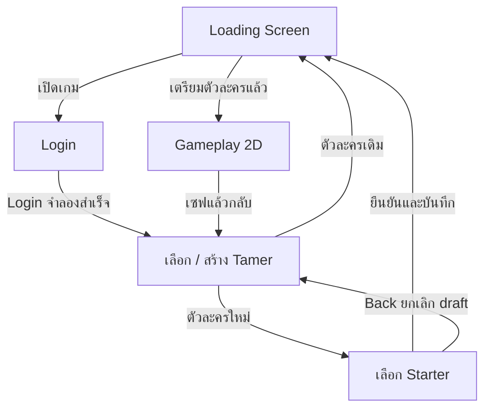
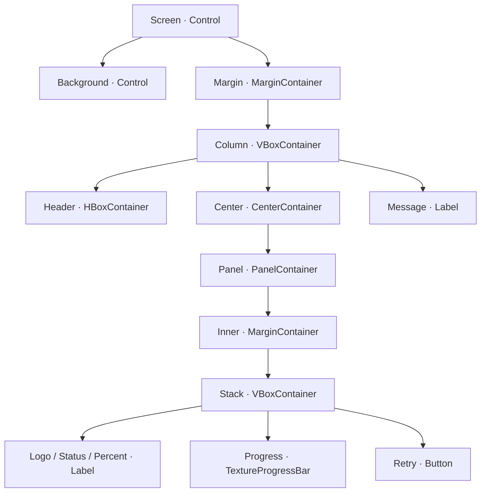
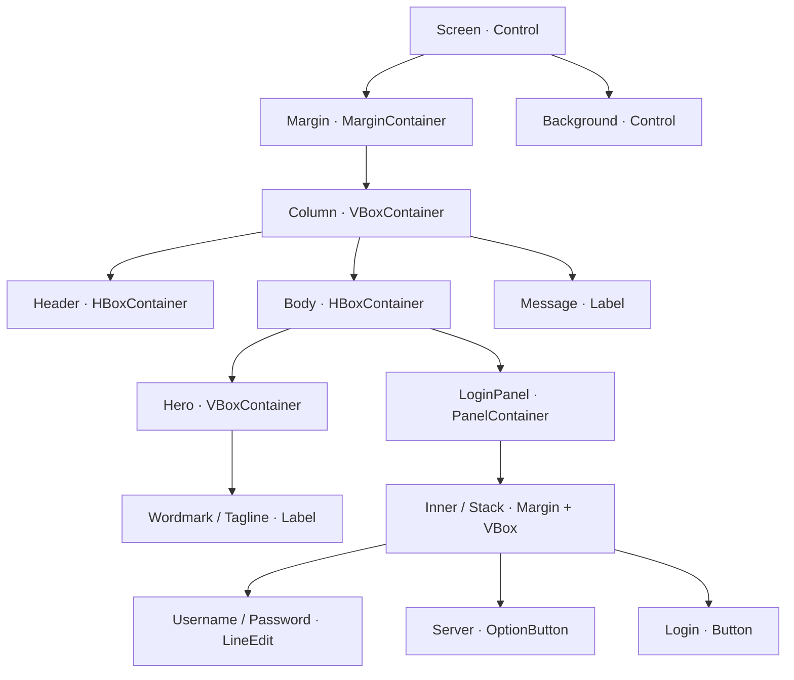
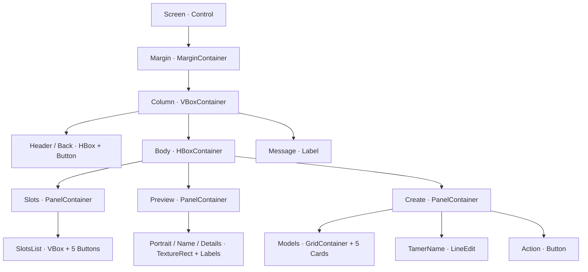
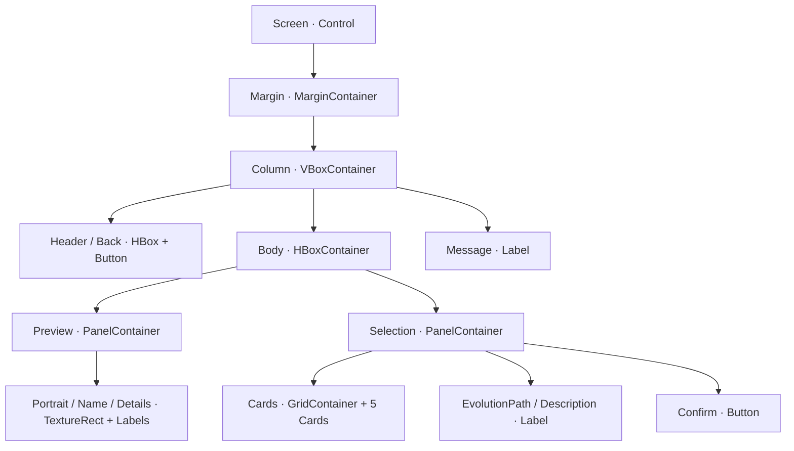
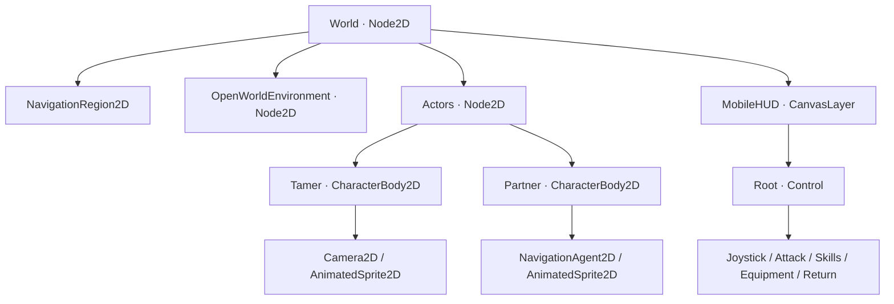

# Godot 4 — ระบบก่อนเข้าเกม v16

โปรเจกต์นี้ต่อยอด v15 จริง ใช้ Landscape 1280×720, Stretch `canvas_items`, Compatibility และ Native Control UI
สี่ฉากเมนูใหม่รวมกับเกมเพลย์เดิมเป็น 5 หน้าจอ; Loading Scene ถูกใช้ซ้ำตอนเข้าโลก
โค้ด GDScript ที่ใช้จริงอยู่ในไฟล์ตามตารางด้านล่าง พร้อมคอมเมนต์ไทย

## ผัง Game Flow



`loading_target` บอก Loading ว่าปลายทางเป็น Login หรือแผนที่ที่เซฟไว้ ไม่ใช้เปอร์เซ็นต์ปลอมตัดสินการเปลี่ยน Scene
ตัวละครเก่าข้าม Starter; ตัวใหม่ commit ลงช่องเมื่อกดยืนยันคู่หูเท่านั้น

## 1. Loading Screen — Node และสคริปต์

ไฟล์ Scene: `scenes/pregame/loading_screen.tscn`
สคริปต์: `scripts/pregame/loading_screen.gd`



| NodePath ที่สคริปต์อ้าง | หน้าที่ |
|---|---|
| `Margin/Column/Center/Panel/Inner/Stack/Progress` | ค่าระหว่าง 0–100 พร้อม GradientTexture2D under/progress |
| `…/Percent` | เปอร์เซ็นต์ตัวเลข |
| `…/Status` | สถานะหรือข้อผิดพลาด |
| `…/Retry` | เริ่ม request ใหม่เมื่อโหลดไม่สำเร็จ |

`start_loading()` เรียก `ResourceLoader.load_threaded_request()` ให้ Scene ปลายทาง และ Catalog ในการเปิดเกมครั้งแรก
`_process()` อ่าน `load_threaded_get_status(path, progress)` แล้วอัปเดตหลอด
รอ `THREAD_LOAD_LOADED` ก่อน `load_threaded_get()` เพื่อไม่ block main thread ก่อนพร้อม
Catalog และ Scene พร้อมครบจึงตั้ง 100% รอหนึ่ง process frame แล้ว `change_scene_to_packed()`
ถ้า resource/path ไม่ถูกต้องจะแสดง Retry ไม่เปลี่ยนฉากวน
`minimum_visible_seconds` แค่รักษาการมองเห็น Loading สั้น ๆ; ไม่มีการเปลี่ยน Scene ก่อน resource พร้อมจริง

## 2. Login Screen — Node และสคริปต์

Scene: `scenes/pregame/login_screen.tscn`
สคริปต์: `scripts/pregame/login_screen.gd`



`Username` / `Password` / `Server` / `Login` อยู่ใต้ `Margin/Column/Body/LoginPanel/Inner/Stack`
Password ตั้ง `secret = true` และ keyboard type password
Server display name และ server ID แยกด้วย item metadata; เช่น `file_1` / `file_2`
กด Login หรือ Done/Enter จาก Password เรียกฟังก์ชันเดียวกัน
ตรวจ Username 3–24 ตัว, Password ไม่ว่าง, Server ที่มีอยู่ ก่อนเปิด Character Scene
ระบบจำลองยอมรับข้อมูลที่ผ่าน validation ไม่ใช่ระบบ authentication จริง
Password ถูกล้างจาก LineEdit หลังสำเร็จ และไม่ถูกใส่ใน GameManager/JSON

## 3. Character Selection / Creation — Node และสคริปต์

Scene: `scenes/pregame/character_selection.tscn`
สคริปต์: `scripts/pregame/character_selection.gd`



ทุก Panel ใช้ `Inner (MarginContainer) / Stack (VBoxContainer)` อยู่ด้านใน
มี 5 ช่องตัวละครต่อบัญชี/Server และ 5 โมเดลต้นแบบให้เลือกตอนสร้าง เป็นคนละรายการ
โมเดล: ไทจิ, ยามาโตะ, โซระ, โคจิโร่, มีมี่ เก็บใน `TamerModelData` .tres

`select_model(id)` เปลี่ยน portrait/เพศ/สไตล์/HP/DS/Speed จาก Resource
`select_slot(index)` ถ้าเป็นช่องเดิมจะตั้ง Tamer/Starter ที่เคยสร้างและใช้ปุ่มเข้าโลก ถ้าเป็นช่องว่างใช้ปุ่มสร้าง
ตัวละครเดิมไม่ถูกเปลี่ยนโมเดลด้วยการแตะการ์ดพรีวิว
`_continue()` ใช้ `begin_creation()` ตรวจชื่อ 2–16 ตัวและชื่อซ้ำ แล้วสร้าง draft ก่อนเปิด Starter
กด Back จาก Starter จะไม่ commit slot แต่เก็บชื่อ/โมเดล draft ไว้แก้ต่อ
ปุ่ม `ImportLegacy` ใช้คัดลอกเซฟ v15 ลงช่องว่างโดยเก็บต้นฉบับไว้

## 4. Starter Selection — Node และสคริปต์

Scene: `scenes/pregame/starter_selection.tscn`
สคริปต์: `scripts/pregame/starter_selection.gd`



การ์ดแต่ละใบเป็น instance ของ `selection_card.tscn`: Button → MarginContainer → VBoxContainer → TextureRect / Name Label / Detail Label
Button รับ input และลูกตั้ง Mouse Filter Ignore เพื่อไม่บัง touch
`select_partner(id)` เปลี่ยนภาพ ชื่อ Attribute/Element, HP/ATK/SPD และ Evolution Path จาก `StarterPartnerData`
`confirm()` commit ตัวละครพร้อม Starter ที่เลือก แล้วเตรียมเซฟเฉพาะตัวละครก่อน Loading เข้าแผนที่
เปิด Scene โดยตรงโดยไม่มี draft จะกลับหน้า Character/Login เพื่อไม่สร้างตัวละครลอย ๆ

| Starter | ร่าง Champion | ร่าง Ultimate | ธาตุ | Attribute ตามโจทย์ |
|---|---|---|---|---|
| Agumon | Greymon | MetalGreymon | ไฟ | วัคซีน |
| Gabumon | Garurumon | WereGarurumon | น้ำแข็ง | ข้อมูล |
| Piyomon | Birdramon | Garudamon | ลม | วัคซีน |
| Tentomon | Kabuterimon | MegaKabuterimon | สายฟ้า | วัคซีน |
| Palmon | Togemon | Lillymon | พืช | ข้อมูล |

แต่ละสายมี MonsterData 3 Resource, สกิลและ SpriteFrames ต้นแบบแยก ไม่ใช่เปลี่ยนเฉพาะข้อความ UI
Ultimate ยังตรวจ QuestManager เดิมก่อนใช้ เช่นปลดล็อกหลังเควสต์ Etemon

## 5. Gameplay — ต่อเข้าฉากเดิม

File Island Scene: `scenes/world.tscn`; โซนอื่นเลือกจาก `GameManager.ZONE_SCENES` ตาม save



Tamer `_ready()` อ่าน Model Resource ก่อนตั้งฐาน CharacterProgress และกำหนด SpriteFrames/ชื่อ/HP/DS/Speed
Partner `_ready()` เปลี่ยน `forms` เป็นสาย Starter ก่อนโหลดร่างพื้นฐานและก่อน HUD ตั้งชุดสกิล
`story_world._ready()` คืน equipment/level/form/HP จากเซฟตามระบบเดิม
Tamer `save_party_progress()` ส่ง snapshot ไป `GameManager.sync_party()` ให้ `current_level` / `current_form` และ roster level เป็นค่าปัจจุบัน
ตัวละครที่นำเข้า v15 ใช้ฐาน HP200/DS100/Speed190 และชุดภาพ/สายร่างคู่หูเดิม ไม่ถูกสวมฐาน Taichi ใหม่

## Autoload GameManager.gd

Project → Project Settings → Globals/Autoload → Path `res://scripts/GameManager.gd` → Name `GameManager` → Enable
ZIP ตั้งค่านี้ไว้แล้ว อยู่ต่อจาก QuestManager และ GameChat
**ห้ามเพิ่ม `class_name GameManager`** เพราะชื่อ Autoload มีอยู่แล้ว

| Global Data | ความหมาย |
|---|---|
| `tamer_selected: StringName` | ID โมเดล เช่น `sora` |
| `partner_selected: StringName` | ID สายเริ่มต้น เช่น `gabumon` |
| `tamer_name: String` | ชื่อผู้เล่นที่กรอก |
| `current_level: int` | เลเวลปัจจุบัน อัปเดตจาก Tamer หลังเล่น |
| `current_form: StringName` | ID MonsterData เช่น `gabumon_0` / `gabumon_1` |
| `server_selected: String` | `file_1` / `file_2` |
| `characters: Array[Dictionary]` | metadata 5 ช่องต่อบัญชี/Server |
| `pending_character: Dictionary` | draft ก่อนยืนยัน Starter ไม่ใช่ช่องที่เซฟแล้ว |
| `catalog: PregameCatalog` | Resources ของต้นแบบ Tamer/Starter |
| `loading_target: String` | Scene ที่ Loading ต้องโหลด |
| `gameplay_active: bool` | เปิดเฉพาะเมื่อเข้าเกมผ่าน session ที่เตรียมไว้ |

### ตัวอย่างเรียก API

```gdscript
# 1. Login แบบจำลอง (ไม่ได้เก็บ Password)
if GameManager.login_demo("demo", "demo", "file_1"):
    GameManager.go_to(GameManager.CHARACTER_SCENE)

# 2. เลือกช่องว่างและสร้าง draft Tamer
if GameManager.select_character(0):
    if GameManager.begin_creation(&"sora", "SkyTamer"):
        GameManager.go_to(GameManager.STARTER_SCENE)

# 3. ยืนยันคู่หู แล้วเข้าโลกพร้อม Resource สายที่เลือก
if GameManager.confirm_starter(&"gabumon"):
    GameManager.enter_world()

# 4. ตัวละครเก่าเข้าโลกโดยข้าม Starter
if GameManager.select_character(0):
    GameManager.enter_world()

# 5. อ่านสายร่างโดยไม่ส่ง Node ข้าม Scene
var starter: StarterPartnerData = GameManager.selected_partner_data()
if starter != null:
    var rookie: MonsterData = starter.forms[0]
    print(rookie.monster_name)
```

แต่ละคำสั่งเป็นตัวอย่างแยกขั้นตอน อย่ารันทั้งหมดต่อกันก่อน Scene transition เสร็จ
`go_to()` ใช้รายการปลายทางที่กำหนดและ latch กันกดรัวก่อน change_scene แบบ deferred
ไม่ใช้ Node จาก Scene เก่าเป็น global reference เพราะ Node ถูก free ตอนเปลี่ยนฉาก

## ข้อมูล Custom Resource และไฟล์

| ไฟล์ | หน้าที่ |
|---|---|
| `scripts/pregame/tamer_model_data.gd` | Template Model/เพศ/สไตล์/ฐาน HP-DS-Speed/ภาพ/ชุดเดิน |
| `scripts/pregame/starter_partner_data.gd` | Template Starter/Attribute/Element/Portrait/Array ของ MonsterData |
| `scripts/pregame/pregame_catalog.gd` | Catalog ทั้งสองรายการและค้นด้วย ID |
| `data/pregame/catalog.tres` | Catalog จริงของ 5 Tamers + 5 Starters |
| `data/pregame/sora.tres` | ตัวอย่าง Tamer Model |
| `data/pregame/gabumon.tres` | ตัวอย่างสายร่าง Gabumon |
| `data/pregame/gabumon_0.tres` ถึง `_2.tres` | MonsterData ของแต่ละร่าง |
| `scripts/pregame/menu_screen.gd` | Theme/input/Back/card/feedback ที่ใช้ร่วม |
| `data/pregame/menu_theme.tres` | ฟอนต์ไทยและ StyleBox ของ Control |

เปลี่ยน Portrait / SpriteFrames / Scale ผ่าน Inspector ของแต่ละ Resource ได้
ชุดเดินต้องมี `idle_down/right/up/left` และ `walk_down/right/up/left`
MonsterData ที่เปิด require_action_animations ต้องมี `attack_*` / `cast_*` แบบไม่ Loop อย่างน้อย 4 เฟรม
แก้สกิลใน Resource ของร่างนั้น ไม่ใส่ cooldown/HP ปัจจุบันลงใน Resource ที่ใช้ร่วมกัน
ภาพที่แนบในรุ่นนี้เป็น SVG ต้นแบบที่มีรูปลักษณ์แยกกัน ไม่ใช่ sprite งานอนิเมะสำเร็จรูป
โปรเจกต์เดิมและเซฟที่นำเข้ายังคงใช้ภาพเดิมของ v15

## Touch / Keyboard บนมือถือ

หน้าเมนูใช้ Button, OptionButton, LineEdit มาตรฐาน ด้วย `Input.set_emulate_mouse_from_touch(true)`
ปิด `emulate_touch_from_mouse` ในช่วงเมนูเพื่อไม่ให้ input จำลองวนซ้ำ
ก่อนเข้าสนามคืน `emulate_mouse_from_touch=false`, `emulate_touch_from_mouse=true` ตาม UI เกมเดิมที่แยก finger index
กด Login/สร้างตัวละครแล้ว release_focus และซ่อน virtual keyboard ก่อนเปลี่ยน Scene
Android Back / Esc ในหน้า Starter ยกเลิก draft; หน้า Character Logout; หน้า Login คืน focus โดยไม่ออกเกมทันที

## Persistence / Migration

เซฟ roster อยู่ `user://profiles/<SHA256 ของ username+server>/roster.json`
เซฟเควสต์/ปาร์ตี้แยก `slot_1_story.json` ถึง `slot_5_story.json` ในโฟลเดอร์เดียวกัน
Roster เก็บ ID/ชื่อ/Starter/level ส่วน QuestManager เก็บ HP/DS/EXP/เควสต์/ร่าง/อุปกรณ์
Login ใหม่ username เดิมโดยไม่สนตัวพิมพ์เล็กใหญ่ + Server เดิมคืน roster เดิม
Server และบัญชีอื่นใช้ hash คนละตัว ชื่อผู้ใช้ที่มี `/` หรือภาษาไทยไม่ถูกนำไปใช้เป็นพาธตรง ๆ
Creation ไม่ commit จนยืนยัน Starter; ถ้า save roster ล้มเหลว rollback ช่องและแสดง feedback
ข้อมูลเป็น local prototype สำหรับ game flow เมื่อเชื่อม MMORPG จริงให้ API/server เป็นผู้ยืนยัน Login/roster/inventory/progress

## ทดสอบและภาพจริง

`tests/pregame_flow_test.tscn` ทดสอบ Loading/Catalog, input, validation, draft/back/duplicate, ทุกร่าง, disk save, กลับเข้าโลก, slot/server/account isolation และ migration
ชุด regression ของ v15 ยังทดสอบ combat, skill animation, HP/egg/recovery, equipment, quests, spawning และ open world

```bash
godot --headless --audio-driver Dummy --fixed-fps 60 --path . res://tests/pregame_flow_test.tscn
```

`tools/pregame_preview.tscn` → F6 สาธิตด้วยเซฟแยก; main game ใช้ F5
ภาพ Loading/Login/Tamer/Starter/Gameplay ใน `docs/screenshots/` เรนเดอร์ Native โดย Godot จริง
ผลและขอบเขตทดสอบอยู่ `PREGAME_TEST_RESULTS.json`

เอกสารหลัก Godot:
- https://docs.godotengine.org/en/4.4/tutorials/io/background_loading.html
- https://docs.godotengine.org/en/4.4/classes/class_resourceloader.html
- https://docs.godotengine.org/en/4.4/tutorials/scripting/singletons_autoload.html
- https://docs.godotengine.org/en/4.4/classes/class_lineedit.html
