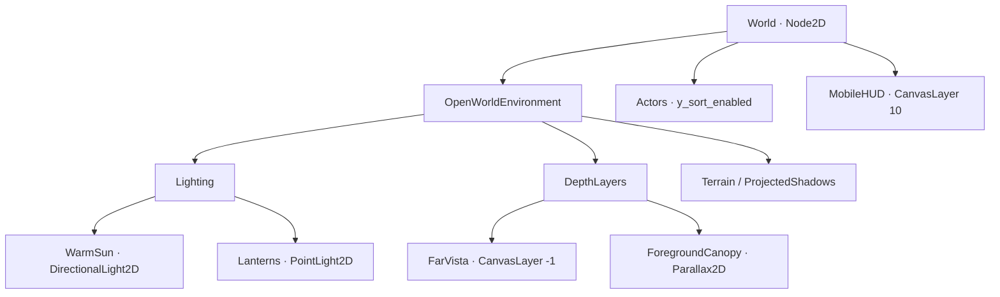
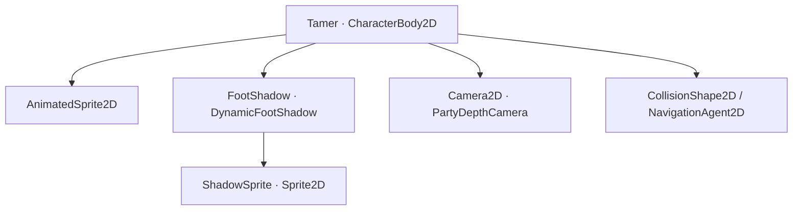
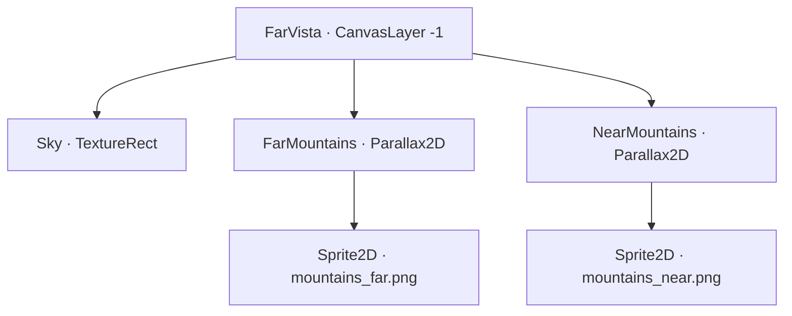

# Godot 4 — Pseudo 3D / 2.5D v21

ต่อจาก v20 ให้ตัวละครมีน้ำหนักบนพื้น: เงา Sprite ปรับตามการเดินและทิศแสง, DirectionalLight2D และ LightOccluder2D สร้างเงาทอดบนพื้น, กล้องเฉลี่ยตำแหน่ง Tamer/คู่หูแล้วซูมเล็กน้อยตามความเร็ว, ภูเขา Parallax และวงสกิลฉายด้วย Transform2D สไตล์ Ragnarok ผสมโลกดิจิตอล

## เปิดใช้งาน

1. แตกโปรเจกต์ลงโฟลเดอร์ใหม่ แล้ว Import `mobile_survival_v21/project.godot` ด้วย **Godot 4.4.1 ขึ้นไป** รอ import texture เสร็จ
2. กด F5 เล่นเกมตามปกติ ระบบฉากเกาะไฟล์เชื่อมเอฟเฟกต์ใหม่แล้ว
3. เปิด `tools/depth_preview.tscn` แล้ว F6 เพื่อดูเมนูสาธิต: หมู่บ้าน / วิวเกาะ / วงสกิล / เช้า–เย็น / มุมแสง / Low FX
4. เดินด้วย Joystick เหมือนเดิม หรือแตะจุดเควสต์เพื่อ Auto Navigation ดูกล้องตาม Tamer และคู่หู
5. เมนู `เมนู +` มีตัวเลือกภาพน้อย/ภาพเต็ม และลดการเคลื่อนไหวที่เชื่อมกับระบบใหม่

ฉากสาธิตใช้ `user://depth_preview_v21.json` และ preference ของฉากสาธิตแยกจากสล็อตจริง สคริปต์ survival ไม่เดินเวลาในฉากสาธิต ชื่อแอปยังเป็น Digital Adventure Form Skills จึงอ่านตำแหน่งเซฟเดิมได้ เวอร์ชันแอปเป็น `0.21.0`

เงาใต้เท้า วงเป้า และคลื่นสกิลใช้กับ Actor ในทุกโซน ส่วนแสงอาทิตย์/โคม/ภูเขา/ฉากหน้าและกล้องใหม่เชื่อมในแผนที่โลกกว้างเกาะไฟล์ โซนภาพพื้นหลังเดิมยังจัดเฟรมเต็มฉากตามเดิม

## โครงสร้าง Node ของแผนที่

Node หลายส่วนสร้างตอน `_ready()` เปิด Remote Scene Tree ระหว่างรันเพื่อดูโครงสร้างจริง





คู่หูมี Sprite/FootShadow/Collision/Navigation แบบเดียวกัน กล้องใช้งานจริงมีดวงเดียวใต้ Tamer โดยตั้ง `top_level = true` จึงไม่รับตำแหน่ง Tamer ซ้ำ



พร็อพมีราก `Prop_tree / Prop_rocks · Node2D` ใน Actors, มีลูก `LightOccluder2D` อยู่ก่อน `Artwork · Sprite2D` เงาพร็อพแบบภาพอยู่แยกใน `OpenWorldEnvironment/ProjectedShadows` วงเป้าศัตรูมีราก `TargetRing` และลูก `GroundVisual` ที่รับการบีบแกน

### ลำดับภาพและพิกัด

| Node / ภาพ | Layer หรือ Z | หน้าที่ |
|---|---:|---|
| FarVista | CanvasLayer -1 | ท้องฟ้าและภูเขาที่อยู่หลังขอบเกาะ |
| Terrain | Z -100 | พื้นเดินจริง / ถนน / แม่น้ำ |
| NorthCliffEdge | Z -95 | หน้าผาตกแต่งที่ขอบเหนือ |
| ProjectedShadows | Z -30 | เงารูปร่างพร็อพ มีความยาวจำกัด |
| FootShadow | Z -20 แบบ absolute | เงาใต้เท้าทุก Actor |
| TargetRing / GroundWarning | Z -18 แบบ absolute | วงเป้า/วงเตือนบนพื้น |
| SkillImpact | Z -17 แบบ absolute | คลื่นสกิลที่แผ่ออกจากพื้น |
| Actors | Z 0, Y Sort เปิด | คน คู่หู มอนสเตอร์ ต้นไม้ บ้าน |
| ForegroundCanopy | Z 150 | ยอดไม้ตกแต่งที่เลื่อนเร็วกว่าฉาก |
| DamagePopups | Z 200 | ตัวเลขความเสียหาย |
| MobileHUD | CanvasLayer 10 | HUD ไม่รับแสงโลก |

ราก Actor วางที่ **จุดเท้า** ให้ `CollisionShape2D` อยู่ใกล้ `(0,0)` ภาพที่ยืนบนจุดนี้ใช้ offset Y ติดลบ เช่น texture สูง 512 px ใช้ `offset.y = -256` แล้วปรับ scale ของ Sprite ตามขนาดตัวละคร ราก CharacterBody2D ต้องมี `scale = Vector2.ONE` การ Y Sort จะเปรียบเทียบจุดเท้า ไม่ใช่กึ่งกลางใบหน้า

## 1. Dynamic 2D Light & Shadow

### แสงอาทิตย์

`WorldLighting` สร้าง `CanvasModulate` และ `DirectionalLight2D` แดดอุ่นเป็นแสงขนาน ใช้ร่วมกับโคม PointLight2D บนพื้น โครงสร้างนี้ไม่ต้องใช้แสง/เงา 3D

| ค่า | เริ่มต้นในโปรเจกต์ | เหตุผลทางภาพ |
|---|---|---|
| Ambient กลางวัน | `(0.80, 0.84, 0.88)` | เก็บรายละเอียดในพื้นที่เงา ไม่ดำสนิท |
| Ambient เย็น | `(0.43, 0.51, 0.68)` | สีเงาเย็นตัดกับโคมสีอุ่น |
| Sun color | `(1.0, 0.95, 0.80)` | สีอบอุ่นให้ตัวละครแยกจากหญ้า |
| Sun energy | 0.19 เช้า / 0.12 เย็น | ไม่ให้ภาพและพื้นสว่างขาวเกินไป |
| Shadow filter | PCF5, smooth 1.0 | เงานุ่มพอดีโดยไม่ใช้ PCF13 |
| Shadow color | `(0.07, 0.12, 0.18, 0.28)` | เงาทอดยาวมี alpha ต่ำ อ่านพื้นได้ |
| Sun max_distance | 1200 px | คัด occluder ไกลกล้อง; **ไม่ใช่การตัดความยาวเงา** |
| Range layer min/max | 0 / 0 | แสงจำกัดใน canvas ของโลก |

`sun_direction_degrees` เป็นทิศที่เงาทอดไปบนจอ ค่า 35° ทอดขวาล่าง ตั้ง `sun.rotation = deg_to_rad(degrees) - PI/2` เพราะแสง Directional ใช้แกน Y ใน local transform เป็นทิศรังสี เงา Actor และเงาพร็อพอ่านทิศเดียวกันผ่าน `get_shadow_direction()`

**ข้อจำกัดจริงของ Godot 2D:** DirectionalLight2D สร้างเงายาวไม่สิ้นสุด `height` มีผลกับ normal mapping และไม่กำหนดความยาวเงา v21 ใช้เงาทอดจริงที่ alpha ต่ำ และเสริมเงา Sprite มีความยาวจำกัดจากความสูงภาพ ถ้าต้องการเฉพาะเงาสั้นแบบศิลป์ ตั้ง `sun_occlusion_enabled = false` ได้ เงา Sprite ยังอยู่

DirectionalLight2D ไม่ใช้ light cull mask สำหรับเลือกผู้รับแสง จึงแยก HUD ด้วย CanvasLayer และ Range Layer ส่วน `shadow_item_cull_mask` ยังเลือก Occluder ได้ตามปกติ

### เงาใต้เท้าที่ปรับตามการเดิน

สคริปต์ `scripts/art_shadow.gd` คือ `DynamicFootShadow` ผูกกับ Node2D `FootShadow` ใต้ CharacterBody2D ราก FootShadow อยู่ที่ `(0,0)` สคริปต์สร้าง Sprite2D `ShadowSprite` เองและโหลด `assets/depth/soft_shadow.png` จึงไม่ต้องตั้ง Sprite ซ้ำใน Inspector

| Export | Tamer / คู่หู | ความหมาย |
|---|---|---|
| actor | เว้นว่างให้อ่าน parent | CharacterBody2D เจ้าของความเร็ว |
| light_source | เว้นว่างให้อ่านกลุ่ม depth_lighting | Node ผู้ส่งทิศแดด |
| radius | 18 / 23 | รัศมีภาพก่อนบีบลงพื้น |
| opacity | 0.32 | ความดำของเงาแบบโปร่งแสง |
| response | 10 | ความไวของการไหลตามทิศ/ความเร็ว |
| reference_speed | 190 | ความเร็วเดินปกติที่ใช้เทียบ |
| visual_height | 0 | ความสูงทางภาพของกระโดด/ลอย |

แต่ละ physics tick อ่าน `get_real_velocity()` หลัง `move_and_slide()` ดังนั้นดัน Joystick ติดกำแพงแล้วเงาจะหยุด ไม่ยืดต่อจากคำสั่งเดินที่ไม่เกิดจริง ใช้ `1 - exp(-response * delta)` ทำ smoothing ซึ่งตอบสนองใกล้กันแม้ update 30/60 Hz

สคริปต์บีบแกน Y ลง 0.34 และเฉือน X เล็กน้อย เปลี่ยนความยาวประมาณ 10–20% ตามการเดิน ไม่ใช้ sine เขย่าเงาตลอดเวลา จุดกลางเงาขยับตามแสงเพียงไม่กี่พิกเซล และยังติดกับฐานเท้า ภาพลอยสูงทำให้เงาเล็ก จาง และห่างจากเท้าโดยไม่เปลี่ยน Collision

Texture และ CanvasItemMaterial ของเงาใช้ร่วมกันทุก Actor จึงไม่สร้าง texture ใหม่ต่อเฟรม Material เป็น unshaded ให้เงายังคงสีดำโปร่งแสงตอนเจอโคมสว่าง

### LightOccluder2D ของต้นไม้และหิน

1. รากต้นไม้/หินต้องอยู่ที่ฐานบนพื้น และ Artwork offset ขึ้นข้างบน
2. เพิ่ม `LightOccluder2D` เป็นลูกของรากพร็อพ ก่อน Artwork ใน Scene Tree
3. สร้าง `OccluderPolygon2D` ตาม footprint ใน local coordinates สำหรับเกมมองเอียงนี้ เช่น ลำต้น `(-20,-12),(20,-12),(20,14),(-20,14)`
4. เปิด `show_behind_parent` และตั้ง `occluder_light_mask = 1`
5. ที่แสงตั้ง `shadow_enabled = true` และ `shadow_item_cull_mask = 1`

ในฉาก 2.5D top-down footprint ทำให้เงาตั้งต้นที่ฐานและไม่บังยอดไม้ของตัวเอง เงา alpha จากรูปต้นไม้ที่ฉายลงพื้นเติมรายละเอียดใบ/หลังคาให้อ่านความสูงได้ การ tracing outline ทั้ง Sprite เหมาะกับฉาก side view มากกว่า สำหรับเกาะไฟล์ใช้ footprint ร่วมกับเงาภาพ

```gdscript
func add_footprint_occluder(prop: Node2D, footprint: PackedVector2Array) -> void:
    # ทุกจุดต้องอยู่ในพิกัด local ของ prop ไม่ใช้พิกัดโลกใส่ polygon ซ้ำ
    var shape := OccluderPolygon2D.new()
    shape.polygon = footprint
    var occluder := LightOccluder2D.new()
    occluder.occluder = shape
    occluder.occluder_light_mask = 1
    occluder.show_behind_parent = true
    occluder.sdf_collision = false # ไม่มี shader SDF ในตัวอย่างนี้
    prop.add_child(occluder)
    prop.move_child(occluder, 0)
```

ถ้ามีพร็อพเคลื่อนที่ ให้ occluder เป็นลูกของรากเดียวกัน พร็อพในแผนที่นี้เป็นแบบคงที่ เงาภาพอัปเดตผ่าน signal `sun_changed` ตอนเปลี่ยนมุม/เวลา ไม่ต้องคำนวณเงาต้นไม้หลายร้อยต้นทุกเฟรม

### PointLight2D สำหรับโคม

`add_lantern()` สร้าง GradientTexture2D 256×256 แบบ radial สีขาวตรงกลางจางเป็นโปร่งใส, fill_from `(0.5,0.5)`, fill_to `(1,0.5)`, texture_scale 2.0 และสี `(1.0,0.71,0.36)` แสงอยู่สูงกว่าฐานโคม 76 px

โคมเปิดเฉพาะใกล้กล้อง และเปิดเงาให้โคมใกล้สุดได้อย่างมาก 1 ดวงร่วมกับแดด 1 ดวง หากลดเอฟเฟกต์จะปิดเงาของแสงทั้งหมด แต่คงแสงสีและเงา Sprite อย่าเพิ่ม PointLight2D มีเงาให้ทุกลูกไฟหรือทุกตัวละครบนมือถือ

## 2. Parallax และกล้องเฉลี่ยตำแหน่ง

ใช้ **Parallax2D (Godot 4.3+)** ร่วมกับ CanvasLayer ในโปรเจกต์ 4.4 แทนการเริ่มระบบใหม่ด้วย ParallaxBackground/ParallaxLayer รุ่นเก่า

| เลเยอร์ | Scroll factor | การตั้งค่า |
|---|---:|---|
| FarMountains | `(0.12,0.02)` | CanvasLayer -1, manual scroll |
| NearMountains | `(0.24,0.04)` | CanvasLayer -1, manual scroll |
| Terrain / Actors | `(1,1)` | พิกัดโลกจริง ไม่ทำ Parallax |
| ForegroundCanopy | `(1.07,1.07)` | Canvas ของโลก เลื่อนด้วย Camera อัตโนมัติ |
| HUD | คงหน้าจอ | CanvasLayer 10 |

ภูเขาอยู่ต่าง canvas กับกล้อง ตั้ง `follow_viewport = false` และ `ignore_camera_scroll = true` แล้วส่ง `scroll_offset = -camera.get_screen_center_position() * scroll_scale` เอง ใช้ตำแหน่งกล้องที่ถูก clamp แล้ว ไม่ใช้ตำแหน่ง Tamer โดยตรง จึงไม่เกิดการไหลของภูเขาขณะกล้องติดขอบแผนที่

`repeat_size.x = 2048`, repeat_times 2 และ texture กว้าง 1024 ที่ scale X 2 ช่วยปิดช่องว่างเมื่อเลื่อน/หน้าจอกว้าง แนวตั้งไม่ repeat เพราะมี Sky เต็ม viewport อยู่ด้านหลัง ส่วนฉากหน้าที่อยู่ใน canvas โลกใช้ระบบ scroll ของ Parallax2D อัตโนมัติและไม่ส่ง scroll_offset ซ้ำ

**พื้นเต็มจอทึบจะบังภูเขา:** เกาะไฟล์เผยวิวจากขอบเหนือ กล้องมี `limit_top = -300` และมีหน้าผาตกแต่งเหนือ y=0 กำแพง/พื้นที่เดินยังใช้ขอบเดิม ผู้เล่นเดินตกหน้าผาไม่ได้ ใจกลางเกาะภูเขาจะถูกพื้นบังตามการจัดฉาก ถ้าจะทำแผนที่ใหม่ให้วางช่องวิว/ขอบเกาะใน artwork อย่าวางภูเขาทับพื้นเดิน

ฉากหน้าใช้ texture ที่ส่งผ่าน `foreground_texture` คุม alpha 0.26 และอยู่ริมทาง วางฉากหน้าให้หลบจุดแตะเป้าหมาย ไม่ใส่ Collision ให้เลเยอร์นี้ เมื่อลดเอฟเฟกต์จะซ่อนฉากหน้าตกแต่ง

### กล้อง

ผูก `scripts/depth/party_depth_camera.gd` ให้ Camera2D ใต้ Tamer เว้นค่า tamer/partner ว่างได้ในโครงสร้าง Actors/Tamer/Partner แบบโปรเจกต์นี้ หรือเลือกใน Inspector ถ้าใช้ชื่อ Node อื่น

| ค่า | เริ่มต้น | ผล |
|---|---:|---|
| top_level | true | เป็นลูก Tamer แต่ไม่รับ transform ของ Tamer |
| process_callback | Physics | ตามตำแหน่งหลัง physics tick |
| process_physics_priority | 10 | ทำงานหลัง Actor ที่ priority 0 |
| partner_weight | 0.22 | เฉลี่ยตำแหน่งโดยยังให้ผู้เล่นเป็นศูนย์กลาง |
| max_partner_pull | 240 | จำกัดเวกเตอร์ก่อนคูณน้ำหนัก |
| framing_offset | `(0,-32)` | เห็นพื้นที่เหนือหัวและเส้นทางเพิ่ม |
| follow_response | 8 | Exponential position smoothing |
| rest_zoom / moving_zoom | 0.92 / 0.865 | เห็นพื้นที่กว้างขึ้นเพียงประมาณ 6% ตอนเดินเร็ว |
| zoom_duration | 0.45 s | Sine Out แทนการเปลี่ยน scale ทันที |

Camera2D `zoom` ค่ายิ่งต่ำยิ่งเห็นพื้นที่กว้างขึ้น Script ใช้ค่าเฉลี่ยความเร็วแล้วขอ Tween ใหม่ไม่เกิน 5 ครั้ง/วินาที และเฉพาะเมื่อเป้าซูมต่างเกิน 0.004 ป้องกัน Tween ถูก kill/recreate ทุกเฟรม

เราใช้ smoothing ใน Script จึงปิด `position_smoothing_enabled` ของ Camera2D เพื่อไม่ทำ smoothing ซ้ำ หากจะใช้ built-in smoothing แทน ให้เขียนตำแหน่งเป้าตรง ๆ และเปิด built-in เพียงจุดเดียว

ตั้ง Physics Interpolation ของโปรเจกต์ไว้เหมือน v20 (`common/physics_interpolation = true`) หลัง teleport เรียก `reset_physics_interpolation()` ของ Actor และ `camera.snap_to_party()` ซึ่งคืนฐาน/scroll ของกล้องทันที

Camera Follow เขียน `global_position`, Camera Zoom เขียน `zoom` และ Camera Shake เดิมเขียน `offset` จึงไม่แย่ง property กัน เปิด modal แล้วกล้อง/zoom หยุดพร้อมโลก แต่ cutscene ยังสั่นผ่านระบบ offset เดิมได้ เมื่อลดการเคลื่อนไหว จะปิด look-ahead/zoom ตามความเร็ว และฉากหน้าเลื่อนเท่าพื้น

## 3. วงสกิลที่แนบพื้นด้วย Matrix

`GroundProjection.make_transform()` คืนคอลัมน์ฐานของ `P × R`:

```text
P = [[1, shear_x], [0, flatten_y]]
R = การหมุนในระนาบพื้นตาม heading
```

นี่เป็น matrix notation ไม่ใช่ Node Tree การหมุนอยู่ **ก่อน** การฉายพื้น จึงไม่ทำให้วงรีเงยจากพื้นเมื่อตั้ง heading ต่างกัน `flatten_y = 0.46`, `shear_x = 0.12` เป็นค่าเริ่มต้น ดูเหมือนมองพื้นจากกล้องเอียง ส่วน heading ใช้ radian ใน helper

ราก `GroundSkillIndicator` อยู่ที่ตำแหน่งเป้าจริง ลูก `GroundVisual` รับ Transform2D ไม่ยืดราก Actor, Collision หรือ Navigation ถ้าเป็น TextureRect/Sprite วงเวทของคุณ ให้ใส่ไว้ใต้รากวง แล้วส่ง Sprite2D นั้นเข้า `GroundProjection.apply_to_visual()` ได้เหมือนกัน

```gdscript
func put_ring_on_floor(ring_visual: Node2D) -> void:
    # สร้างฐานใหม่จากค่าเดิมเสมอ ไม่คูณ scale.y *= 0.46 ทุกครั้ง
    GroundProjection.apply_to_visual(ring_visual, 0.46, 0.12, deg_to_rad(15.0))
```

โปรเจกต์เชื่อม `target_ring.gd` กับวงเลือกศัตรูแล้ว และฉาย `skill_impact.gd` ให้คลื่นสกิลแผ่บนพื้น เอฟเฟกต์กรงเล็บ/ลูกไฟ/ละอองที่อยู่ในอากาศยังมีรูปทรงปกติ เพื่อให้มองเห็นทั้งความสูงและระนาบพื้น

### วงเตือนบอส

`scenes/ground_warning.tscn` เป็นตัวอย่างรัศมี 110 สีแดงจาง พร้อม Tween เติมวง เส้นขอบเข้มและขีดดิจิตอลอ่านได้ทั้งบนพื้นหญ้าและหิน

```gdscript
const WARNING_SCENE: PackedScene = preload("res://scenes/ground_warning.tscn")
var active_warning: GroundSkillIndicator
signal warning_ready(indicator: GroundSkillIndicator)

func show_boss_warning(world_parent: Node2D, at: Vector2, seconds: float = 1.2) -> void:
    # เปลี่ยน cast ใหม่แล้วปิดภาพเตือนเก่า ป้องกัน callback ของสกิลเก่าค้าง
    cancel_boss_warning()
    active_warning = WARNING_SCENE.instantiate() as GroundSkillIndicator
    active_warning.position = world_parent.to_local(at)
    world_parent.add_child(active_warning)
    active_warning.warning_finished.connect(_on_warning_finished, CONNECT_ONE_SHOT)
    active_warning.start_warning(seconds)

func _on_warning_finished() -> void:
    # ส่งให้ระบบต่อสู้ตัดสิน hit/ดาเมจ ภาพเตือนไม่ลด HP ด้วยตัวเอง
    var completed: GroundSkillIndicator = active_warning
    active_warning = null
    warning_ready.emit(completed)
    # Listener เริ่ม cast ใหม่ได้ จึงลบวงที่จบเท่านั้น ไม่ลบ active_warning ใหม่
    if is_instance_valid(completed):
        completed.queue_free()

func cancel_boss_warning() -> void:
    # เรียกเมื่อบอสตาย สลบ ถูกขัด หรือเปลี่ยนฉาก
    if is_instance_valid(active_warning):
        active_warning.cancel_warning()
        active_warning.queue_free()
    active_warning = null
```

Signal นี้ส่งก่อน queue_free ให้ listener ใช้ข้อมูลทันที หากต้องรอข้ามเฟรมให้คัดลอก center/radius/basis แทนการเก็บ reference ของวงที่กำลังถูกลบ

**ภาพกับพื้นที่โดนต้องตกลงให้ตรงกัน:** v21 ไม่เปลี่ยนสูตรความเสียหายเดิม วงเป้าและ impact ของสกิลเดิมเป็นงานภาพ หากเพิ่ม AoE ใหม่ที่ใช้วงรีนี้เป็นขอบเขตจริง ให้เรียก `indicator.contains_world_point(target.global_position)` วิธีนี้ inverse-transform จุดกลับสู่ระนาบแล้วตรวจรัศมี ทำให้พื้นที่โดนตรงกับวงที่เห็น อย่าตรวจวงกลม world-space เดิมแล้วบอกว่าขอบวงรีคือเขตอันตรายที่แน่นอน

อีกทางหนึ่งคือฉายทั้ง world จาก ground coordinates เดียวกันทั้ง Actor/วงและแปลง input กลับเสมอ แต่ต้องปรับ movement/collision/server coordinates พร้อมกัน ซึ่งไม่ใช่ขอบเขตของการเปลี่ยนงานภาพครั้งนี้

## โค้ดและไฟล์ที่เกี่ยวข้อง

| ไฟล์ | งาน |
|---|---|
| `scripts/art_shadow.gd` | Sprite เงาใต้เท้า/ความเร็วจริง/ทิศแสง |
| `scripts/depth/ground_projection.gd` | Matrix ฉายพื้นและ helper ไม่สะสม transform |
| `scripts/depth/ground_ring_visual.gd` | เส้นวง/ขีดดิจิตอล/การเติมวง |
| `scripts/depth/ground_skill_indicator.gd` | วงเป้า/เตือน/ยกเลิก/ตรวจจุดในวง |
| `scripts/depth/party_depth_camera.gd` | เฉลี่ยตำแหน่ง/position smoothing/zoom tween |
| `scripts/depth/depth_parallax.gd` | CanvasLayer ไกลและ Parallax2D หลายระยะ |
| `scripts/depth/cliff_edge.gd` | ขอบเกาะทางภาพ |
| `scripts/world_lighting.gd` | แดด/โคม/คุณภาพ/ทิศเงาร่วม |
| `scripts/open_world_environment.gd` | เชื่อมพร็อพ Occluder และเงาตามมุมแดด |
| `assets/depth/` | PNG เงา/ท้องฟ้า/ภูเขาที่แชร์ใช้ |

ชุด `Godot4_Pseudo3D_Kit_v21.zip` มี helper ทั้งหมดที่จำเป็น รวม GameVisualSettings และ asset ตามเส้นทาง `res://` คัดลอกโฟลเดอร์ scripts/assets/scenes/shaders เข้าโปรเจกต์ของคุณแล้วรอ Godot scan class_name ไม่ต้องสร้าง Autoload เพิ่มให้ helper ชุดนี้ อย่าเพิ่ม GameVisualSettings สองไฟล์ที่ประกาศ class_name เดียวกัน หากโปรเจกต์มี v20 อยู่แล้วใช้ไฟล์เดิมได้

## งบภาพสำหรับ Mobile

| ระบบ | ภาพเต็ม | ลดเอฟเฟกต์ |
|---|---|---|
| Sprite เงาใต้เท้า | เปิด, texture 64×64 แชร์ | เปิด |
| Sprite เงารูปร่างต้นไม้ | เปิด, ใช้ texture เดิมของพร็อพ | เปิด |
| Directional shadow | แดด 1 ดวง, PCF5 | ปิด |
| Point shadow | โคมใกล้สุดไม่เกิน 1 ดวง | ปิด |
| แสงโคม | เฉพาะระยะกล้อง 720 px | เหมือนเดิม |
| ภูเขา | 2 Parallax layers, repeat X | เหมือนเดิม |
| ฉากหน้า | 2 Sprite alpha ต่ำ | ซ่อน |
| กล้องซูม/มองนำ | Tween ตามความเร็ว | ปิดเมื่อ Reduce Motion |

ใช้ Compatibility renderer ตามโปรเจกต์เดิม ไม่ต้องเปลี่ยนเป็น Forward+ และไม่ต้องเปิด glow แบบ post-process ทั่วหน้าจอ งานวงสกิลใช้เส้น/สีที่วาดตรง ส่วนเอฟเฟกต์วาบและ particles จาก v20 ยังใช้ระบบเดิม

ผลทดสอบด้านพฤติกรรมไม่ได้เป็นตัวเลข FPS ของมือถือจริง ต้องวัดบนอุปกรณ์เป้าหมายด้วย Profiler หาก GPU หนักให้เริ่มปิดเงาของแดด/โคมก่อนลดคุณภาพ Sprite เงา หรือเปลี่ยน shadow filter เป็น None สำหรับภาพพิกเซลคม ค่า PCF13 ไม่ได้เปิดไว้

## การตรวจงาน

Godot **4.4.1**: ชุดทดสอบที่เกี่ยวข้อง 7 ชุด รวม **268 ข้อ / 0 failures**

| ชุดทดสอบ | จำนวนผ่าน | สิ่งที่ยืนยัน |
|---|---:|---|
| pseudo3d_test | 31 | เงา/Matrix/กล้อง/zoom/pause/ยกเลิก/งบแสง |
| openworld_test | 21 | Navigation จริง สะพาน ขอบโลก กล้องเลื่อนและการแตะเป้า |
| smoke_test | 30 | คำสั่ง/Follow/ต่อสู้/Multi-touch |
| visual_polish_test | 19 | HUD/ปุ่ม/Modal/Camera Shake/Reduce Motion เดิม |
| projectile_upgrade_test | 32 | ลูกไฟ/Hit/สิ่งกีดขวาง |
| form_skills_animation_test | 69 | ร่าง/ภาพ/สกิล/จังหวะ hit |
| survival_status_test | 66 | HP/MP/Hunger/Stamina/Cannot Battle |

ภาพ `docs/previews/Pseudo3D_v21_*.png` และวิดีโอ `Pseudo3D_v21_Demo.mp4` อ่านจาก framebuffer จริงของ **OpenGL Compatibility / Mesa llvmpipe** ที่ 1280×720 ไม่ใช่ภาพ mockup วิดีโอ 5 วินาที 24fps ไม่มีเสียง ยังไม่ได้รัน APK บนโทรศัพท์จริง

โหมด capture จัดตำแหน่ง Actor และย้ายบอสไว้ในลานสาธิตเท่านั้น เกม F5 ไม่ย้ายบอสเข้าเมืองและไม่เพิ่มสกิลบอสใหม่เอง

## เอกสาร Godot อ้างอิง

- [2D lights and shadows (4.4)](https://docs.godotengine.org/en/4.4/tutorials/2d/2d_lights_and_shadows.html)
- [DirectionalLight2D (4.4)](https://docs.godotengine.org/en/4.4/classes/class_directionallight2d.html)
- [LightOccluder2D (4.4)](https://docs.godotengine.org/en/4.4/classes/class_lightoccluder2d.html)
- [Parallax2D (4.4)](https://docs.godotengine.org/en/4.4/classes/class_parallax2d.html)
- [Camera2D (4.4)](https://docs.godotengine.org/en/4.4/classes/class_camera2d.html)
- [Transform2D (4.4)](https://docs.godotengine.org/en/4.4/classes/class_transform2d.html)

โค้ดฉบับเต็มของ helper อยู่ท้ายคู่มือนี้และอยู่ในโปรเจกต์ตามตารางด้านบน ทุกฟังก์ชันมีคอมเมนต์ไทยอธิบายการคุมรูปทรงและเวลา

## โค้ดฉบับเต็ม

### scripts/art_shadow.gd

```gdscript
class_name DynamicFootShadow
extends Node2D
## เงาสีดำโปร่งแสงติดจุดเท้า รับทิศแสงและความเร็วจริงหลังชนกำแพง
@export var actor: CharacterBody2D
@export var light_source: Node2D
@export_range(6.0, 80.0) var radius: float = 18.0
@export_range(0.0, 1.0) var opacity: float = 0.32
@export_range(1.0, 30.0) var response: float = 10.0
@export var reference_speed: float = 190.0
## ความสูงทางภาพสำหรับกระโดด/ลอย ไม่ยก Collision
@export_range(0.0, 200.0) var visual_height: float = 0.0
const SHADOW_TEXTURE: Texture2D = preload("res://assets/depth/soft_shadow.png")
var blob: Sprite2D
var _smoothed_velocity := Vector2.ZERO
var _heading: float = 0.0
var _visual_scale := Vector2.ONE
static var _unlit_material: CanvasItemMaterial

func _ready() -> void:
    # Sprite เดียวต่อ Actor ใช้ texture ร่วมกันทุกตัว ไม่สร้างภาพใหม่ทุกเฟรม
    if actor == null:
        actor = get_parent() as CharacterBody2D
    if light_source == null:
        light_source = get_tree().get_first_node_in_group("depth_lighting") as Node2D
    z_as_relative = false
    z_index = -20
    blob = Sprite2D.new()
    blob.name = "ShadowSprite"
    blob.texture = SHADOW_TEXTURE
    blob.texture_filter = CanvasItem.TEXTURE_FILTER_LINEAR
    if _unlit_material == null:
        _unlit_material = CanvasItemMaterial.new()
        _unlit_material.light_mode = CanvasItemMaterial.LIGHT_MODE_UNSHADED
    blob.material = _unlit_material
    add_child(blob)
    update_shadow(Vector2.ZERO, 1.0)

func _physics_process(delta: float) -> void:
    # ความเร็วจริงไม่ทำให้เงาแกว่งต่อเมื่อดัน Joystick ติดกำแพง
    var movement: Vector2 = actor.get_real_velocity() if is_instance_valid(actor) else Vector2.ZERO
    update_shadow(movement, delta)

func update_shadow(movement: Vector2, delta: float) -> void:
    # Exponential smoothing ให้ผลใกล้กันบน 30/60/120 Hz และไม่ overshoot
    var blend: float = 1.0 - exp(-response * maxf(0.0, delta))
    _smoothed_velocity = _smoothed_velocity.lerp(movement, blend)
    var speed: float = clampf(_smoothed_velocity.length() / maxf(1.0, reference_speed), 0, 1)
    var rays := Vector2(0.82, 0.57)
    var length_ratio: float = 0.42
    if is_instance_valid(light_source) and light_source.has_method("get_shadow_direction"):
        rays = light_source.call("get_shadow_direction", global_position)
        length_ratio = float(light_source.call("get_shadow_length_ratio"))
    # ทิศแสงบนจอแปลงกลับสู่ระนาบก่อนหมุนฐานของวงเงา
    var on_ground := Vector2(rays.x, rays.y / 0.34).normalized()
    var walk: Vector2 = _smoothed_velocity.normalized()
    _heading = lerp_angle(_heading, on_ground.angle() + walk.x * speed * 0.08, blend)
    var parallel: float = absf(walk.dot(on_ground)) * speed
    var height_ratio: float = clampf(visual_height / 160.0, 0, 1)
    var wanted_scale := Vector2(1.10 + length_ratio * 0.4 + parallel * 0.12,
        1.0 - speed * 0.07) * lerpf(1.0, 0.65, height_ratio)
    _visual_scale = _visual_scale.lerp(wanted_scale, blend)
    # เปลี่ยนรูปเล็กน้อยให้เงามีน้ำหนัก ไม่สั่นจุดเท้าของ Actor
    var stretch := Transform2D(0.0,
        _visual_scale * (radius * 2.0 / SHADOW_TEXTURE.get_width()), 0.0, Vector2.ZERO)
    var center: Vector2 = rays * (3.0 + visual_height * 0.2) - walk * speed * 0.8
    blob.transform = GroundProjection.make_transform(0.34,
        0.04 + walk.x * speed * 0.05, _heading, center) * stretch
    blob.modulate = Color(0.015, 0.025, 0.035, opacity * lerpf(1.0, 0.45, height_ratio))
```

### scripts/depth/ground_projection.gd

```gdscript
class_name GroundProjection
extends RefCounted
## ฐานพิกัดของภาพพื้น: หมุนในระนาบก่อน แล้วจึงบีบแกน Y และเฉือนแกน X
## ใช้กับลูก Visual เท่านั้น อย่านำไปใส่ CharacterBody2D / CollisionShape2D

static func make_transform(flatten_y: float = 0.46, shear_x: float = 0.12,
        heading: float = 0.0, origin: Vector2 = Vector2.ZERO) -> Transform2D:
    # คอลัมน์คือ P × R โดย P = [[1, shear], [0, flatten]]
    # บีบ Y อย่างเดียวทำให้วงกลมเป็นวงรี; shear เพิ่มความเฉียงแบบพื้น isometric
    # clamp กันฐานยุบเป็นเส้น จึงยังใช้ affine_inverse() แปลงจุดกลับได้
    var depth: float = clampf(flatten_y, 0.15, 1.0)
    var shear: float = clampf(shear_x, -0.45, 0.45)
    var c: float = cos(heading)
    var s: float = sin(heading)
    return Transform2D(Vector2(c + shear * s, depth * s),
        Vector2(-s + shear * c, depth * c), origin)

static func apply_to_visual(visual: Node2D, flatten_y: float = 0.46,
        shear_x: float = 0.12, heading: float = 0.0) -> void:
    # สร้างฐานใหม่เสมอ ไม่คูณ transform เดิมสะสม; เก็บตำแหน่งเดิมไว้
    # อย่าตั้ง scale/rotation ซ้ำหลังฟังก์ชันนี้ เพราะจะเขียนทับฐานที่คำนวณไว้
    visual.transform = make_transform(flatten_y, shear_x, heading, visual.position)
```

### scripts/depth/ground_ring_visual.gd

```gdscript
class_name GroundRingVisual
extends Node2D
## วาดวงในระนาบปกติ แล้วให้ parent คำนวณ Transform2D ฉายลงพื้น
var radius: float = 29.0
var tint: Color = Color("ffd477")
var fill_alpha: float = 0.08
var progress: float = 0.0
var warning: bool = false

func _draw() -> void:
    # เส้นเข้มด้านนอกช่วยให้วงอ่านออกทั้งบนทราย หญ้า และพื้นสว่าง
    draw_circle(Vector2.ZERO, radius, Color(tint, fill_alpha))
    draw_arc(Vector2.ZERO, radius, 0, TAU, 64, Color(0.035, 0.08, 0.10, 0.75), 6.0, true)
    draw_arc(Vector2.ZERO, radius, 0, TAU, 64, Color(tint, 0.9), 2.5, true)
    draw_arc(Vector2.ZERO, radius - 5.0, 0, TAU, 64, Color(tint, 0.38), 1.0, true)
    # ขีดสี่ทิศและจุดพิกเซลให้กลิ่นอายเครื่องสแกนในโลกดิจิตอล
    for i: int in range(12):
        var direction := Vector2.from_angle(float(i) * TAU / 12.0)
        var length: float = 8.0 if i % 3 == 0 else 3.0
        draw_line(direction * (radius + 3), direction * (radius + 3 + length), tint, 2.0, true)
    if warning and progress > 0.001:
        # เส้นเติมตามเวลาอ่านง่ายกว่าไฟกะพริบเร็ว เหมาะกับจอมือถือ
        draw_arc(Vector2.ZERO, radius - 10.0, -PI * 0.5,
            -PI * 0.5 + TAU * progress, 64, Color(tint, 0.95), 3.0, true)
```

### scripts/depth/ground_skill_indicator.gd

```gdscript
class_name GroundSkillIndicator
extends Node2D
## Root อยู่ที่พิกัดล็อกเป้าจริง; ลูก GroundVisual รับการบีบภาพเท่านั้น
signal warning_finished
@export_range(12.0, 500.0) var radius: float = 29.0
@export_range(0.15, 1.0) var flatten_y: float = 0.46
@export_range(-0.45, 0.45) var shear_x: float = 0.12
@export var heading_degrees: float = 0.0
@export var tint: Color = Color("ffd477")
@export_range(0.0, 0.3) var fill_alpha: float = 0.08
var visual: GroundRingVisual
var _warning_tween: Tween

func _ready() -> void:
    # อยู่บนพื้นทุกครั้ง ไม่ลอยขึ้นหน้า sprite เมื่อ Actor ถูก Y Sort
    z_as_relative = false
    z_index = -18
    visual = GroundRingVisual.new()
    visual.name = "GroundVisual"
    var unlit := CanvasItemMaterial.new()
    unlit.light_mode = CanvasItemMaterial.LIGHT_MODE_UNSHADED
    visual.material = unlit
    add_child(visual)
    refresh_visual()

func refresh_visual() -> void:
    # เปลี่ยนรัศมี/สีได้โดยไม่สร้าง material หรือ texture ใหม่ทุกเฟรม
    if not is_instance_valid(visual):
        return
    visual.radius = radius
    visual.tint = tint
    visual.fill_alpha = fill_alpha
    GroundProjection.apply_to_visual(visual, flatten_y, shear_x, deg_to_rad(heading_degrees))
    visual.queue_redraw()

func start_warning(duration: float = 1.2) -> void:
    # เป็นเวลาของภาพเท่านั้น ผู้เรียกเป็นเจ้าของดาเมจและการยกเลิกสกิล
    # Tween ผูกกับ Node จึงหยุดตามโลกเมื่อเปิด Inventory หรือคัตซีน
    cancel_warning()
    visual.warning = true
    _set_warning_progress(0.0)
    _warning_tween = create_tween()
    _warning_tween.tween_method(_set_warning_progress, 0.0, 1.0, maxf(0.05, duration))
    _warning_tween.tween_callback(_finish_warning)

func contains_world_point(world_point: Vector2) -> bool:
    # สำหรับสกิลใหม่ที่ใช้วงรีนี้เป็นพื้นที่โดนจริง: แปลงจุดกลับผ่านฐานของ Visual
    # ระบบโจมตีเดิมยังใช้ SkillHitResolver ของเดิม จึงไม่เปลี่ยนสมดุลโดยอัตโนมัติ
    if not is_instance_valid(visual):
        return false
    var plane_point: Vector2 = visual.global_transform.affine_inverse() * world_point
    return plane_point.length_squared() <= radius * radius

func cancel_warning() -> void:
    # รีเซ็ตเมื่อบอสตาย/สกิลถูกขัด ไม่ทิ้ง callback เก่าทำงานตอนเริ่มใหม่
    if _warning_tween != null and _warning_tween.is_valid():
        _warning_tween.kill()
    if is_instance_valid(visual):
        visual.warning = false
        visual.progress = 0.0
        visual.queue_redraw()

func _set_warning_progress(value: float) -> void:
    # redraw เฉพาะวงที่กำลังเติม ไม่ redraw ทุก Actor
    visual.progress = clampf(value, 0, 1)
    visual.queue_redraw()

func _finish_warning() -> void:
    # ให้ระบบต่อสู้ตรวจเงื่อนไขก่อนลงดาเมจอีกครั้ง ไม่มีดาเมจในสคริปต์ภาพ
    warning_finished.emit()
```

### scripts/depth/party_depth_camera.gd

```gdscript
class_name PartyDepthCamera
extends Camera2D
## กล้อง orthographic สร้างความรู้สึกมีมิติด้วยการจัดเฟรม/ซูมเพียงเล็กน้อย
@export var tamer: CharacterBody2D
@export var partner: Node2D
@export_range(0.0, 0.5) var partner_weight: float = 0.22
@export var max_partner_pull: float = 240.0
@export var framing_offset := Vector2(0, -32)
@export_range(1.0, 20.0) var follow_response: float = 8.0
@export var rest_zoom: float = 0.92
@export var moving_zoom: float = 0.865
@export var reference_speed: float = 190.0
@export var zoom_duration: float = 0.45
var _zoom_tween: Tween
var _requested_zoom: float = 0.92
var _zoom_timer: float = 0.0
var _filtered_speed: float = 0.0

func _ready() -> void:
    # ยังอยู่ที่ Tamer/Camera2D ให้ Cutscene หาเจอ แต่ไม่รับ transform ของ Tamer
    top_level = true
    if tamer == null:
        tamer = get_parent() as CharacterBody2D
    if partner == null and is_instance_valid(tamer):
        partner = tamer.get_parent().get_node_or_null("Partner") as Node2D
    process_callback = Camera2D.CAMERA2D_PROCESS_PHYSICS
    process_physics_priority = 10 # ตาม Actor หลัง move_and_slide() ใน tick เดียวกัน
    position_smoothing_enabled = false # ทำ smoothing เอง ไม่เพิ่ม lag สองชั้น
    zoom = Vector2.ONE * rest_zoom
    _requested_zoom = rest_zoom
    snap_to_party()

func party_focus() -> Vector2:
    # ค่าเฉลี่ยถ่วงน้ำหนัก จำกัดระยะดึงกล้องถ้าคู่หูติดทางหรืออยู่ไกล
    if not is_instance_valid(tamer):
        return global_position
    var focus: Vector2 = tamer.global_position
    if is_instance_valid(partner):
        focus += (partner.global_position - focus).limit_length(max_partner_pull) * partner_weight
    return focus + framing_offset

func snap_to_party() -> void:
    # เรียกหลัง Warp/โหลดแผนที่ ไม่เลื่อนกล้องผ่านผนังจากตำแหน่งเก่า
    global_position = party_focus()
    reset_physics_interpolation()
    reset_smoothing()
    force_update_scroll()

func _physics_process(delta: float) -> void:
    if not is_instance_valid(tamer):
        return
    var desired: Vector2 = party_focus()
    var motion: bool = GameVisualSettings.motion_enabled
    var speed: float = tamer.get_real_velocity().length()
    _filtered_speed = lerpf(_filtered_speed, speed, 1.0 - exp(-5.0 * delta))
    # มองนำทิศเดินเล็กน้อย เห็นทางข้างหน้าโดยไม่ให้คู่หูหลุดเฟรม
    if motion:
        desired += tamer.get_real_velocity().limit_length(reference_speed) * 0.10
    if global_position.distance_squared_to(desired) > 800.0 * 800.0:
        snap_to_party()
    elif motion:
        global_position = global_position.lerp(desired, 1.0 - exp(-follow_response * delta))
    else:
        global_position = desired
    # ขอ Tween ใหม่อย่างมาก 5 ครั้ง/วินาที และเมื่อเป้าซูมต่างจริงเท่านั้น
    _zoom_timer -= delta
    if not motion:
        _request_zoom(rest_zoom, false)
    elif _zoom_timer <= 0.0:
        _zoom_timer = 0.2
        var ratio: float = clampf(_filtered_speed / maxf(1.0, reference_speed), 0, 1)
        _request_zoom(lerpf(rest_zoom, moving_zoom, smoothstep(0.15, 0.90, ratio)), true)

func _request_zoom(value: float, animate: bool) -> void:
    # ค่ายิ่งเล็ก = เห็นพื้นที่กว้างขึ้นใน Godot; offset สงวนให้ Camera Shake
    if animate and absf(value - _requested_zoom) < 0.004:
        return
    _requested_zoom = value
    if _zoom_tween != null and _zoom_tween.is_valid():
        _zoom_tween.kill()
    if not animate:
        zoom = Vector2.ONE * value
        return
    _zoom_tween = create_tween().set_process_mode(Tween.TWEEN_PROCESS_PHYSICS)
    _zoom_tween.tween_property(self, "zoom", Vector2.ONE * value, zoom_duration).set_trans(Tween.TRANS_SINE).set_ease(Tween.EASE_OUT)
```

### scripts/depth/depth_parallax.gd

```gdscript
class_name DepthParallax
extends Node2D
## ฉากไกลบน CanvasLayer -1 อยู่หลังพื้นจริง; ฉากหน้ารับกล้องแต่เลื่อนเร็วกว่า
@export var camera: Camera2D
@export var world_extent := Vector2(5120, 3200)
@export var foreground_texture: Texture2D
var far: Parallax2D
var near: Parallax2D
var foreground: Parallax2D
const FAR_TEXTURE: Texture2D = preload("res://assets/depth/mountains_far.png")
const NEAR_TEXTURE: Texture2D = preload("res://assets/depth/mountains_near.png")
const SKY_TEXTURE: Texture2D = preload("res://assets/depth/sky_gradient.png")

func _ready() -> void:
    # CanvasLayer นี้ไม่มี Input/HUD และไม่ตาม zoom ของโลก ภูเขาจึงอยู่ไกลมาก
    var vista := CanvasLayer.new()
    vista.name = "FarVista"
    vista.layer = -1
    add_child(vista)
    var sky := TextureRect.new()
    sky.name = "Sky"
    sky.texture = SKY_TEXTURE
    sky.mouse_filter = Control.MOUSE_FILTER_IGNORE
    sky.expand_mode = TextureRect.EXPAND_IGNORE_SIZE
    sky.set_anchors_and_offsets_preset(Control.PRESET_FULL_RECT)
    vista.add_child(sky)
    far = _mountain_layer(vista, "FarMountains", FAR_TEXTURE, Vector2(0.12, 0.02), 35.0)
    near = _mountain_layer(vista, "NearMountains", NEAR_TEXTURE, Vector2(0.24, 0.04), 115.0)
    var cliff := DepthCliffEdge.new()
    cliff.name = "NorthCliffEdge"
    cliff.width = world_extent.x
    cliff.z_index = -95
    add_child(cliff)
    # ต้นไม้ด้านหน้าไม่มี collision; รากอยู่นอกทางเล่นและสีจาง ไม่บังเป้าหมาย
    foreground = Parallax2D.new()
    foreground.name = "ForegroundCanopy"
    foreground.scroll_scale = Vector2(1.07, 1.07)
    foreground.z_index = 150
    add_child(foreground)
    for point: Vector2 in [Vector2(375, 1490), Vector2(4300, 1770)]:
        if foreground_texture == null:
            break
        var sprite := Sprite2D.new()
        sprite.texture = foreground_texture
        sprite.offset.y = -foreground_texture.get_height() * 0.5
        sprite.position = point
        sprite.scale = Vector2.ONE * (390.0 / foreground_texture.get_height())
        sprite.modulate = Color(0.55, 0.78, 0.71, 0.26)
        foreground.add_child(sprite)

func _mountain_layer(parent: CanvasLayer, node_name: String, texture: Texture2D,
        scroll: Vector2, altitude: float) -> Parallax2D:
    # CanvasLayer อยู่คนละ canvas กับ Camera จึงส่ง scroll เองจากกล้องที่ clamp แล้ว
    # ignore_camera_scroll ป้องกันการเลื่อนอัตโนมัติซ้ำกับค่าที่ส่งจาก _process
    var layer := Parallax2D.new()
    layer.name = node_name
    layer.follow_viewport = false
    layer.ignore_camera_scroll = true
    layer.scroll_scale = scroll
    layer.repeat_size = Vector2(2048, 0)
    layer.repeat_times = 2
    parent.add_child(layer)
    var sprite := Sprite2D.new()
    sprite.texture = texture
    sprite.centered = false
    sprite.position = Vector2(-1024, altitude)
    sprite.scale = Vector2(2, 1)
    layer.add_child(sprite)
    return layer

func _process(_delta: float) -> void:
    # พื้นเดินจริงเลื่อน 1:1 เสมอ เฉพาะภูเขา/ยอดไม้ตกแต่งจึงมี parallax
    if not is_instance_valid(camera):
        return
    var center: Vector2 = camera.get_screen_center_position()
    far.scroll_offset = -center * far.scroll_scale
    near.scroll_offset = -center * near.scroll_scale
    foreground.visible = not GameVisualSettings.low_effects
    # Reduce Motion ให้ฉากหน้าเลื่อนเท่าพื้น เพื่อลด motion ที่ไม่จำเป็น
    foreground.scroll_scale = Vector2.ONE * (1.07 if GameVisualSettings.motion_enabled else 1.0)
```

### scripts/depth/cliff_edge.gd

```gdscript
class_name DepthCliffEdge
extends Node2D
## ขอบเกาะด้านเหนือเป็นหน้าผาทางภาพ กำแพง/Navigation ยังอยู่ที่ขอบเดิม
var width: float = 5120.0

func _draw() -> void:
    # สีเย็นใต้ขอบหญ้าสื่อความสูง โดยไม่ยก Tile/Collision จริง
    draw_rect(Rect2(0, -46, width, 46), Color("335c65"))
    draw_rect(Rect2(0, -46, width, 9), Color("729373"))
    draw_line(Vector2(0, -35), Vector2(width, -35), Color("8cac87"), 3.0)
    draw_line(Vector2(0, -2), Vector2(width, -2), Color("233f50"), 4.0)
    for i: int in range(int(width / 48.0)):
        var x: float = float(i) * 48.0
        draw_line(Vector2(x + 12, -31), Vector2(x + 5, -4), Color(0.16, 0.29, 0.35, 0.45), 2.0)
```

### scripts/world_lighting.gd

```gdscript
@tool
class_name WorldLighting
extends Node2D
## แสงโลกแยกจาก CanvasLayer ของ HUD จึงไม่ทำให้หลอดเลือด/ปุ่มมืด
@export var dusk: bool = false
## ทิศที่เงาทอดไปบนจอ หน่วยองศา; ใช้ร่วมกับเงา Sprite ของ Actor และพร็อพ
@export var sun_direction_degrees: float = 35.0
@export_range(0.15, 1.2) var finite_shadow_length: float = 0.46
@export var sun_occlusion_enabled: bool = true
signal sun_changed
var ambient: CanvasModulate
var sun: DirectionalLight2D
var lamps: Array[PointLight2D] = []
var player: Node2D
var update_left: float = 0.0

func _ready() -> void:
    add_to_group("depth_lighting")
    ambient = CanvasModulate.new()
    ambient.name = "Ambient"
    add_child(ambient)
    sun = DirectionalLight2D.new()
    sun.name = "WarmSun"
    sun.color = Color(1.0, 0.95, 0.80)
    # Directional เป็นแสงขนาน เงาจริงทอดยาวไม่สิ้นสุด; ใช้ alpha ต่ำให้พื้นยังอ่านง่าย
    # เงา Sprite อีกชั้นกำหนดความยาวจำกัดตามความสูงของภาพ ช่วยให้ต้นไม้มีมวล
    sun.shadow_enabled = true
    sun.shadow_filter = Light2D.SHADOW_FILTER_PCF5
    sun.shadow_filter_smooth = 1.0
    sun.shadow_color = Color(0.07, 0.12, 0.18, 0.28)
    sun.shadow_item_cull_mask = 1
    sun.max_distance = 1200.0
    sun.range_layer_min = 0
    sun.range_layer_max = 0
    add_child(sun)
    apply_time_of_day()

func get_shadow_direction(_world_point: Vector2 = Vector2.ZERO) -> Vector2:
    # ส่งทิศเดียวกันทุกระบบ แดดขนานจึงไม่ขึ้นกับตำแหน่งของผู้รับแสง
    return Vector2.from_angle(deg_to_rad(sun_direction_degrees))

func get_shadow_length_ratio() -> float:
    # ค่านี้ใช้ฉายภาพเท่านั้น ไม่ใช่ DirectionalLight2D.height ซึ่งมีไว้กับ normal map
    return finite_shadow_length

func set_sun_direction(degrees: float) -> void:
    # เปลี่ยนเวลา/มุมแดดแล้วอัปเดตเงาพร็อพครั้งเดียว ไม่วนคำนวณทุกพร็อพทุกเฟรม
    sun_direction_degrees = degrees
    sun.rotation = deg_to_rad(degrees) - PI * 0.5
    sun_changed.emit()

func add_lantern(point: Vector2) -> void:
    # GradientTexture2D เป็น texture แสงจริง ไม่ต้องมี PNG สีขาวเพิ่ม
    var gradient := Gradient.new()
    gradient.colors = PackedColorArray([Color.WHITE, Color(1, 1, 1, 0)])
    var texture := GradientTexture2D.new()
    texture.gradient = gradient
    texture.width = 256
    texture.height = 256
    texture.fill = GradientTexture2D.FILL_RADIAL
    texture.fill_from = Vector2(0.5, 0.5)
    texture.fill_to = Vector2(1, 0.5)
    var light := PointLight2D.new()
    light.position = point + Vector2(0, -76)
    light.texture = texture
    light.texture_scale = 2.0
    light.color = Color(1.0, 0.71, 0.36)
    light.shadow_enabled = false # เลือกโคมที่ใกล้กล้องที่สุดภายใต้งบด้านล่าง
    light.shadow_filter = Light2D.SHADOW_FILTER_PCF5
    light.shadow_filter_smooth = 1.5
    light.shadow_color = Color(0.09, 0.13, 0.22, 0.55)
    light.shadow_item_cull_mask = 1
    light.range_layer_min = 0
    light.range_layer_max = 0
    lamps.append(light)
    add_child(light)
    light.energy = 0.75 if dusk else 0.16

func toggle_time_of_day() -> void:
    dusk = not dusk
    apply_time_of_day()

func apply_time_of_day() -> void:
    if ambient == null:
        return
    ambient.color = Color(0.43, 0.51, 0.68) if dusk else Color(0.80, 0.84, 0.88)
    sun.energy = 0.12 if dusk else 0.19
    finite_shadow_length = 0.70 if dusk else 0.46
    set_sun_direction(22.0 if dusk else 35.0)
    for light: PointLight2D in lamps:
        light.energy = 0.75 if dusk else 0.16

func _process(delta: float) -> void:
    # โคมมีจำนวนจำกัดและเปิดเฉพาะใกล้กล้อง ลดภาระแสงบนมือถือ
    if Engine.is_editor_hint():
        return
    update_left -= delta
    if update_left > 0.0:
        return
    update_left = 0.2
    refresh_quality()

func refresh_quality() -> void:
    # มือถือ: แดดมีเงา 1 ดวง + โคมใกล้สุดมีเงา 1 ดวง; Reduce Effects ปิดเงาไฟทั้งหมด
    # โคมอื่นยังให้แสงสีได้ แต่ไม่สร้าง shadow pass เพิ่ม
    sun.shadow_enabled = sun_occlusion_enabled and not GameVisualSettings.low_effects
    sun.shadow_filter = Light2D.SHADOW_FILTER_PCF5
    var camera: Camera2D = get_viewport().get_camera_2d()
    var center: Vector2 = camera.get_screen_center_position() if camera != null else Vector2.ZERO
    if camera == null and is_instance_valid(player):
        center = player.global_position
    var closest: PointLight2D
    var closest_distance: float = 650.0 * 650.0
    for light: PointLight2D in lamps:
        var distance: float = center.distance_squared_to(light.global_position)
        light.enabled = distance < 720.0 * 720.0
        light.shadow_enabled = false
        if light.enabled and distance < closest_distance:
            closest_distance = distance
            closest = light
    if closest != null and not GameVisualSettings.low_effects:
        closest.shadow_enabled = true
```
