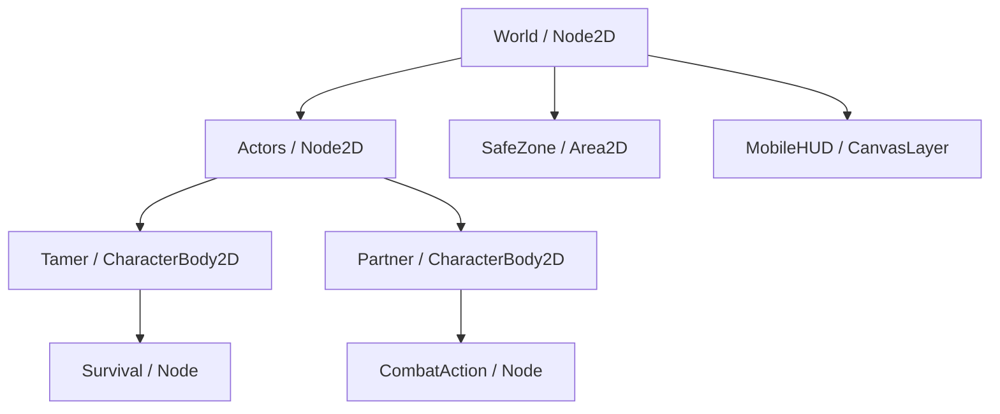
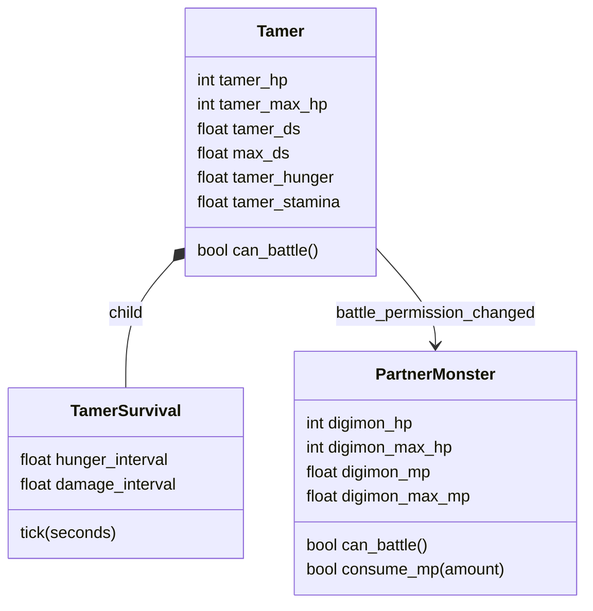
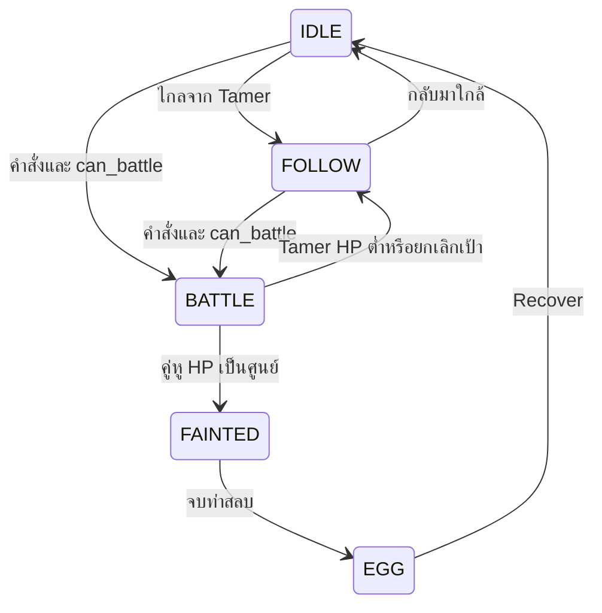

# Godot 4 — Advanced Status & Survival v19

ต่อยอดจากโปรเจกต์ Clean HUD v18 โดยแยกเจ้าของค่าพลังอย่างชัดเจน: **Tamer เป็นเจ้าของ HP / DS / Hunger / Stamina ส่วนคู่หูเป็นเจ้าของ HP / MP** สกิลหัก MP คู่หู เปลี่ยนร่างหัก DS Tamer และความอดอยาก/ความเหนื่อยทำดาเมจ Tamer เท่านั้น

ชื่อ `tamer_hunger` ในโค้ดหมายถึงพลังอาหารที่ยังเหลือ: **100 = อิ่ม, 0 = อดอาหาร** HUD จึงใช้คำว่า “อิ่ม” เพื่ออ่านได้ตรงความหมาย ส่วน Stamina แสดงคำว่า “แรง”

โค้ดในคู่มือนี้ดึงจากไฟล์จริงที่ผ่านการรันด้วย Godot 4.4.1 สคริปต์ Tamer/Partner ฉบับเต็มพร้อมระบบเดิน, AI, EXP, สกิล, กระเป๋า, คัตซีน และเซฟอยู่ใน ZIP การแทรกส่วนต่าง ๆ ในโปรเจกต์เดิมควรรวมเข้าฟังก์ชันเดิม ไม่สร้าง `_ready()` / `_physics_process()` / `class_name` ซ้ำ

## 1. เปิดและทดลอง

1. แตก `Godot4_Survival_v19.zip` ลงโฟลเดอร์ใหม่ แล้ว Import `mobile_survival_v19/project.godot` ด้วย Godot 4.4.1 ขึ้นไป
2. รอ Import ภาพเสร็จ กด F5 เพื่อเล่น Loading → Login → เลือก Tamer/คู่หู → สนามตามระบบเดิม
3. ทดสอบระบบใหม่นี้เร็ว ๆ: เปิด `tools/survival_preview.tscn` แล้วกด F6 มีปุ่ม “หิวหมด”, “HP 19%”, “ฟื้นเต็ม” และแจกผลไม้/น้ำ MP/เนื้อไว้ในกระเป๋า ฉากนี้ใช้เซฟสาธิตแยกจากสล็อตตัวละครจริง
4. เมนู + → กระเป๋า → ผลไม้ดิจิตอล → “กิน” ฟื้นความอิ่ม, HP และแรงของ Tamer น้ำพลังดิจิมอนฟื้น MP คู่หู ส่วนเนื้อเดิมฟื้น HP คู่หู
5. เดินเข้า Safe Zone ในเมืองเพื่อพัก: HP Tamer, Stamina และ MP คู่หูฟื้น คู่หูเป็นไข่จะ Recover ตามระบบเดิม ออกจากเมืองแล้วเวลาความหิวกลับมานับต่อ

ไม่ต้องเพิ่ม Autoload ใหม่: `GameManager`, `QuestManager`, `InventoryManager`, `GameChat` ตั้งไว้แล้ว `TamerSurvival` เป็นลูกของตัวละคร ไม่ใช่ Singleton

## 2. Node และเจ้าของสเตตัส



| Scene / Node | สคริปต์หรือค่าที่ต้องตั้ง |
| --- | --- |
| `scenes/tamer.tscn` / Tamer | `scripts/tamer.gd`; ตัวแปร `partner` ชี้คู่หู |
| Tamer / Survival | Node ลูกธรรมดา ผูก `scripts/tamer_survival.gd`; Process Mode = Inherit |
| Tamer / AnimatedSprite2D, DirectionalAnimator, NavigationAgent2D, Progress | คงของเดิมเพื่อเดินและเลเวล |
| `scenes/partner.tscn` / Partner | `scripts/partner_monster.gd`; `tamer` ชี้ Tamer; `forms[0]` ต้องเป็น Rookie |
| Partner / AnimatedSprite2D, EggSprite, NavigationAgent2D, CombatAction, Progress | คง AI / ท่าโจมตี / ร่างไข่ / เลเวลเดิม |
| `scenes/safe_zone.tscn` / SafeZone | `scripts/safe_zone.gd`; `collision_layer=0`, `collision_mask=2` ตรวจ Tamer ที่อยู่ physics layer 2 |
| SafeZone / CollisionShape2D | CircleShape2D ปรับรัศมีเมืองใน Inspector; ใช้ `body_entered` และ `body_exited` |
| MobileHUD / Root / Safe / Layout / StatusStack / PartyStatus | `scenes/party_status_hud.tscn`; HP คู่หู, HP Tamer, DS/MP, อิ่ม/แรง |
| PartyStatus / Margin / Rows / Energy | HBoxContainer มี ProgressBar ชื่อ DS และ MP แต่ละตัวมี Label ชื่อ Value |
| PartyStatus / Margin / Rows / Needs | HBoxContainer มี ProgressBar ชื่อ Hunger และ Stamina แต่ละตัวมี Label ชื่อ Value |
| MobileHUD / Root / Safe / Layout / Combat / SkillPanel | `scripts/form_skill_panel.gd`; ใช้ MP และ guard ของคู่หู |
| DigivolveCutscene | สร้างไว้ใต้ root ของ SceneTree; CanvasLayer และ AnimationPlayer ทำงาน ALWAYS ระหว่าง pause |

`CharacterProgress` และ `MonsterData` ยังเป็นแหล่งคำนวณ max HP / ATK / speed เมื่อเลเวลหรือร่างเปลี่ยน ข้อมูลที่เปลี่ยนระหว่างเล่นอยู่ใน Actor ไม่เขียน HP/MP ปัจจุบันลง Resource `.tres` ที่อาจถูกใช้ร่วมกัน



ชื่อ `hp` / `max_hp` / `ds` ที่ระบบเดิมใช้อยู่เป็น property alias ของค่าจริง จึงไม่เกิดสเตตัสสองชุดแล้วหลอด UI อ่านผิดตัว

## 3. กติกาเวลาและค่าตั้งต้น

| เหตุการณ์ | ผลลัพธ์ |
| --- | --- |
| เล่นในสนามครบ 5 วินาที | `tamer_hunger -= 1` |
| หิวเพิ่งถึง 0 | เริ่มนับอดอาหารใหม่ ไม่คิดดาเมจย้อนหลังทั้ง 5 วินาที |
| หิว 0 ต่อเนื่องครบ 3 วินาที | Tamer HP −5; เกราะไม่ลดดาเมจนี้ |
| คู่หูอยู่ State.BATTLE | Tamer Stamina −1 ต่อวินาที |
| Stamina 0 ต่อเนื่องครบ 3 วินาที | Tamer HP −5 |
| หิวและ Stamina 0 พร้อมกัน | ดาเมจรวม 5+5 = 10 ต่อรอบ 3 วินาที จากตัวจับเวลาแยกกัน |
| ไม่ต่อสู้และยังมีอาหารเหลือ | Stamina +3 ต่อวินาที |
| อยู่ Safe Zone | หยุดหิวและดาเมจ Survival; HP Tamer +10 ทุก 3 วินาที, Stamina +10/วินาที, MP คู่หู +5/วินาที |
| ออกจาก Safe Zone | นับความหิวต่อจากเศษเวลาเดิม; เริ่มรอบดาเมจใหม่หลังพ้นเขตพัก |
| เปิด Inventory / Status / คัตซีน | สนาม pause นาฬิกา Survival จึงหยุดด้วย |
| มือถือพักแอปหรือปิดเกม | ไม่นำเวลาที่หายไปมาหักความหิวหรือ HP ย้อนหลัง |

ค่าคงที่ STEP = 0.25 วินาทีทำให้ logic อัปเดต 4 ครั้งต่อวินาที ค่า Stamina เปลี่ยนแบบ float แล้ว UI แสดงเป็นจำนวนเต็ม ไม่ส่ง Signal ใหม่ 60 ครั้งต่อวินาทีสำหรับความหิวที่เปลี่ยนทุก 5 วินาที

เมื่อเฟรมกระตุกใช้ accumulator เก็บเวลาค้างและทำงานไม่เกิน 32 step ต่อเฟรม จึงไม่ทิ้งเวลาของรอบที่ครบไปแล้ว `advance(seconds)` เป็น API สำหรับทดสอบ ไม่ต้องเรียกเพิ่มจากเกมจริง เพราะ `_process(delta)` นับให้อยู่แล้ว

## 4. `scripts/tamer_survival.gd` — Loop ฉบับเต็ม

สคริปต์นี้วางใต้ Tamer จึงอ่านสเตตัสจากพ่อโดยตรง และได้รับการ pause ตามฉาก การพักใน Safe Zone ใช้ WeakRef หลายเขตร่วมกัน: ออกจาก A แต่ยังอยู่ B จะไม่หยุดพักก่อนเวลา

```gdscript
class_name TamerSurvival
extends Node
## ตัวจับเวลาตัวเดียวสำหรับ Survival: สเตตัสจริงอยู่ใน Tamer ไม่เก็บสำเนา HP/หิว/เหนื่อย
## อัปเดตแบบ fixed step 0.25s (4 ครั้ง/วินาที) ลดภาระ Signal/UI และผลไม่ขึ้นกับ FPS
@export_range(0.25, 60.0) var hunger_interval: float = 5.0
@export_range(0.0, 10.0) var hunger_loss: float = 1.0
@export_range(0.25, 30.0) var damage_interval: float = 3.0
@export_range(1, 100) var starvation_damage: int = 5
@export_range(1, 100) var fatigue_damage: int = 5
@export_range(0.0, 20.0) var battle_stamina_loss: float = 1.0
@export_range(0.0, 20.0) var idle_stamina_regen: float = 3.0
@export_range(0.0, 50.0) var rest_stamina_regen: float = 10.0
@export_range(0.25, 30.0) var rest_heal_interval: float = 3.0
@export_range(1, 100) var rest_heal_amount: int = 10
@export_range(0.0, 50.0) var rest_mp_regen: float = 5.0
@export var autosave_enabled: bool = true
@export_range(5.0, 60.0) var autosave_interval: float = 10.0
const STEP: float = 0.25
var tamer: Tamer
var _accumulator: float = 0.0
var _hunger_elapsed: float = 0.0
var _starvation_elapsed: float = 0.0
var _fatigue_elapsed: float = 0.0
var _rest_elapsed: float = 0.0
var _safe_zones: Dictionary = {} # instance ID -> WeakRef; ซ้อนหลายเขตได้ไม่หยุดพักก่อนเวลา
var _app_paused: bool = false
var _skip_resume_delta: bool = false
var _save_elapsed: float = 0.0
var _dirty: bool = false

func _ready() -> void:
    # Inherit จาก Tamer: หยุดพร้อมสนามเมื่อ Inventory/Status/Cutscene pause
    tamer = get_parent() as Tamer
    # จับผลที่เปลี่ยนจากนอก loop ด้วย เช่น ร่ายสกิลแล้วพักแอปก่อนครบ tick ความหิว
    for source_signal: Signal in [tamer.hp_changed, tamer.ds_changed, tamer.survival_changed]:
        source_signal.connect(_mark_dirty)
    if is_instance_valid(tamer.partner):
        for source_signal: Signal in [tamer.partner.hp_changed, tamer.partner.mp_changed]:
            source_signal.connect(_mark_dirty)

func _mark_dirty(_a: Variant = null, _b: Variant = null) -> void:
    # Signal ไม่เขียนเซฟทันที แค่ติดธงไว้ให้ checkpoint/app pause ทำครั้งเดียว
    _dirty = true

func _process(delta: float) -> void:
    # เก็บเศษเวลาไว้ ไม่ใช้จำนวนเฟรมหรือ await หลายตัวที่อาจนับซ้อน
    if _app_paused or not is_instance_valid(tamer) or not is_finite(delta) or delta <= 0:
        return
    if _skip_resume_delta:
        # เฟรมแรกหลังกลับแอปอาจรวมเวลาที่ OS หยุดไว้ ไม่เอา delta นั้นมาทำดาเมจย้อนหลัง
        _skip_resume_delta = false
        return
    _accumulator += delta
    # ถ้าเฟรมกระตุกหนัก จำกัดงานเฟรมนี้ไว้ 32 step แต่ไม่ทิ้งเวลาค้าง
    _drain_steps(32)

func advance(seconds: float) -> void:
    # API สำหรับทดสอบ/จำลองเวลา active play; ไม่อ่านเวลานาฬิกาเพื่อหักความหิวขณะปิดเกม
    if not is_instance_valid(tamer) or not is_finite(seconds) or seconds <= 0:
        return
    _accumulator += seconds
    _drain_steps(-1)

func _drain_steps(limit: int) -> void:
    var steps: int = 0
    while _accumulator + 0.000001 >= STEP and (limit < 0 or steps < limit):
        _accumulator = maxf(0, _accumulator - STEP)
        _tick(STEP)
        steps += 1

func _tick(seconds: float) -> void:
    # ตรวจช่วงต้น step เพื่อไม่คิดดาเมจย้อนหลังทั้งเฟรมเมื่อหิวเพิ่งลดถึงศูนย์ตอนท้าย
    var previous_hp: int = tamer.hp
    var previous_hunger: float = tamer.tamer_hunger
    var previous_stamina: float = tamer.tamer_stamina
    var previous_mp: float = tamer.partner.digimon_mp if is_instance_valid(tamer.partner) else 0
    var resting: bool = is_resting()
    var battling: bool = not resting and is_instance_valid(tamer.partner) and tamer.partner.state == PartnerMonster.State.BATTLE
    var hunger: float = tamer.tamer_hunger
    var stamina: float = tamer.tamer_stamina
    if resting:
        # พักในเมืองหยุดความหิว/ดาเมจ Survival; ไม่เติมอาหารฟรี ค่าหิวเดิมยังคงอยู่
        _starvation_elapsed = 0
        _fatigue_elapsed = 0
        _rest_elapsed += seconds
        if _rest_elapsed + 0.000001 >= rest_heal_interval:
            _rest_elapsed = maxf(0, _rest_elapsed - rest_heal_interval)
            tamer.restore_hp(rest_heal_amount)
        stamina = minf(100, stamina + rest_stamina_regen * seconds)
        if is_instance_valid(tamer.partner):
            tamer.partner.restore_mp(rest_mp_regen * seconds)
    else:
        _rest_elapsed = 0
        if hunger <= 0:
            _starvation_elapsed += seconds
            if _starvation_elapsed + 0.000001 >= damage_interval:
                _starvation_elapsed = maxf(0, _starvation_elapsed - damage_interval)
                tamer.take_survival_damage(starvation_damage)
        else:
            _starvation_elapsed = 0
        if stamina <= 0:
            _fatigue_elapsed += seconds
            if _fatigue_elapsed + 0.000001 >= damage_interval:
                _fatigue_elapsed = maxf(0, _fatigue_elapsed - damage_interval)
                tamer.take_survival_damage(fatigue_damage)
        else:
            _fatigue_elapsed = 0
        _hunger_elapsed += seconds
        if _hunger_elapsed + 0.000001 >= hunger_interval:
            _hunger_elapsed = maxf(0, _hunger_elapsed - hunger_interval)
            hunger = maxf(0, hunger - hunger_loss)
        if battling:
            stamina = maxf(0, stamina - battle_stamina_loss * seconds)
        elif hunger > 0:
            stamina = minf(100, stamina + idle_stamina_regen * seconds)
    # หิวและเหนื่อยศูนย์พร้อมกัน: มีดาเมจ 5+5 ต่อรอบ แยกตัวจับเวลา ไม่หัก HP คู่หู
    tamer.set_survival_values(hunger, stamina)
    tamer.check_battle_permission()
    var values_changed: bool = (
        previous_hp != tamer.hp
        or not is_equal_approx(previous_hunger, tamer.tamer_hunger)
        or not is_equal_approx(previous_stamina, tamer.tamer_stamina)
        or (is_instance_valid(tamer.partner)
            and not is_equal_approx(previous_mp, tamer.partner.digimon_mp))
    )
    _dirty = _dirty or values_changed
    _save_elapsed += seconds
    if _save_elapsed >= autosave_interval:
        _save_elapsed = 0
        _save_if_dirty()

func _save_if_dirty() -> void:
    # เซฟไม่เกินหนึ่งครั้งต่อ 10s เฉพาะค่าที่เปลี่ยน ห้ามเขียน DS ระหว่างจองคัตซีน
    if autosave_enabled and _dirty and is_instance_valid(tamer) and (not is_instance_valid(tamer.partner) or not tamer.partner.evolution_busy):
        tamer.save_party_progress()
        _dirty = false

func set_safe_zone(zone: Node, entered: bool) -> void:
    # ID + WeakRef ไม่ยื้อ Safe Zone เก่าที่ถูกลบ และออกเขต A ขณะยังอยู่ B ยังคงพัก
    if not is_instance_valid(zone):
        return
    if entered:
        _safe_zones[zone.get_instance_id()] = weakref(zone)
    else:
        _safe_zones.erase(zone.get_instance_id())
    if is_resting() and is_instance_valid(tamer.partner):
        tamer.partner.auto_battle = false
        tamer.partner.cancel_battle()
    tamer.survival_changed.emit(tamer.tamer_hunger,tamer.tamer_stamina)

func is_resting() -> bool:
    # เมื่อเขตถูก free โดยไม่ส่ง body_exited ให้เก็บกวาดและไม่พักค้างนอกเมือง
    for id: int in _safe_zones.keys():
        var zone: Node = (_safe_zones[id] as WeakRef).get_ref()
        if not is_instance_valid(zone) or not zone.is_inside_tree() or zone.is_queued_for_deletion():
            _safe_zones.erase(id)
    return not _safe_zones.is_empty()

func get_save_data() -> Dictionary:
    # เก็บเศษตัวจับเวลาเพื่อวาร์ปไม่เริ่มรอบความหิว/ดาเมจใหม่ทุกครั้ง ไม่เก็บ Node เมือง
    return {
        "version": 1,
        "hunger": tamer.tamer_hunger,
        "stamina": tamer.tamer_stamina,
        "cannot_battle": not tamer.can_battle(),
        "step_elapsed": _accumulator,
        "hunger_elapsed": _hunger_elapsed,
        "starvation_elapsed": _starvation_elapsed,
        "fatigue_elapsed": _fatigue_elapsed,
        "rest_elapsed": _rest_elapsed,
    }

func restore_data(data: Dictionary) -> void:
    # เซฟ v18 ไม่มีฟิลด์ Survival: เริ่มหิว/เหนื่อย 100 และไม่หักเวลาขณะปิดเกม
    _safe_zones.clear()
    _save_elapsed = 0
    _dirty = false
    tamer.set_survival_values(_number(data,"hunger",100,100),_number(data,"stamina",100,100))
    _accumulator = _number(data,"step_elapsed",0,60)
    _hunger_elapsed = _number(data,"hunger_elapsed",0,hunger_interval)
    _starvation_elapsed = _number(data,"starvation_elapsed",0,damage_interval)
    _fatigue_elapsed = _number(data,"fatigue_elapsed",0,damage_interval)
    _rest_elapsed = _number(data,"rest_elapsed",0,rest_heal_interval)
    tamer.restore_battle_latch(bool(data.get("cannot_battle",false)))

func _number(data: Dictionary, key: String, fallback: float, maximum: float) -> float:
    # ปฏิเสธชนิด/NaN/Infinity จาก JSON หรือสคริปต์ภายนอกก่อนนำเข้าสมการ
    var value: Variant = data.get(key,fallback)
    if not (value is int or value is float) or not is_finite(float(value)):
        return fallback
    return clampf(float(value),0,maximum)

func _notification(what: int) -> void:
    # ไม่ทำดาเมจย้อนหลังตอนสลับไปใช้แอปอื่น/จอดับบนมือถือ
    if what == NOTIFICATION_APPLICATION_PAUSED:
        _app_paused = true
        _save_if_dirty()
    elif what == NOTIFICATION_APPLICATION_RESUMED:
        _app_paused = false
        _skip_resume_delta = true
```

## 5. สเตตัสและเงื่อนไขเลือดใน `scripts/tamer.gd`

ส่วนประกาศค่าจริงด้านล่างอยู่ในคลาส Tamer เดิม `tamer_max_hp` มีค่าเริ่มต้น 200 และถูกปรับจาก TamerModelData / CharacterProgress / อุปกรณ์เมื่อเข้าเกมหรือเลเวลเปลี่ยน:

```gdscript
# เจ้าของสเตตัสเป็น Tamer เท่านั้น ชื่อ hp/max_hp/ds เดิมเป็น alias ไม่ใช่ข้อมูลอีกชุด
var tamer_max_hp: int = 200
var tamer_hp: int = 200:
    set(value):
        tamer_hp = clampi(value,0,maxi(1,tamer_max_hp))
        if is_node_ready():
            check_battle_permission()
var tamer_hunger: float = 100.0
var tamer_stamina: float = 100.0
var _cannot_battle: bool = false
@onready var survival: TamerSurvival = $Survival
var max_hp: int:
    get: return tamer_max_hp
    set(value): tamer_max_hp = maxi(1,value)
var hp: int:
    get: return tamer_hp
    set(value): tamer_hp = value

signal hp_changed(current: int, maximum: int)
signal survival_changed(hunger: float, stamina: float)
signal battle_permission_changed(allowed: bool)
signal ds_changed(current: float, maximum: float)
```

Tamer เดิมมี `max_ds` เป็นตัวแปร export แล้ว ใช้ property `tamer_ds` / `ds` ชี้ค่าเดียวกัน:

```gdscript
var tamer_ds: float = 100.0:
    set(value):
        if is_finite(value):
            tamer_ds = clampf(value,0,max_ds)
var ds: float:
    get: return tamer_ds
    set(value): tamer_ds = clampf(value,0,max_ds)
```

### Threshold ที่ 20% ไม่สั่นไปมา

| Tamer max HP = 200 | ผล |
| --- | --- |
| HP 39 หรือน้อยกว่า | เข้า Cannot Battle |
| HP 40 หลังเพิ่งเข้า debuff | ยังต่อสู้ไม่ได้ |
| HP 40 ก่อนเคยเข้า debuff | ยังต่อสู้ได้ เพราะยังไม่ต่ำกว่า 20% |
| HP 41 หรือมากกว่า | ออกจาก debuff |

ใช้ `hp * 5` เทียบ `max_hp` โดยตรงและเก็บ latch เพื่อทำตามเงื่อนไข “เข้าเมื่อต่ำกว่า 20% / ออกเมื่อมากกว่า 20%” อย่างเคร่งครัด Signal ส่งเฉพาะตอนเปลี่ยนสิทธิ์ ไม่สั่งคู่หูกลับ Rookie ซ้ำทุก tick

```gdscript
func can_battle() -> bool:
    # แม้ระบบภายนอกเขียน HP ตรง ๆ ก็ไม่ข้ามประตูนี้; ใช้จำนวนเต็ม *5 ป้องกัน float ที่ 20%
    return hp > 0 and hp * 5 >= max_hp and not _cannot_battle

func check_battle_permission() -> void:
    # เข้า debuff เมื่อ <20%; ออกจาก debuff เมื่อ >20%; ที่เท่ากันคง latch เดิม
    var blocked: bool = _cannot_battle
    if hp * 5 < max_hp or hp == 0:
        blocked = true
    elif hp * 5 > max_hp:
        blocked = false
    if blocked == _cannot_battle:
        return
    _cannot_battle = blocked # เขียนก่อน Signal เพื่อให้ callback ตรวจ can_battle() ได้ทันที
    battle_permission_changed.emit(not blocked)
    if blocked:
        set_target(null)

func restore_battle_latch(saved_blocked: bool) -> void:
    # จำสถานะที่ HP เท่ากับ 20% ข้ามเซฟ แต่ไม่เชื่อ latch ที่ขัดกับ HP จริง
    _cannot_battle = saved_blocked if hp * 5 == max_hp else hp * 5 < max_hp
    battle_permission_changed.emit(can_battle())

func set_survival_values(hunger: float, stamina: float) -> void:
    # รวม Signal ครั้งเดียวต่อ step; UI อ่านค่าล่าสุด ไม่แยก Timer ต่อหลอด
    if not is_finite(hunger) or not is_finite(stamina):
        return
    var next_hunger: float = clampf(hunger,0,100)
    var next_stamina: float = clampf(stamina,0,100)
    if is_equal_approx(tamer_hunger,next_hunger) and is_equal_approx(tamer_stamina,next_stamina):
        return
    tamer_hunger = next_hunger
    tamer_stamina = next_stamina
    survival_changed.emit(tamer_hunger,tamer_stamina)

func take_survival_damage(amount: int) -> void:
    # ความอดอยาก/เหนื่อยเป็นดาเมจตรง ไม่ให้เกราะลด 5 หน่วยจนผู้เล่นไม่ต้องกินอาหาร
    if amount <= 0 or hp <= 0:
        return
    hp = maxi(0,hp-amount)
    hp_changed.emit(hp,max_hp)

func restore_hp(amount: int) -> int:
    # อาหาร/พักในเมืองฟื้น Tamer ได้แม้ HP 0; ไม่ชุบคู่หูและไม่เปิด Auto เอง
    if amount <= 0:
        return 0
    var healed: int = mini(amount,max_hp-hp)
    if healed <= 0:
        return 0
    hp += healed
    hp_changed.emit(hp,max_hp)
    return healed

func can_eat_food(hunger_value: float, heal_value: int, stamina_value: float) -> bool:
    # ไม่กินทิ้งเมื่อทุกค่าที่อาหารนี้ฟื้นได้เต็มแล้ว; กินได้แม้คู่หูยังเป็นไข่
    return (hunger_value > 0 and tamer_hunger < 100) or (heal_value > 0 and hp < max_hp) or (stamina_value > 0 and tamer_stamina < 100)

func eat_food(hunger_value: float, heal_value: int, stamina_value: float) -> bool:
    # Inventory ตัดจำนวนหลังฟื้นสำเร็จ แล้ว save HP+สเตตัส+จำนวนพร้อมกัน
    if not is_finite(hunger_value) or not is_finite(stamina_value) or not can_eat_food(hunger_value,heal_value,stamina_value):
        return false
    set_survival_values(tamer_hunger+maxf(0,hunger_value),tamer_stamina+maxf(0,stamina_value))
    restore_hp(maxi(0,heal_value))
    check_battle_permission()
    return true
```

เรียก `take_survival_damage()` แทน `take_damage()` สำหรับความอดอยาก/ความเหนื่อย เพราะดาเมจ Survival ต้องไม่ถูกลดด้วย DEF ของอุปกรณ์ สำหรับอาหารเรียก `eat_food()` ผ่าน InventoryManager เพื่อให้จำนวนของถูกหักและเซฟพร้อมกัน

Tamer HP = 0 ยังอยู่ในฉากและเดินกลับเมืองหรือกินอาหารได้ ปุ่มต่อสู้จะปิดจน HP เกินเกณฑ์ อาหาร Tamer ไม่ชุบชีวิตคู่หูเป็นไข่ ต้องใช้ Recover หรือเมืองตามระบบเดิม

## 6. คู่หูยกเลิกการต่อสู้และกลับ Rookie

ใน `_ready()` ของคู่หูเชื่อม Signal หลังตั้ง MP เต็ม:

```gdscript
digimon_mp = digimon_max_mp
if is_instance_valid(tamer):
    tamer.battle_permission_changed.connect(_on_tamer_battle_permission)
mp_changed.emit(digimon_mp, digimon_max_mp)
```

เมื่อติด debuff ยกเลิก Auto, เป้าหมาย, สกิลรอเข้า range, wind-up และ projectile ที่เป็นของคู่หูนี้ทั้งหมด แล้วเปลี่ยนข้อมูลเป็น `forms[0]` โดยคง **สัดส่วน HP** และค่า MP เดิมไว้ ไม่โหลดร่างใหม่เพื่อแจก HP/MP เต็มฟรี

ตัวอย่าง Champion HP 180/240 เปลี่ยน Rookie max HP 120 จะได้ HP 90/120 ส่วน MP 17 ยังคง 17 การเปลี่ยนตัวเลข HP นี้เกิดจาก max HP ร่างใหม่ ไม่ใช่ดาเมจความหิวที่ยิงใส่คู่หู

```gdscript
func can_battle() -> bool:
    # เป็น guard จริงที่ตัวละคร ไม่พึ่งปุ่ม UI อย่างเดียว; ใน Safe Zone ให้พักแทนโจมตี
    return is_alive() and is_instance_valid(tamer) and tamer.can_battle() and not tamer.survival.is_resting()

func _on_tamer_battle_permission(allowed: bool) -> void:
    # หยุด Wind-up, Auto, คำสั่งรอ, Target และลูกไฟเก่าก่อนกลับร่างพื้นฐาน
    if allowed:
        return # ไม่เปิด Auto/ล็อกเป้าหมายเก่าซ้ำเองหลังฟื้น
    abort_digivolve() # คืน DS ที่จองถ้าคัตซีนยังไม่ Commit
    auto_battle = false
    cancel_battle()
    for projectile: Node in get_tree().get_nodes_in_group("skill_projectiles"):
        if is_instance_valid(projectile) and projectile.source == self:
            projectile._expire()
    if is_alive() and not forms.is_empty() and current_form != forms[0]:
        # HP เปลี่ยนตาม max ของ Rookie โดยคงสัดส่วนเดิม ไม่ทำดาเมจจาก Survival ใส่คู่หู
        _apply_form(0,true)
    velocity = Vector2.ZERO
    _desired_velocity = Vector2.ZERO
    if is_alive():
        _change_state(State.FOLLOW if global_position.distance_to(tamer.global_position) > follow_stop_distance else State.IDLE)
    feedback.emit("Tamer HP ต่ำกว่า 20%: กลับ Rookie และหยุดต่อสู้")
```

นอกจากนี้ `_physics_process()` บังคับใช้กติกาซ้ำที่ขอบเขตของ AI เผื่อสคริปต์อื่นเขียน Auto/State โดยตรง:

```gdscript
if not tamer.can_battle() and (state == State.BATTLE or auto_battle or form_index > 0):
    _on_tamer_battle_permission(false)
if not can_battle() and is_instance_valid(target):
    cancel_battle()
```

คู่หูที่ยังมีชีวิตเปลี่ยนเป็น FOLLOW เมื่อไกลกว่า follow_stop_distance หรือ IDLE เมื่อใกล้ Tamer หลังจากนั้น AI เดิมพากลับมาหาตาม NavigationAgent2D คู่หูที่เป็นไข่อยู่แล้วคงเป็น EGG และเดินตาม ไม่สวม Rookie เพื่อชุบชีวิตเอง



ในทุกคำสั่งโจมตี, การเริ่มสกิล, impact frame และ SkillProjectile ยังตรวจ `can_battle()` ที่ Actor ด้วย ปิดปุ่ม UI อย่างเดียวจึงไม่ใช่แหล่งบังคับกฎ

## 7. MP เป็นของคู่หู; สกิลไม่หัก DS

ส่วนค่าของคู่หูใน `scripts/partner_monster.gd`:

```gdscript
# ค่าสถานะระหว่างเล่น แยกจาก Resource ต้นแบบ
var digimon_hp: int = 0
var digimon_max_hp: int = 0
@export_range(1.0, 99999.0) var digimon_max_mp: float = 100.0
var digimon_mp: float = 100.0:
    set(value):
        if is_finite(value):
            digimon_mp = clampf(value,0,digimon_max_mp)
# Alias เพื่อให้ Nameplate/เซฟ/EXP เดิมใช้งานได้ ข้อมูลจริงมีเพียงชุดเดียว
var hp: int:
    get: return digimon_hp
    set(value): digimon_hp = clampi(value,0,maxi(0,digimon_max_hp))
var max_hp: int:
    get: return digimon_max_hp
    set(value): digimon_max_hp = maxi(1,value)

signal mp_changed(current: float, maximum: float)
```

`digimon_max_mp` ปรับใน Inspector ของ Partner ได้ ค่าเริ่มต้น 100 รุ่นนี้ยังไม่เพิ่ม max MP ตามเลเวลหรือร่างโดยอัตโนมัติ สกิลแต่ละอันมี `mp_cost` ของตนเอง:

```gdscript
class_name MonsterSkill
extends Resource
## ข้อมูลต้นแบบสกิล: คูลดาวน์และเป้าหมายเก็บในคู่หู ไม่แก้ Resource ร่วมกัน

@export var id: StringName = &"strike"
@export var display_name: String = "Strike"
@export var icon: Texture2D
@export_group("ท่าใช้สกิล")
## cast ใช้ท่าร่าย/พ่นพลัง; attack ใช้ท่ากรงเล็บ/กัด
@export var animation_prefix: StringName = &"cast"
@export_range(0, 30) var release_frame: int = 2
@export_group("ค่าต่อสู้")
@export_range(0.01, 20.0) var multiplier: float = 1.2
@export_range(1.0, 1000.0) var cast_range: float = 90.0
@export_range(0.1, 60.0) var cooldown: float = 3.0
@export_range(0.0, 100.0) var mp_cost: float = 5.0
## 0 = เป้าหมายเดียว; มากกว่า 0 = ระเบิดรอบตำแหน่งเป้าหมาย
@export_range(0.0, 500.0) var impact_radius: float = 0.0
@export var effect_color: Color = Color(1.0, 0.45, 0.1)
@export_range(4.0, 100.0) var effect_size: float = 12.0
@export_group("ลูกไฟเดินทาง")
## 0 = โจมตีทันที; ค่าบวก = ความเร็วลูกไฟเป็นพิกเซลต่อวินาที
@export_range(0.0, 3000.0) var projectile_speed: float = 0.0
## กำหนดอายุสูงสุด ป้องกันลูกไฟไล่เป้าหมายที่วิ่งหนีไม่สิ้นสุด
@export_range(0.1, 10.0) var projectile_lifetime: float = 3.0

func validation_error() -> String:
    # ตรวจ runtime ด้วย เพราะแก้ .tres ด้วยมือข้ามข้อจำกัด Inspector ได้
    if id == &"" or display_name.strip_edges().is_empty():
        return "สกิลต้องมี ID และชื่อ"
    if animation_prefix not in [&"attack", &"cast"] or release_frame < 0:
        return "ต้องเลือกท่า attack/cast และ release_frame ต้องไม่ติดลบ"
    if not is_finite(multiplier) or multiplier <= 0.0:
        return "Multiplier ต้องเป็นจำนวนบวก"
    if not is_finite(cast_range) or cast_range <= 0.0 or not is_finite(cooldown) or cooldown <= 0.0:
        return "ระยะและคูลดาวน์ต้องมากกว่า 0"
    if not is_finite(mp_cost) or mp_cost < 0.0 or not is_finite(impact_radius) or impact_radius < 0.0:
        return "MP และรัศมีต้องไม่ติดลบ"
    if not is_finite(effect_size) or effect_size <= 0.0:
        return "ขนาดเอฟเฟกต์ต้องมากกว่า 0"
    if not is_finite(projectile_speed) or projectile_speed < 0.0:
        return "ความเร็วลูกไฟต้องไม่ติดลบ"
    if not is_finite(projectile_lifetime) or projectile_lifetime <= 0.0:
        return "อายุลูกไฟต้องมากกว่า 0"
    return ""

func roll_damage(base_attack: int, rng: RandomNumberGenerator) -> int:
    # แกว่ง +/-5% ของผลคูณทั้งหมด และปัดเป็นจำนวนเต็มท้ายสุด
    if base_attack <= 0:
        return 0
    return maxi(1, int(round(float(base_attack) * multiplier * rng.randf_range(0.95, 1.05))))

var ds_cost: float:
    # Alias ของ API เก่าเท่านั้น; Inspector v19 ใช้ mp_cost และไม่หัก DS ตอนร่าย
    get: return mp_cost
    set(value): mp_cost = value
```

ไฟล์ `.tres` ของสกิลทั้งหมดใน v19 เปลี่ยนจาก `ds_cost = ...` เป็น `mp_cost = ...` แล้ว ค่าเก่าคือค่าพลังของสกิลเดิมที่ย้ายเจ้าของไปคู่หู หากมีสกิลที่สร้างเพิ่มเอง ให้ย้ายชื่อฟิลด์ในไฟล์นั้นด้วย property `ds_cost` ที่ยังอยู่ท้ายคลาสเป็น alias API เพื่อรองรับสคริปต์เก่า ไม่ใช่พลังงานอีกหลอดหนึ่ง

### ตรวจและหักพลังในจุดเดียว

```gdscript
func consume_mp(amount: float) -> bool:
    # เรียกเมื่อกำลังเริ่มสกิลเท่านั้น ท่าโจมตีธรรมดา/เดิน/ความหิวไม่แตะ MP
    if not is_finite(amount) or amount < 0 or digimon_mp < amount:
        return false
    if amount > 0:
        digimon_mp = maxf(0,digimon_mp-amount)
        mp_changed.emit(digimon_mp,digimon_max_mp)
    return true

func restore_mp(amount: float) -> float:
    # เมือง/ไอเทม/Recover เติม MP แต่เปลี่ยนร่างไม่เติมฟรีและไม่หัก MP
    if not is_finite(amount) or amount <= 0:
        return 0
    var restored: float = minf(amount,digimon_max_mp-digimon_mp)
    if restored <= 0:
        return 0
    digimon_mp += restored
    mp_changed.emit(digimon_mp,digimon_max_mp)
    return restored

func _try_skill_resource(skill: MonsterSkill) -> bool:
    # กลไกเดียวกับสกิลร่างปัจจุบัน: ท่าร่าย/Projectile/AoE ใช้ Resource ที่ร้องขอ
    # attack_power และ Sprite ยังคงเป็นร่างในสนาม คูลดาวน์เก็บตาม skill.id เดิม
    if combat_action.busy or not can_battle() or evolution_busy:
        return false
    if skill == null or cooldown_remaining(skill) > 0.0 or not is_instance_valid(target) or not target.is_alive():
        return false
    if global_position.distance_to(target.global_position) > skill.cast_range:
        return false
    var direction: Vector2 = global_position.direction_to(target.global_position)
    var fallback: StringName = current_form.cast_animation if skill.animation_prefix == &"cast" else current_form.attack_animation
    if not _has_line_of_sight() or not combat_action.can_begin(skill.animation_prefix, direction, fallback):
        return false
    if not consume_mp(skill.mp_cost):
        return false
    # หัก MP/CD ครั้งเดียวตอนเริ่มร่าย เก็บ ATK ตอนนี้แม้ Level Up ระหว่างท่า
    skill_cooldowns[skill.id] = skill.cooldown
    _action_target = target
    _action_skill = skill
    _action_damage = skill.roll_damage(attack_power, _damage_rng)
    velocity = Vector2.ZERO
    _attack_animation_locked = true
    if not combat_action.begin(skill.animation_prefix, direction, fallback, skill.release_frame):
        restore_mp(skill.mp_cost)
        skill_cooldowns.erase(skill.id)
        _clear_action_context()
        return false
    if skill.animation_prefix == &"cast" and combat_action.busy:
        _charge_effect = _create_action_effect(self, _mouth_offset(), direction,
            CombatActionEffect.Kind.CHARGE, skill.effect_color, skill.effect_size,
            _time_to_frame(sprite.animation, skill.release_frame))
    return true
```

ก่อนหัก MP ตรวจสุขภาพ Tamer/คู่หู, คัตซีน, cooldown, เป้าหมายยังมีชีวิต, ระยะ, line of sight และท่าแอนิเมชัน หากยังไกลคำสั่งจะให้ AI เดินเข้า range ก่อน แล้วค่อยหักตอนเริ่มร่าย เมื่อเริ่มท่าไม่ได้จะคืน MP และ cooldown ที่เพิ่งจอง ถ้าท่าเริ่มไปแล้วแต่ถูกยกเลิกจาก HP ต่ำ MP ที่ใช้ร่ายยังถูกใช้ไปตามกติกา

โจมตีธรรมดาไม่เสีย MP; การเดิน ความหิว และความเหนื่อยไม่เสีย MP; เปลี่ยนร่างหรือถูกบังคับกลับ Rookie ไม่เติม/หัก MP ส่วน Recover และไอเทม/เขตพักเป็นการฟื้น MP ที่ตั้งใจให้เกิดขึ้น

Skill Cycle จาก v18 ยังเลือกชุดสกิลของร่างที่ปลดล็อกเควสต์แล้วได้ โดยใช้ `mp_cost` ของสกิลหน้าที่เลือก และ ATK ของร่างที่อยู่ในสนาม ไม่ปลดร่าง/รีเซ็ตคูลดาวน์เมื่อกดเปลี่ยนหน้า

## 8. DS ใช้เปลี่ยนร่างและจองระหว่างคัตซีน

ฟังก์ชันหัก DS อยู่ที่ Tamer:

```gdscript
func consume_ds(amount: float) -> bool:
    # ตรวจและหักในจุดเดียว ป้องกันเปลี่ยนร่างโดยไม่มีพลังงาน
    if not is_finite(amount) or amount < 0.0 or ds < amount:
        return false
    ds = maxf(0.0, ds - amount)
    ds_changed.emit(ds, max_ds)
    return true

func restore_ds(amount: float) -> void:
    if not is_finite(amount) or amount <= 0:
        return
    var next_ds: float = clampf(ds + amount, 0.0, max_ds)
    if not is_equal_approx(next_ds, ds):
        ds = next_ds
        ds_changed.emit(ds, max_ds)

func command_attack() -> void:
    if not can_battle() or not is_instance_valid(partner):
        return
    if get_target() == null:
        set_target(partner.find_nearest_enemy())
    partner.command_attack(get_target())

func command_skill(slot: int) -> void:
    if can_battle() and is_instance_valid(partner):
        partner.command_skill(slot, get_target())

func command_form_skill(source: MonsterData, slot: int) -> void:
    # ชุดสกิลต่างร่างใช้คำสั่งแยก ไม่เรียกเปลี่ยนข้อมูลตัวละคร
    cancel_auto_navigation()
    if can_battle() and is_instance_valid(partner):
        partner.command_form_skill(source, slot, get_target())

func command_digivolve() -> void:
    if can_battle() and is_instance_valid(partner):
        digivolve_requested.emit(partner)

func set_auto_battle(enabled: bool) -> void:
    if is_instance_valid(partner):
        partner.auto_battle = enabled and can_battle() and not survival.is_resting()
```

คู่หูมี `_reserved_form: MonsterData`, `_reserved_previous: MonsterData`, `_reserved_cost: float` และ `evolution_busy: bool` สำหรับ transaction การเปลี่ยนร่าง การกดซ้ำระหว่างคัตซีนไม่หัก DS เพิ่ม

```gdscript
func prepare_digivolve() -> MonsterData:
    # จอง DS เมื่อสุขภาพ Tamer พร้อม เมืองพักเปลี่ยนร่างได้แต่ไม่โจมตี
    if evolution_busy or not is_alive() or not is_instance_valid(tamer) or not tamer.can_battle():
        return null
    var next_data: MonsterData = get_next_form()
    if next_data == null or not QuestManager.can_use_form(next_data):
        feedback.emit("ร่างถัดไปยังล็อกหรืออยู่ร่างสูงสุดแล้ว")
        return null
    var error: String = next_data.validation_error()
    if not error.is_empty():
        feedback.emit(error)
        return null
    if not tamer.consume_ds(next_data.evolution_cost):
        feedback.emit("DS ไม่พอเปลี่ยนร่าง")
        return null
    _cancel_combat_action() # หยุด wind-up ก่อนคัตซีน
    _reserved_form = next_data
    _reserved_previous = current_form
    _reserved_cost = next_data.evolution_cost
    evolution_busy = true
    velocity = Vector2.ZERO
    evolution_changed.emit(true)
    return next_data

func finish_digivolve() -> bool:
    # Commit หลังคัตซีนจบ ตรวจสิทธิ์อีกครั้งก่อนเปลี่ยนตัวจริงในสนาม
    if not evolution_busy:
        return false
    if not is_alive() or not is_instance_valid(tamer) or not tamer.can_battle() or current_form != _reserved_previous or not QuestManager.can_use_form(_reserved_form):
        abort_digivolve()
        return false
    _internal_load = true
    var success: bool = load_monster_data(_reserved_form)
    _internal_load = false
    if not success:
        abort_digivolve()
        return false
    evolution_busy = false
    _reserved_cost = 0.0
    _reserved_form = null
    _reserved_previous = null
    evolution_changed.emit(false)
    feedback.emit("Digivolve: " + current_form.monster_name)
    tamer.save_party_progress()
    return true

func abort_digivolve() -> void:
    # ยกเลิก/ปิดคัตซีนก่อนจบ: คืน DS ครั้งเดียวและปลด busy
    if not evolution_busy:
        return
    if is_instance_valid(tamer):
        tamer.restore_ds(_reserved_cost)
    evolution_busy = false
    _reserved_cost = 0.0
    _reserved_form = null
    _reserved_previous = null
    evolution_changed.emit(false)
```

การเรียกจริงจาก MobileHUD จะสร้าง DigivolveCutscene ซึ่งเรียก `prepare_digivolve()` ก่อน pause; จบ AnimationPlayer จึงเรียก `finish_digivolve()`; ยกเลิก, ลบฉาก, watchdog หรือ HP Tamer ต่ำจะเรียก `abort_digivolve()` เพื่อคืน DS ครั้งเดียว

**DS maintenance ของร่างสูงจากระบบเดิมยังอยู่**: ขณะยืนเป็นร่างพัฒนา `MonsterData.ds_drain_per_second` อาจค่อย ๆ หัก DS แม้ไม่ได้กดสกิล นี่เป็นค่ารักษาร่าง ไม่ใช่ค่า MP สกิล ถ้าต้องการ DS เฉพาะตอนกดเปลี่ยนร่าง ให้ตั้งค่านี้เป็น 0 ใน Resource ของร่างต่าง ๆ ไม่ต้องแก้ระบบ MP

ในเมืองโจมตีไม่ได้ แต่ยังเปลี่ยนร่างได้เมื่อคู่หูมีชีวิต, HP Tamer ผ่านเกณฑ์, เควสต์ปลดล็อก และ DS เพียงพอ การตรวจ Digivolve จึงใช้ `tamer.can_battle()` ไม่ใช้ guard คู่หูที่ห้ามต่อสู้ใน Safe Zone

## 9. Pause และยกเลิกคัตซีนอย่างปลอดภัย

DigivolveCutscene เป็น CanvasLayer ใต้ root ทำงาน ALWAYS ส่วน Tamer/Survival/Partner สืบทอด Process Mode ที่ pause ได้ จึงหยุดเกมรวมทั้งนาฬิกาหิวโดยไม่หยุด AnimationPlayer ของคัตซีน

```gdscript
func play_for(partner: PartnerMonster) -> bool:
    # ไม่ซ้อนคัตซีนหรือเปิดทับ pause จากเมนูอื่น และตรวจสิทธิ์ก่อนเริ่ม
    if _owns_pause or _tree.paused or not is_instance_valid(partner):
        return false
    var next_data: MonsterData = partner.prepare_digivolve()
    if next_data == null:
        return false
    _partner = partner
    _partner.tree_exiting.connect(cancel)
    old_sprite.texture = WalkTextureTools.visible_texture(partner.current_form.sprite_frames.get_frame_texture(partner.current_form.idle_animation, 0))
    new_sprite.texture = WalkTextureTools.visible_texture(next_data.sprite_frames.get_frame_texture(next_data.idle_animation, 0))
    _old_scale = Vector2.ONE * (220.0 / maxf(old_sprite.texture.get_width(), old_sprite.texture.get_height()))
    _new_scale = Vector2.ONE * (300.0 / maxf(new_sprite.texture.get_width(), new_sprite.texture.get_height()))
    $Root/Caption.text = partner.current_form.monster_name + "  →  " + next_data.monster_name
    # ล้างนิ้วที่ปล่อยระหว่าง pause จะไม่ส่ง release กลับถึง Joystick
    if is_instance_valid(partner.tamer):
        partner.tamer.cancel_auto_navigation()
        partner.tamer.velocity = Vector2.ZERO
        if is_instance_valid(partner.tamer.joystick):
            partner.tamer.joystick.release_input()
    _previous_paused = _tree.paused
    _owns_pause = true
    _tree.paused = true
    player.play(&"evolve")
    player.advance(0.0)
    $Watchdog.start()
    return true

func _on_animation_finished(animation: StringName) -> void:
    # เปลี่ยนตัวจริงเฉพาะเมื่อ AnimationPlayer เล่นจนจบ
    if animation == &"evolve" and not _finished:
        var success: bool = is_instance_valid(_partner) and _partner.finish_digivolve()
        _finish(success)

func cancel() -> void:
    # ใช้เมื่อเปลี่ยน Scene/ปิดคัตซีน หรือ Watchdog พบว่า Animation ไม่จบ
    if not _finished:
        _finish(false)

func _finish(success: bool) -> void:
    # ทำครั้งเดียว ป้องกัน animation_finished และ timeout เรียกซ้อนกัน
    if _finished:
        return
    _finished = true
    $Watchdog.stop()
    if not success and is_instance_valid(_partner):
        _partner.abort_digivolve()
        if is_instance_valid(_partner.tamer):
            _partner.tamer.save_party_progress()
    _restore_pause()
    finished.emit(success)
    queue_free()

func _restore_pause() -> void:
    # คืนสถานะเดิมเฉพาะ pause ที่คัตซีนนี้เป็นผู้ถือครอง
    if _owns_pause and is_instance_valid(_tree):
        _tree.paused = _previous_paused
    _owns_pause = false

func _exit_tree() -> void:
    # เผื่อมีผู้เรียก queue_free() โดยตรง: ต้องไม่ทิ้งสนามไว้ในสถานะ pause
    if is_instance_valid(_partner) and _partner.evolution_busy:
        _partner.abort_digivolve()
        if is_instance_valid(_partner.tamer):
            _partner.tamer.save_party_progress()
    _restore_pause()
```

HUD รับ permission Signal แม้สนาม pause อยู่ หากระบบภายนอกทำ HP ลดระหว่างคัตซีน มันต้องปิดหน้าจอคัตซีนและคืน pause ให้ด้วย:

```gdscript
func _request_digivolve(partner_node: PartnerMonster) -> void:
    if is_instance_valid(active_cutscene) or get_tree().paused:
        return
    release_for_equipment()
    var cutscene: DigivolveCutscene = CUTSCENE_SCENE.instantiate() as DigivolveCutscene
    get_tree().root.add_child(cutscene)
    cutscene.finished.connect(_on_cutscene_finished)
    if not cutscene.play_for(partner_node):
        cutscene.queue_free()
        return
    active_cutscene = cutscene

func _on_battle_permission(allowed: bool) -> void:
    # Signal ยังคงทำงานตอน pause: อันตรายจากระบบอื่นสามารถยกเลิกคัตซีน/คืน DS ได้ทันที
    if not allowed:
        skill_panel.release_input()
        for button: TouchCommand in [attack_button,evolve_button,auto_button]:
            button.release_input()
        if is_instance_valid(active_cutscene):
            active_cutscene.cancel()
    skill_panel._refresh_buttons()
    _refresh_bars()
```

การ pause หยุด `_process` / `_physics_process` ของ Node ที่ pause ได้ แต่ **Signals และฟังก์ชันที่ถูกเรียกโดยตรงยังทำงาน** ตามเอกสาร Godot การตรวจ guard ในแต่ละฟังก์ชันจึงจำเป็นอยู่ด้วย อ้างอิง: [Godot 4.4 — Pausing games and process mode](https://docs.godotengine.org/en/4.4/tutorials/scripting/pausing_games.html)

## 10. อาหาร กระเป๋า และ MP Drink

`ItemType` เดิมยังอยู่และเพิ่ม `EffectType` เพื่อระบุเจ้าของผลไอเทม:

```gdscript
class_name ItemData
extends Resource
## ข้อมูลต้นแบบเท่านั้น: จำนวนที่ถืออยู่ต้องเก็บใน InventoryManager ไม่แก้ Resource ร่วมกัน
enum ItemType { CONSUMABLE, QUEST_ITEM, EGG }
enum EffectType { PARTNER_HP, TAMER_FOOD, PARTNER_MP }
@export var item_id: String = ""
@export var item_name: String = ""
@export var item_type: ItemType = ItemType.CONSUMABLE
@export var item_texture: Texture2D
@export_multiline var description: String = ""
@export var effect_value: int = 0
@export var effect_type: EffectType = EffectType.PARTNER_HP
@export_range(0, 9999) var tamer_hp_restore: int = 0
@export_range(0.0, 100.0) var tamer_stamina_restore: float = 0.0

func type_label() -> String:
    # ไอเทมเก่า default เป็นเนื้อคู่หู; อาหาร Tamer/น้ำ MP ใช้ EffectType แยกจาก ItemType
    if item_type == ItemType.CONSUMABLE:
        return ["ฟื้น HP คู่หู","อาหาร Tamer","ฟื้น MP คู่หู"][clampi(effect_type,0,2)]
    return "ไอเทมเควสต์" if item_type == ItemType.QUEST_ITEM else "ไข่ดิจิมอน"
```

| ไอเทม | item_id / effect_type | ผลต่อหนึ่งชิ้น |
| --- | --- | --- |
| ผลไม้ดิจิตอล | digital_fruit / TAMER_FOOD | ความอิ่ม +30, HP Tamer +25, Stamina +10 |
| น้ำพลังดิจิมอน | mp_drink / PARTNER_MP | MP คู่หู +30 |
| เนื้อฟื้นพลังเดิม | meat / PARTNER_HP | HP คู่หู +80 |
| ชิปข้อมูล / ไข่ | data_chip / digitama | เก็บเป็นไอเทมเควสต์ / ไข่ตามระบบเดิม |

อาหาร Tamer ใช้ได้แม้คู่หูเป็นไข่ MP Drink และเนื้อต้องรอ Recover ก่อน หากค่าทุกอย่างที่ไอเทมนั้นฟื้นได้เต็มแล้ว ระบบไม่ตัดของ ไอเทมจะเติมเท่าที่ขาดโดย clamp เพดาน

ฟังก์ชันใช้ไอเทมจริงใน InventoryManager ตรวจชนิดและสภาพก่อน commit แล้วหักจำนวนครั้งเดียว สุดท้าย emit `changed` เพื่อเซฟผลกับกระเป๋าใน snapshot เดียว:

```gdscript
func can_use_item(item: ItemData) -> bool:
    # ใช้ guard เดียวกันทั้ง UI และคำสั่งจริง ไม่ปิดอาหารเพราะ HP คู่หูเต็ม/ยังเป็นไข่
    return _use_error(item,player_node()).is_empty()

func _use_error(item: ItemData, player: Node) -> String:
    if item == null or not is_instance_valid(player):
        return "ไม่พบไอเทมหรือ Tamer"
    if item.item_type != ItemData.ItemType.CONSUMABLE:
        return "ไข่เก็บไว้สำหรับระบบฟัก ส่วนชิปข้อมูลใช้เป็นไอเทมเควสต์"
    if not is_instance_valid(player.partner) or player.partner.evolution_busy:
        return "รอคัตซีนเปลี่ยนร่างจบก่อน"
    match item.effect_type:
        ItemData.EffectType.TAMER_FOOD:
            if not player.can_eat_food(item.effect_value,item.tamer_hp_restore,item.tamer_stamina_restore):
                return "ค่าที่อาหารนี้ฟื้นได้เต็มแล้ว"
        ItemData.EffectType.PARTNER_HP:
            if not player.partner.is_alive(): return "คู่หูสลบ ใช้ Recover ก่อนใช้เนื้อ"
            if item.effect_value <= 0 or player.partner.hp >= player.partner.max_hp: return "HP เต็มแล้ว ไอเทมยังอยู่ในกระเป๋า"
        ItemData.EffectType.PARTNER_MP:
            if not player.partner.is_alive(): return "คู่หูสลบ ใช้ Recover ก่อนฟื้น MP"
            if item.effect_value <= 0 or player.partner.digimon_mp >= player.partner.digimon_max_mp: return "MP เต็มแล้ว ไอเทมยังอยู่ในกระเป๋า"
        _: return "ไม่รู้จักผลของไอเทม"
    return ""

func use_item(item_index: int) -> bool:
    # ตรวจครบก่อนเริ่ม; commit ผลและจำนวนของหนึ่งครั้ง จึงค่อย emit changed เพื่อเซฟ
    var item: ItemData = item_at(item_index)
    var player: Node = player_node()
    if _busy:
        return false
    var error: String = _use_error(item,player)
    if not error.is_empty():
        return _fail(error)
    _busy = true
    var healed: int = 0
    var applied: bool = false
    var message: String = ""
    match item.effect_type:
        ItemData.EffectType.TAMER_FOOD:
            var previous_hp: int = player.hp
            applied = player.eat_food(item.effect_value,item.tamer_hp_restore,item.tamer_stamina_restore)
            healed = player.hp-previous_hp
            message = "Tamer อิ่ม +%d / HP +%d" % [item.effect_value,healed]
        ItemData.EffectType.PARTNER_HP:
            var previous_hp: int = player.partner.hp
            heal_requested.emit(item.effect_value)
            healed = maxi(0,int(player.partner.hp)-previous_hp)
            applied = healed > 0
            message = "คู่หู HP +%d" % healed
        ItemData.EffectType.PARTNER_MP:
            var restored: float = player.partner.restore_mp(item.effect_value)
            applied = restored > 0
            message = "คู่หู MP +%.0f" % restored
    if not applied:
        _busy = false
        return false
    _remove(item_index,1)
    _busy = false
    changed.emit() # รวม HP/MP/Hunger/Stamina และจำนวนใหม่ใน snapshot เดียว
    item_used.emit(item,healed)
    feedback.emit("ใช้ %s — %s" % [item.item_name,message])
    return true
```

ใน InventoryUI ใช้ guard เดียวกับ manager และอ่านข้อมูลจาก Actor จริง ทำให้ Use ไม่ถูกปิดเพียงเพราะคู่หู HP เต็มในกรณีเลือกอาหาร Tamer ใน drop table ปัจจุบันเพิ่มผลไม้ 60% จำนวน 1–2 และน้ำ MP 30% จากการสุ่มแต่ละ entry อิสระ ของเดิมยังดรอปตามเดิม

การเพิ่มอาหารเอง: สร้าง ItemData `.tres`, เลือก ItemType=CONSUMABLE และ EffectType=TAMER_FOOD; `effect_value` เป็นความอิ่มที่เติม แล้วตั้ง `tamer_hp_restore` / `tamer_stamina_restore` ใส่ลง `data/items/catalog.tres` และ LootTable ที่ต้องการ

## 11. Safe Zone

Attach โค้ดนี้กับ Area2D ที่มี CollisionShape2D และ mask ตรวจ layer Tamer ตัวอย่างพร้อมใช้คือ `scenes/safe_zone.tscn` ก๊อปปี้ไปวางในเมืองได้เลย:

```gdscript
extends Area2D
## เขตพัก: เดินเข้าแล้วหยุด Survival damage ฟื้น HP Tamer/MP คู่หู และ Recover ร่างไข่
var _visitors: Dictionary = {} # WeakRef ตาม ID ป้องกันถือ Tamer ของ Scene เก่า
func _ready() -> void:
    # mask=2 ตรวจเฉพาะ Tamer; body_exited ใช้คืนการนับเวลาความหิวเมื่อออกเมือง
    body_entered.connect(_on_body_entered)
    body_exited.connect(_on_body_exited)

func _on_body_entered(body: Node2D) -> void:
    if not body is Tamer:
        return
    _visitors[body.get_instance_id()] = weakref(body)
    body.survival.set_safe_zone(self,true)
    if is_instance_valid(body.partner):
        body.partner.recover()

func _on_body_exited(body: Node2D) -> void:
    if body is Tamer:
        _visitors.erase(body.get_instance_id())
        body.survival.set_safe_zone(self,false)

func _exit_tree() -> void:
    # Safe Zone อาจถูกลบโดยไม่ส่ง exit; ปล่อยสถานะพักให้ทุกคนที่ยังอยู่ใน Scene
    for reference: WeakRef in _visitors.values():
        var visitor: Tamer = reference.get_ref() as Tamer
        if is_instance_valid(visitor) and is_instance_valid(visitor.survival):
            visitor.survival.set_safe_zone(self,false)
    _visitors.clear()
```

เขตพักหยุด Auto และยกเลิกเป้าเพื่อไม่ให้คู่หูไล่ออกไปโจมตีขณะ Tamer พัก การลบพื้นที่หรือ overlap หลายเขตไม่ทำให้สถานะพักค้างอยู่จาก Node ที่ถูกลบ

## 12. UI อัปเดตผ่าน Signals

ใน `MobileHUD._ready()` เชื่อม Signal เหล่านี้กับ `_refresh_bars()` และเชื่อม `battle_permission_changed` กับ `_on_battle_permission()` ตามที่ตั้งไว้ในโปรเจกต์:

```gdscript
for source_signal: Signal in [
    tamer.hp_changed, tamer.ds_changed, tamer.survival_changed,
    partner.hp_changed, partner.mp_changed, partner.state_changed,
    tamer.progress.progress_changed, partner.progress.progress_changed,
]:
    source_signal.connect(_refresh_bars)
tamer.battle_permission_changed.connect(_on_battle_permission)
```

`_refresh_bars` รับ arguments แบบ optional เพราะแต่ละ Signal ส่งจำนวน argument ต่างกัน UI ไม่เก็บสำเนา HP/DS/MP ของตนเอง:

```gdscript
func _refresh_bars(_a: Variant = null, _b: Variant = null, _c: Variant = null) -> void:
    if not is_instance_valid(exp_strip):
        return
    party_status.update_values(tamer, partner)
    _refresh_combat_controls()
    exp_strip.max_value = maxi(1, tamer.progress.max_exp)
    exp_strip.value = tamer.progress.current_exp
    recover_button.visible = not partner.is_alive()
    attack_button.visible = not recover_button.visible
    if is_instance_valid(smart_panel) and smart_panel.is_open and smart_panel.kind == &"status":
        stats_panel.text = _status_text()

func _refresh_combat_controls() -> void:
    # Cannot Battle ปิด Attack/Auto/Digivolve/สกิล แต่ Recover/อาหารยังใช้งานได้
    var blocked: bool = chat_editing or menu.expanded or (is_instance_valid(smart_panel) and smart_panel.is_open)
    attack_button.locked = blocked or not partner.can_battle() or partner.evolution_busy
    recover_button.locked = blocked or partner.evolution_busy
    auto_button.locked = attack_button.locked
    auto_button.set_caption("Auto ON" if partner.auto_battle else "Auto OFF")
    var next_index: int = partner.form_index + 1
    evolve_button.locked = blocked or partner.evolution_busy or not partner.is_alive() or not tamer.can_battle() or next_index >= partner.forms.size()
    if not evolve_button.locked:
        evolve_button.locked = not QuestManager.can_use_form(partner.forms[next_index])
    cycle_button.locked = blocked or partner.evolution_busy or skill_panel.pages.size() < 2
```

PartyStatusHUD ฉบับเต็ม แยกหลอดและตัวเลขของสองตัวละคร และสร้าง portrait ใหม่เฉพาะตอน texture เปลี่ยน:

```gdscript
class_name PartyStatusHUD
extends PanelContainer
## กรอบเดียวแสดงคู่หูและ Tamer; HP ทั้งสองยังเห็น แต่ DS ของ Tamer / MP คู่หูแยกกัน ไม่มี EXP ในกรอบ
@onready var tamer_portrait: TextureRect = $Margin/Rows/Portraits/TamerIcon
@onready var partner_portrait: TextureRect = $Margin/Rows/Portraits/PartnerIcon
@onready var names: Label = $Margin/Rows/Portraits/Names
@onready var partner_hp: ProgressBar = $Margin/Rows/PartnerHP
@onready var tamer_hp: ProgressBar = $Margin/Rows/TamerHP
@onready var ds_bar: ProgressBar = $Margin/Rows/Energy/DS
@onready var mp_bar: ProgressBar = $Margin/Rows/Energy/MP
@onready var hunger_bar: ProgressBar = $Margin/Rows/Needs/Hunger
@onready var stamina_bar: ProgressBar = $Margin/Rows/Needs/Stamina
@onready var condition: Label = $Margin/Rows/Condition
var _tamer_texture: Texture2D
var _partner_texture: Texture2D

func update_values(tamer: Node, partner: Node) -> void:
    # Signal-driven อัปเดตเมื่อค่าจริงเปลี่ยน ตัดการสร้าง Atlas ซ้ำทุกเฟรม
    if partner.current_form == null:
        return
    names.text = "%s • Lv%d\n%s • Lv%d" % [tamer.display_name, tamer.progress.level, partner.current_form.monster_name if partner.is_alive() else "DIGITAMA", partner.progress.level]
    _update_hp(partner_hp, partner.hp, partner.max_hp, "คู่หู")
    _update_hp(tamer_hp, tamer.hp, tamer.max_hp, "Tamer")
    ds_bar.max_value = maxf(1.0, tamer.max_ds)
    ds_bar.value = tamer.ds
    (ds_bar.get_node("Value") as Label).text = "DS %.0f/%.0f" % [tamer.ds, tamer.max_ds]
    mp_bar.max_value = partner.digimon_max_mp
    mp_bar.value = partner.digimon_mp
    (mp_bar.get_node("Value") as Label).text = "MP %.0f/%.0f" % [partner.digimon_mp,partner.digimon_max_mp]
    hunger_bar.value = tamer.tamer_hunger
    stamina_bar.value = tamer.tamer_stamina
    (hunger_bar.get_node("Value") as Label).text = "อิ่ม %.0f/100" % tamer.tamer_hunger
    (stamina_bar.get_node("Value") as Label).text = "แรง %.0f/100" % tamer.tamer_stamina
    condition.visible = not tamer.can_battle() or tamer.survival.is_resting()
    condition.text = "พักในเมือง • ฟื้น HP / MP" if tamer.can_battle() else "ต่อสู้ไม่ได้ • กินอาหารหรือพักในเมือง"
    condition.modulate = Color("9ee8ba") if tamer.can_battle() else Color("ffbdab")
    var tamer_image: Texture2D = tamer.sprite.sprite_frames.get_frame_texture(&"idle_down", 0)
    var partner_image: Texture2D = partner.egg_sprite.texture if not partner.is_alive() else partner.current_form.sprite_frames.get_frame_texture(partner.current_form.idle_animation, 0)
    if tamer_image != _tamer_texture:
        _tamer_texture = tamer_image
        tamer_portrait.texture = _portrait(tamer_image)
    if partner_image != _partner_texture:
        _partner_texture = partner_image
        partner_portrait.texture = _portrait(partner_image)

func _update_hp(bar: ProgressBar, hp: int, maximum: int, title: String) -> void:
    # สีแดงเมื่อ <=25% เพิ่มคำว่า HP/ตัวเลขด้วย เพื่อไม่พึ่งการมองสีอย่างเดียว
    bar.max_value = maxi(1, maximum)
    bar.value = hp
    (bar.get_node("Value") as Label).text = "%s HP  %d / %d" % [title, hp, maximum]
    var color: Color = Color("d45463") if float(hp) / maxi(1, maximum) <= 0.25 else Color("238a68")
    var style: StyleBoxFlat = bar.get_theme_stylebox("fill") as StyleBoxFlat
    if style.bg_color != color:
        style = style.duplicate() as StyleBoxFlat
        style.bg_color = color
        bar.add_theme_stylebox_override("fill", style)

func _portrait(texture: Texture2D) -> Texture2D:
    # Atlas ใช้ภาพเดิม ไม่สร้างรูปภาพใหม่; ตัดส่วนบนให้อ่านหน้าตัวละครในกรอบสี่เหลี่ยม
    var visible: Texture2D = WalkTextureTools.visible_texture(texture)
    var result := AtlasTexture.new()
    result.atlas = visible
    result.region = Rect2(0, 0, visible.get_width(), visible.get_height() * 0.5)
    return result
```

แผงสกิลตรวจ `partner.can_battle()`, `partner.digimon_mp >= skill.mp_cost`, cooldown, คัตซีน และเควสต์ของหน้าสกิลก่อนรับคำสั่ง เมื่อกด Attack/Skill จากสคริปต์เองก็เจอ guard เดียวที่ Partner อีกชั้น จึงไม่ได้พึ่งการเปลี่ยนสีปุ่ม

Cannot Battle ปิด Attack, Auto, Digivolve และสกิล ส่วนปุ่ม Cycle ใช้เปิดดูชุดได้, Recover ยังใช้กับคู่หูเป็นไข่ได้, กระเป๋า/อาหารและการเดินยังใช้งานได้ หลังฟื้น HP ระบบเปิดปุ่มกลับ แต่ไม่เปิด Auto หรือโจมตีเป้าหมายเก่าโดยอัตโนมัติ

## 13. เซฟและย้าย Scene

Tamer รวมสถานะ Survival และ MP ของคู่หูไว้ใน snapshot เดิม ไม่สร้างเซฟอีกชุดที่ค่าตีกัน:

```gdscript
func capture_party_state() -> Dictionary:
    # เก็บแต่ข้อมูลธรรมดา ไม่บันทึก Node หรือ Resource ลง JSON
    var result: Dictionary = {"ds": ds, "tamer_hp": hp, "tamer_progress": progress.get_save_data(), "equipment": equipment.get_save_data(), "survival":survival.get_save_data()}
    # Singleton เก็บกระเป๋าของ Tamer ที่ bind อยู่เท่านั้น ไม่ปนข้อมูล Scene/slot เก่า
    if InventoryManager.player_node() == self:
        result["inventory"] = InventoryManager.get_save_data()
    if is_instance_valid(partner) and partner.current_form != null:
        result.merge({
            "form_id": String(partner.current_form.id), "hp": partner.hp, "digimon_mp":partner.digimon_mp,
            "egg": partner.state in [PartnerMonster.State.FAINTED, PartnerMonster.State.EGG],
            "partner_progress": partner.progress.get_save_data()
        })
    return result

func save_party_progress() -> void:
    # ไม่บันทึก DS ที่กำลังจองคัตซีนลง Save จนกว่าจะ Commit/Cancel เสร็จ
    if is_instance_valid(partner) and not partner.evolution_busy:
        QuestManager.party_profile = capture_party_state()
        GameManager.sync_party(QuestManager.party_profile)
        QuestManager.save_progress()
```

ตัวอย่างข้อมูลใหม่ที่เพิ่มลงเซฟ:

```json
{
  "tamer_hp": 39,
  "ds": 78,
  "hp": 90,
  "form_id": "rookie",
  "digimon_mp": 17,
  "survival": {
    "version": 1,
    "hunger": 12,
    "stamina": 54,
    "cannot_battle": true,
    "step_elapsed": 0.0,
    "hunger_elapsed": 2.5,
    "starvation_elapsed": 0.0,
    "fatigue_elapsed": 0.0,
    "rest_elapsed": 0.0
  }
}
```

World คืน progress / อุปกรณ์ / max HP ก่อนคืน HP, คืนร่างพร้อม HP คู่หูเพื่อรู้สัดส่วนร่างเซฟ, คืน MP, แล้วคืน Survival และตรวจ latch หากเซฟเป็นร่างสูงแต่ HP Tamer ต่ำจะบังคับ Rookie โดยคง HP ratio ไม่ฟื้นคู่หูเต็มฟรี จากนั้นค่อย bind กระเป๋าและ refresh Signals

เซฟ v18 ที่ไม่มี Survival ใช้ค่าความอิ่ม/Stamina=100 และ MP คู่หูเต็ม เศษเวลาของความหิวและดาเมจถูกเก็บเพื่อให้วาร์ปไม่รีเซ็ตเวลาเสมอ ค่า NaN/Infinity/ผิดชนิดในฟิลด์ใหม่ใช้ fallback และ clamp ไม่ใช้ลงสมการ

Autosave checkpoint ทุก 10 วินาทีที่เล่นและมีค่าสเตตัสเปลี่ยน รวมถึงเมื่อแอปถูกพัก ห้ามเซฟ DS ที่กำลังจองคัตซีน เมื่อกิน/เก็บไอเทม, เลเวลเพิ่ม, เปลี่ยนร่างสำเร็จ และออกหน้าเลือกตัวละครยังใช้จุดเซฟเดิม ถ้าปิดโปรเซสแบบฉับพลันอาจย้อนกลับถึง checkpoint ล่าสุดได้ ไม่มีระบบหักความหิวขณะออฟไลน์

## 14. ปรับสมดุลใน Inspector

| ตัวแปรบน Tamer / Survival | ค่าเริ่มต้น | ความหมาย |
| --- | --- | --- |
| hunger_interval | 5.0 | วินาทีต่อรอบอาหารลด |
| hunger_loss | 1.0 | อาหารที่ลดต่อรอบ |
| damage_interval | 3.0 | วินาทีต่อรอบดาเมจเมื่อหิว/แรงศูนย์ |
| starvation_damage / fatigue_damage | 5 / 5 | HP Tamer ที่ลดต่อรอบของแต่ละเหตุ |
| battle_stamina_loss | 1.0 | แรงที่ลดต่อวินาทีเมื่อ BATTLE |
| idle_stamina_regen | 3.0 | แรงที่ฟื้นต่อวินาทีเมื่อหยุดสู้และอาหารเหลือ |
| rest_stamina_regen | 10.0 | แรงที่ฟื้นต่อวินาทีในเมือง |
| rest_heal_interval / rest_heal_amount | 3.0 / 10 | รอบและจำนวน HP ที่ฟื้นในเมือง |
| rest_mp_regen | 5.0 | MP คู่หูที่ฟื้นต่อวินาทีในเมือง |
| autosave_interval | 10.0 | รอบ checkpoint เมื่อมีค่าที่เปลี่ยน |
| Partner / digimon_max_mp | 100.0 | max MP ของคู่หู |
| MonsterSkill / mp_cost | ตามไฟล์สกิล | ค่า MP ต่อการเริ่มร่ายครั้งหนึ่ง |
| MonsterData / evolution_cost | ตามร่าง | ค่า DS ตอนกดเปลี่ยนร่าง |
| MonsterData / ds_drain_per_second | ตามร่าง | ค่า DS คงร่างสูง; ตั้ง 0 เพื่อไม่ drain |

ค่าเวลาขั้นต่ำ 0.25 วินาทีตรงกับ STEP ความละเอียดของกติกาคือ 0.25 วินาที ค่าเริ่มต้น 5/3 วินาทีลงตัวทั้งหมด หากตั้งเวลาที่ไม่เป็นจำนวนเท่าของ STEP รอบจะถูกประเมินใน tick ที่ถึงเวลาถัดไป

## 15. ไฟล์หลักที่ควรแก้ต่อ

| งาน | ไฟล์ |
| --- | --- |
| กติกาหิว/เหนื่อย/พัก/เศษเวลา | scripts/tamer_survival.gd |
| HP threshold, อาหาร Tamer, DS | scripts/tamer.gd |
| บังคับ Rookie, MP, สกิล/AI | scripts/partner_monster.gd |
| ราคา MP ของสกิล | scripts/skill_data.gd, data/rookie_bolt.tres และ data/pregame/*_skill.tres |
| หลักป้องกันลูกไฟหลัง Cannot Battle | scripts/skill_projectile.gd, scripts/skill_hit_resolver.gd |
| ผลไอเทมและจำนวนในกระเป๋า | scripts/item_data.gd, scripts/InventoryManager.gd |
| พื้นที่พัก | scripts/safe_zone.gd, scenes/safe_zone.tscn |
| หลอดสถานะ | scripts/party_status_hud.gd, scenes/party_status_hud.tscn |
| ปุ่มและ UI | scripts/mobile_hud.gd, scripts/form_skill_panel.gd, scripts/inventory_ui.gd |
| คืนเซฟเมื่อเข้าโลก | scripts/story_world.gd |
| คัตซีนเปลี่ยนร่าง | scripts/digivolve_cutscene.gd, scenes/digivolve_cutscene.tscn |
| ฉากทดลองเร็ว | tools/survival_preview.tscn |
| การทดสอบระบบใหม่ | tests/survival_status_test.tscn |

## 16. การตรวจที่ทำแล้ว

ทดสอบด้วย Godot 4.4.1 รวม 18 ชุด / 706 assertions / 0 failures รวมระบบเดิมและ Survival ใหม่ 66 ข้อ รายงานอยู่ใน `SURVIVAL_TEST_RESULTS_V19.json` และ log แต่ละชุดใน `docs/test_logs/`

ชุด Survival ตรวจ hunger timing และ frame delta หลายขนาด, ขอบดาเมจเมื่อหิวเพิ่งศูนย์, เกราะไม่ลด Survival damage, fatigue และการ stack, HP 19%/20%/21%, ยกเลิกเป้า/Auto/wind-up/projectile, DS/MP แยกกัน, ปฏิเสธค่าพลังติดลบ/NaN, อาหารเมื่อคู่หูเป็นไข่, MP Drink, Safe Zone ซ้อน/ถูกลบ, pause, เศษเวลาในเซฟ, Touch Use จริง, ยกเลิกคัตซีนคืน DS, โหลด World คืนค่า/บังคับ Rookie, checkpoint 10s และพักแอปหลังเสีย MP โดยไม่หักความหิวเบื้องหลัง

ภาพ HUD, Cannot Battle และ Food ใน `docs/previews/Survival_v19_*.png` ถ่ายจาก native renderer ของโปรเจกต์จริง ข้อมูลบนภาพตั้งไว้ในฉากสาธิตเพื่อให้เปรียบเทียบสถานะได้ชัดเจน

การตรวจนี้ครอบคลุมโค้ด/ฉากและ renderer บน Linux ยังไม่ได้ build APK หรือทดสอบอุปกรณ์ Android จริง ปัญหา Gradle บน Windows จากงานก่อนหน้าเป็นอีกขั้นตอนของ export ไม่ถูกอ้างว่าแก้จากการทดสอบนี้

